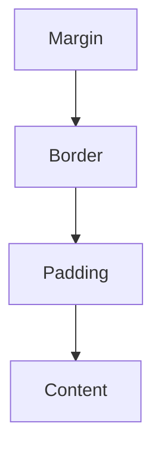
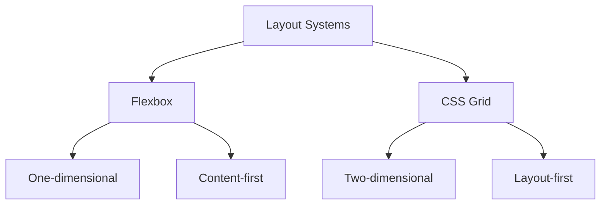
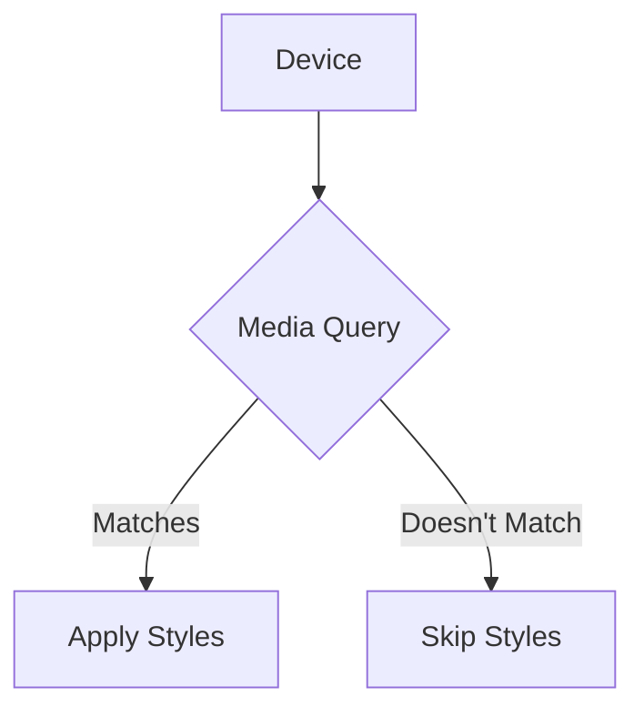
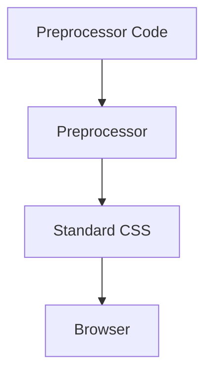
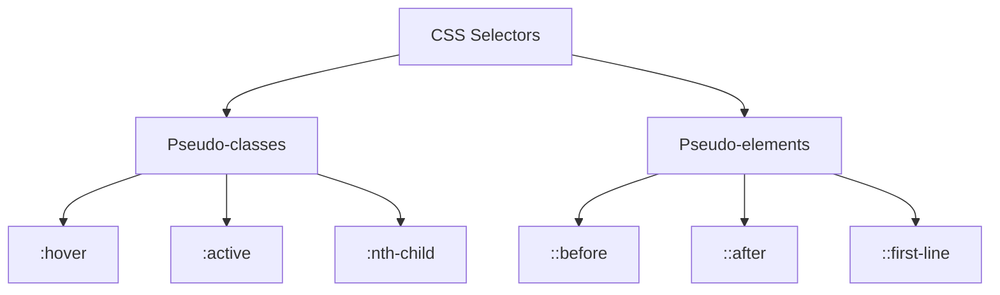

# 🎨 The Ultimate CSS Interview Guide: From Novice to Pro 🚀

## Table of Contents

1. [CSS Basics](#css-basics)
2. [Layout and Positioning](#layout-and-positioning)
3. [Responsive Design](#responsive-design)
4. [CSS Preprocessors](#css-preprocessors)
5. [Advanced Concepts](#advanced-concepts)
6. [CSS Animations and Transitions](#css-animations-and-transitions)

## CSS Basics

### 1. What is the difference between `inline`, `block`, and `inline-block` elements in CSS?

#### Novice Explanation 🐣
Imagine you're arranging books on a shelf:
- `inline` elements are like small bookmarks that sit next to each other.
- `block` elements are like big books that take up the whole shelf width.
- `inline-block` elements are like medium-sized books that sit next to each other but maintain their box-like shape.

#### Pro Explanation 🧠
- `inline`: 
  - Flows with text content
  - Doesn't force new lines
  - Ignores width and height
  - Respects left & right margins/padding, but not top & bottom

- `block`:
  - Forces a line break after the element
  - Takes up full width available by default
  - Respects all margins and padding

- `inline-block`:
  - Flows with text content
  - Doesn't force new lines
  - Respects width, height, and all margins/padding

#### Example:

```css
.inline { display: inline; }
.block { display: block; }
.inline-block { display: inline-block; }
```

```html
<span class="inline">Inline</span>
<span class="inline">Elements</span>

<div class="block">Block Element</div>

<div class="inline-block">Inline-block</div>
<div class="inline-block">Elements</div>
```


### 2. Explain the box model in CSS and how you can alter it.

#### Novice Explanation 🎁
Think of every HTML element as a gift box:
- The content is the gift inside
- Padding is the bubble wrap around the gift
- Border is the box itself
- Margin is the space you leave around the box when placing it next to other boxes

#### Pro Explanation 🧠
The CSS box model describes how elements are rendered in the browser. From inside to outside:

1. Content: The actual content of the element (text, image, etc.)
2. Padding: Space between content and border
3. Border: A line around the padding and content
4. Margin: Space outside the border

By default, when you set a width/height, it applies to the content box only. This is the "content-box" box-sizing model. You can change this behavior:

```css
* {
  box-sizing: border-box;
}
```

With `border-box`, the width/height includes content, padding, and border, making layout calculations easier.

#### Diagram:


### 3. What is the difference between `margin` and `padding` in CSS?

#### Novice Explanation 🍔
Think of an element as a burger:
- The content is the patty
- Padding is the sauce inside the bun
- Margin is the space around the entire burger on the plate

#### Pro Explanation 🧠
- `Margin`:
  - Creates space around the element, outside its border
  - Can have negative values
  - Margins of adjacent elements can collapse
  - Transparent

- `Padding`:
  - Creates space inside the element, between its content and border
  - Cannot have negative values
  - Affects the element's size (unless using `box-sizing: border-box`)
  - Takes on the background color of the element

#### Example:
```css
.burger {
  background-color: #f4a460; /* bun color */
  padding: 20px; /* sauce */
  border: 5px solid #8b4513; /* crust */
  margin: 10px; /* space on the plate */
}
```


## Layout and Positioning

### 4. What is Flexbox, and how does it differ from CSS Grid?

#### Novice Explanation 🧩
- Flexbox is like arranging toys in a line or column
- CSS Grid is like arranging furniture in a room with a floor plan

#### Pro Explanation 🧠
**Flexbox:**
- One-dimensional layout system (row OR column)
- Great for distributing space and aligning content in a container
- Ideal for components of an application (navigation menus, etc.)

**CSS Grid:**
- Two-dimensional layout system (rows AND columns)
- Excellent for defining a layout structure for a whole page
- Provides more fine-grained layout control

#### Example:
Flexbox:
```css
.container {
  display: flex;
  justify-content: space-between;
}
```

CSS Grid:
```css
.container {
  display: grid;
  grid-template-columns: repeat(3, 1fr);
  gap: 20px;
}
```

#### Visual Comparison:


### 5. What is the difference between `absolute`, `relative`, `fixed`, and `sticky` positioning in CSS?

#### Novice Explanation 🏃‍♂️
Imagine a race:
- `static`: Runners in their starting positions (default)
- `relative`: Runners who've moved a bit from their start
- `absolute`: Runners who've left the track and are standing somewhere in the stadium
- `fixed`: Spectators in their seats (don't move even if you scroll)
- `sticky`: Water station staff (stay in place until you scroll past, then follow along)

#### Pro Explanation 🧠
- `static`: Default positioning. Element follows normal document flow.

- `relative`: 
  - Positioned relative to its normal position
  - Doesn't affect layout of other elements
  - Creates a new containing block for absolute children

- `absolute`:
  - Removed from normal document flow
  - Positioned relative to nearest positioned ancestor (or initial containing block)
  - Can overlap other elements

- `fixed`:
  - Removed from normal document flow
  - Positioned relative to the viewport
  - Stays in place during scrolling

- `sticky`:
  - Hybrid of relative and fixed
  - Treated as relative until it crosses a specified threshold, then becomes fixed

#### Example:
```css
.relative {
  position: relative;
  top: 10px;
  left: 20px;
}

.absolute {
  position: absolute;
  top: 50px;
  right: 30px;
}

.fixed {
  position: fixed;
  bottom: 20px;
  right: 20px;
}

.sticky {
  position: sticky;
  top: 0;
}
```


## Responsive Design

### 6. How do you implement responsive design using CSS?

#### Novice Explanation 📱💻🖥️
Imagine your website is like water, and devices are different shaped containers. Responsive design ensures your "water" (content) fits perfectly into any "container" (device screen).

#### Pro Explanation 🧠
Responsive design involves several techniques:

1. **Fluid Grids**: Use percentage-based widths instead of fixed pixels.

2. **Flexible Images**: Ensure images scale with their containing element.
   ```css
   img {
     max-width: 100%;
     height: auto;
   }
   ```

3. **Media Queries**: Apply different styles based on device characteristics.
   ```css
   @media (max-width: 600px) {
     .container {
       flex-direction: column;
     }
   }
   ```

4. **Viewport Meta Tag**: Ensure proper rendering on mobile devices.
   ```html
   <meta name="viewport" content="width=device-width, initial-scale=1">
   ```

5. **CSS Grid and Flexbox**: For flexible, responsive layouts.

6. **Mobile-First Approach**: Design for mobile devices first, then progressively enhance for larger screens.

#### Example:
```css
/* Base styles (mobile) */
.container {
  width: 100%;
  padding: 15px;
}

/* Tablet styles */
@media (min-width: 768px) {
  .container {
    width: 750px;
    margin: 0 auto;
  }
}

/* Desktop styles */
@media (min-width: 1024px) {
  .container {
    width: 970px;
  }
}
```

### 7. What are CSS media queries and how do they work?

#### Novice Explanation 📏
Media queries are like a tailor for your website. They measure the screen size and adjust your site's clothes (styles) to fit perfectly.

#### Pro Explanation 🧠
Media queries allow you to apply CSS styles based on device characteristics, most commonly the viewport width. They're a fundamental part of responsive design.

Syntax:
```css
@media [media-type] and (media-feature) {
  /* CSS rules */
}
```

- `media-type`: screen, print, speech, all (default)
- `media-feature`: width, height, orientation, aspect-ratio, etc.

You can use logical operators (`and`, `or`, `not`) to combine multiple conditions.

#### Example:
```css
/* Styles for screens narrower than 600px */
@media screen and (max-width: 600px) {
  body {
    font-size: 14px;
  }
}

/* Styles for screens wider than 1200px and in landscape orientation */
@media screen and (min-width: 1200px) and (orientation: landscape) {
  .container {
    max-width: 1140px;
  }
}
```

Media queries can also be used in link tags:
```html
<link rel="stylesheet" media="screen and (max-width: 600px)" href="small.css">
```

#### Visual Representation:


## CSS Preprocessors

### 8. What are CSS preprocessors? Give examples and explain why you might use them.

#### Novice Explanation 🧪
CSS preprocessors are like super-powered CSS. They let you write CSS with extra features, then turn it into normal CSS that browsers understand.

#### Pro Explanation 🧠
CSS preprocessors are scripting languages that extend CSS and compile to standard CSS. They offer features like variables, nesting, mixins, functions, and more, which aren't available in plain CSS.

Popular CSS preprocessors:
1. Sass (SCSS)
2. Less
3. Stylus

Benefits of using preprocessors:
1. **Modularity**: Break styles into smaller, manageable files.
2. **Reusability**: Use variables and mixins for consistent values and patterns.
3. **Nesting**: Write less, more readable code.
4. **Functions and Operations**: Perform calculations and manipulations.
5. **Maintainability**: Easier to manage large stylesheets.

#### Example (using Sass):
```scss
// Variables
$primary-color: #3498db;
$padding: 15px;

// Mixin
@mixin border-radius($radius) {
  -webkit-border-radius: $radius;
     -moz-border-radius: $radius;
          border-radius: $radius;
}

// Nesting and usage
.button {
  background-color: $primary-color;
  padding: $padding;
  @include border-radius(5px);
  
  &:hover {
    background-color: darken($primary-color, 10%);
  }
}
```

This compiles to:

```css
.button {
  background-color: #3498db;
  padding: 15px;
  -webkit-border-radius: 5px;
     -moz-border-radius: 5px;
          border-radius: 5px;
}

.button:hover {
  background-color: #217dbb;
}
```

#### Visual Representation:


## Advanced Concepts

### 9. Explain the concept of specificity in CSS. How is specificity calculated?

#### Novice Explanation 🏆
Imagine a contest where different types of CSS selectors compete. Some selectors are more "important" and win over others. That's specificity!

#### Pro Explanation 🧠
Specificity determines which CSS rule is applied when multiple rules target the same element. It's calculated as a four-part value: a, b, c, d

- a: Inline styles
- b: Number of ID selectors
- c: Number of class selectors, attribute selectors, and pseudo-classes
- d: Number of element selectors and pseudo-elements

The selector with the highest specificity wins. If specificities are equal, the last rule in the CSS is applied.


#### Calculation:
1. Start at 0
2. Add 1000 for inline style
3. Add 100 for each ID
4. Add 10 for each class, attribute, or pseudo-class
5. Add 1 for each element name or pseudo-element

#### Examples:
```css
/* Specificity: 1 */
p { color: black; }

/* Specificity: 10 */
.text { color: red; }

/* Specificity: 100 */
#header { color: blue; }

/* Specificity: 11 */
p.text { color: green; }

/* Specificity: 110 */
#header .text { color: purple; }
```


### 10. What are CSS pseudo-classes and pseudo-elements? Provide examples.

#### Novice Explanation 🎭
- Pseudo-classes are like costumes for your HTML elements. They change how elements look in different situations.
- Pseudo-elements are like adding extra parts to your HTML elements, like giving them a fancy hat or shoes.

#### Pro Explanation 🧠
**Pseudo-classes** select elements based on a certain state or condition. They use a single colon `:`.

**Pseudo-elements** allow you to style a specific part of an element. They use a double colon `::` (single colon also works for backwards compatibility).

#### Examples of Pseudo-classes:
```css
/* Styles a link when hovered over */
a:hover {
  color: red;
}

/* Styles every odd child of a list */
li:nth-child(odd) {
  background-color: #f2f2f2;
}

/* Styles an input when it's focused */
input:focus {
  border-color: blue;
}
```

#### Examples of Pseudo-elements:
```css
/* Adds content before an element */
.quote::before {
  content: "❝";
}

/* Styles the first line of a paragraph */
p::first-line {
  font-weight: bold;
}

/* Styles the first letter of a heading */
h1::first-letter {
  font-size: 2em;
  color: red;
}
```

#### Visual Representation:


### 11. How can you center an element horizontally and vertically in CSS?

#### Novice Explanation 🎯
Imagine you're trying to put a sticker exactly in the middle of a page. There are different ways to do this, depending on what kind of sticker and page you have!

#### Pro Explanation 🧠
There are several ways to center elements in CSS, depending on the context:

1. **Using Flexbox:**
```css
.parent {
  display: flex;
  justify-content: center;
  align-items: center;
  height: 100vh; /* Ensure the parent takes full viewport height */
}
```

2. **Using Grid:**
```css
.parent {
  display: grid;
  place-items: center;
  height: 100vh;
}
```

3. **Using absolute positioning:**
```css
.parent {
  position: relative;
}
.child {
  position: absolute;
  top: 50%;
  left: 50%;
  transform: translate(-50%, -50%);
}
```

4. **For inline or inline-block elements:**
```css
.parent {
  text-align: center; /* Horizontal centering */
  line-height: 100vh; /* Vertical centering, adjust as needed */
}
.child {
  display: inline-block;
  vertical-align: middle;
}
```

5. **Using margin auto (for horizontal centering of block elements with a set width):**
```css
.child {
  width: 300px;
  margin: 0 auto;
}
```

## CSS Animations and Transitions

### 12. How can you create animations in CSS? Provide an example.

#### Novice Explanation 🎬
CSS animations are like creating a flip book. You define how something looks at different stages, and CSS makes it move smoothly between those stages.

#### Pro Explanation 🧠
CSS animations allow you to gradually change from one style to another. They consist of two components:

1. **@keyframes rule**: Defines the stages and styles of the animation.
2. **Animation properties**: Assign the animation to an element and define how it should behave.

#### Example:
```css
/* Define the keyframes */
@keyframes bounce {
  0%, 100% { 
    transform: translateY(0);
  }
  50% {
    transform: translateY(-20px);
  }
}

/* Apply the animation to an element */
.bouncing-ball {
  width: 50px;
  height: 50px;
  background-color: red;
  border-radius: 50%;
  animation: bounce 1s ease infinite;
}
```

This creates a bouncing ball effect.

#### Animation Properties:
- `animation-name`: Name of the @keyframes rule
- `animation-duration`: How long the animation takes
- `animation-timing-function`: How the animation progresses (ease, linear, etc.)
- `animation-delay`: Delay before the animation starts
- `animation-iteration-count`: How many times the animation should run
- `animation-direction`: Whether the animation should alternate direction or reset
- `animation-fill-mode`: Styles applied before/after the animation
- `animation-play-state`: Whether the animation is running or paused

#### Visual Representation:
```mermaid
graph TD
    A[@keyframes] --> B[Define Stages]
    C[Animation Properties] --> D[Apply to Element]
    B --> E[Animation Effect]
    D --> E
```

### 13. What are CSS transitions and how do you create them? Provide an example.

#### Novice Explanation 🚶‍♂️ ➡️ 🏃‍♂️
CSS transitions are like smooth gear changes in a car. Instead of abruptly changing from one style to another, the change happens gradually over time.

#### Pro Explanation 🧠
CSS transitions allow you to define the transition between two states of an element. They provide a way to control animation speed when changing CSS properties.

#### Transition Properties:
- `transition-property`: CSS properties to transition
- `transition-duration`: How long the transition takes
- `transition-timing-function`: How the transition progresses (ease, linear, etc.)
- `transition-delay`: Delay before the transition starts

#### Example:
```css
.button {
  background-color: blue;
  color: white;
  padding: 10px 20px;
  transition: background-color 0.3s ease;
}

.button:hover {
  background-color: darkblue;
}
```

This creates a smooth color change when hovering over the button.

#### Shorthand:
You can use the `transition` shorthand property:
```css
.button {
  transition: background-color 0.3s ease 0.1s;
}
```

### 14. What are CSS variables (custom properties) and how do you use them?

#### Novice Explanation 🎨
CSS variables are like paint buckets with custom colors. You can define a color once and use it many times throughout your stylesheet. If you want to change the color, you only need to change it in one place!

#### Pro Explanation 🧠
CSS variables, also known as custom properties, allow you to store specific values to be reused throughout a document. They are set using custom property notation (e.g., `--main-color: black;`) and are accessed using the `var()` function.

#### Defining CSS Variables:
```css
:root {
  --main-color: #3498db;
  --padding: 15px;
  --font-size: 16px;
}
```

#### Using CSS Variables:
```css
.button {
  background-color: var(--main-color);
  padding: var(--padding);
  font-size: var(--font-size);
}
```

#### Benefits:
1. Reusability
2. Easy global changes
3. More readable and maintainable code
4. Can be manipulated with JavaScript

#### Example with fallback:
```css
.text {
  color: var(--text-color, black);
}
```

If `--text-color` isn't defined, it will fall back to black.

#### Visual Representation:
```mermaid
graph TD
    A[CSS Variables] --> B[Define in :root]
    A --> C[Use with var()]
    B --> D[Global Scope]
    C --> E[Local Usage]
    E --> F[Easy Updates]
```

### 15. Explain the difference between `rem` and `em` units in CSS.

#### Novice Explanation 📏
- `em` is like measuring based on your parent's height.
- `rem` is like measuring based on the height of the tallest person in your family.

#### Pro Explanation 🧠
Both `em` and `rem` are relative units, but they have different reference points:

- `em`: Relative to the font-size of the element (2em means 2 times the size of the current font)
  - If used to specify font-size, it's relative to the parent's font-size
  - If used for other properties, it's relative to the element's own font-size

- `rem`: Relative to the font-size of the root element (html)
  - Always relative to the root, regardless of where it's used

#### Example:
```css
html {
  font-size: 16px;
}

.parent {
  font-size: 18px;
}

.child-em {
  font-size: 2em;  /* 36px (2 * 18px) */
  padding: 1em;    /* 36px (1 * 36px) */
}

.child-rem {
  font-size: 2rem; /* 32px (2 * 16px) */
  padding: 1rem;   /* 16px (1 * 16px) */
}
```

#### When to use:
- Use `rem` for sizes you want to scale with page zoom
- Use `em` for sizes you want to scale with component zoom


