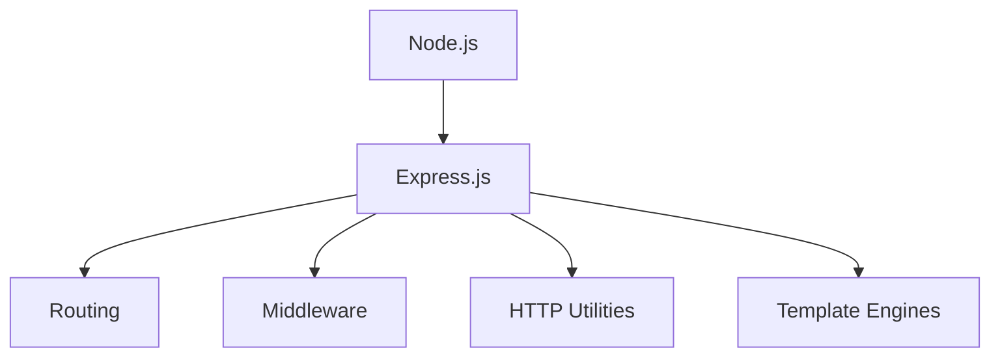
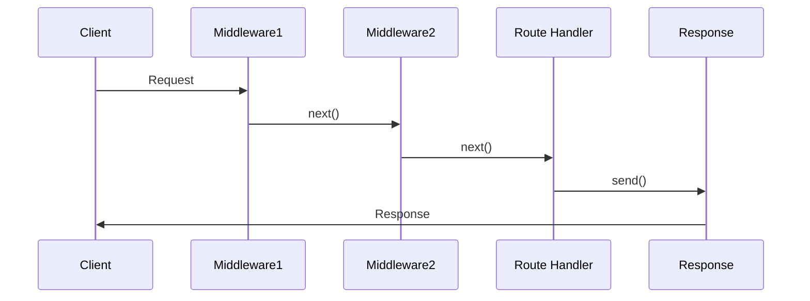
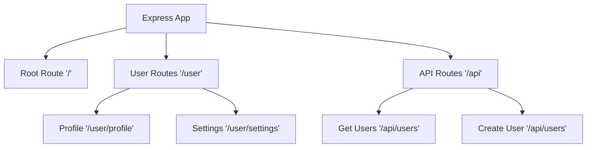
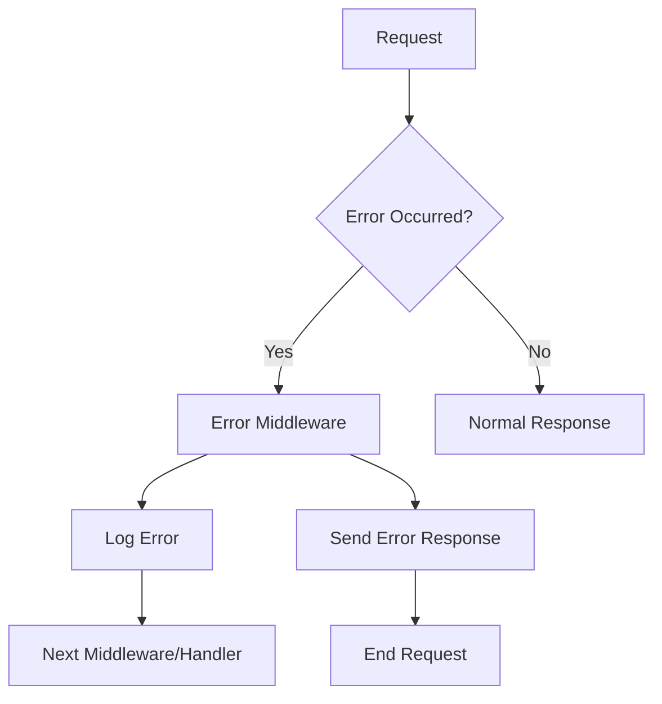
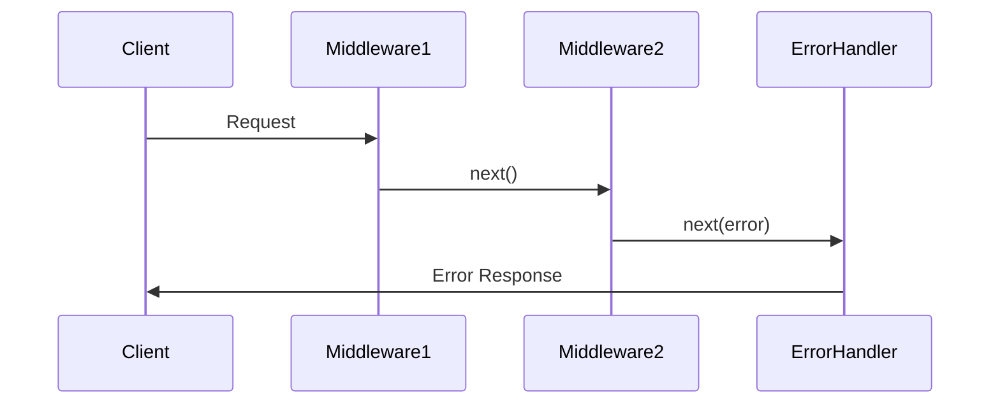
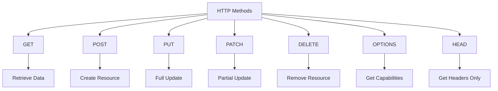
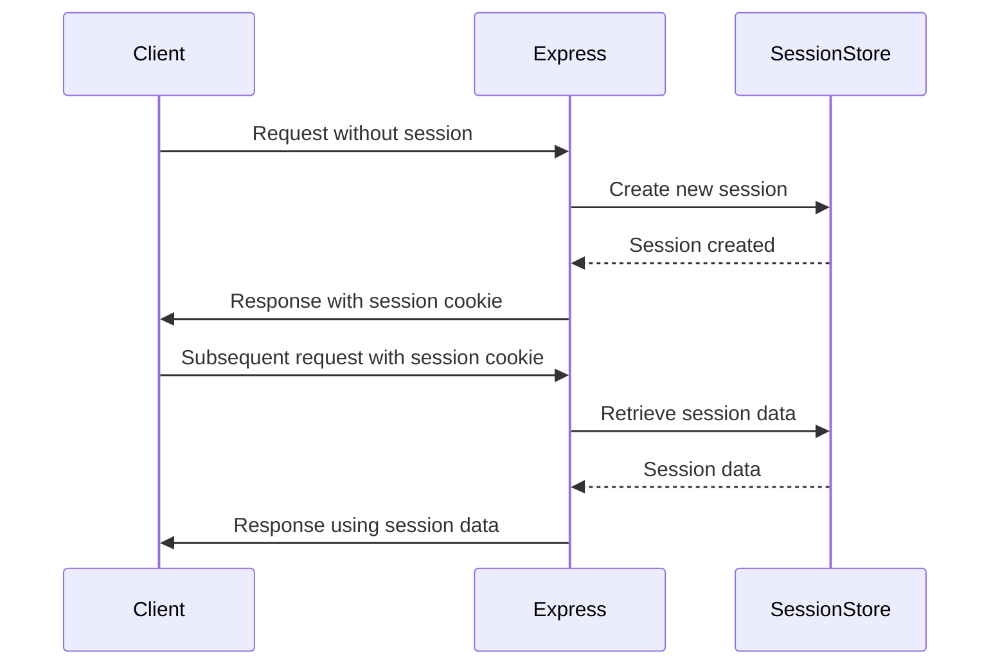
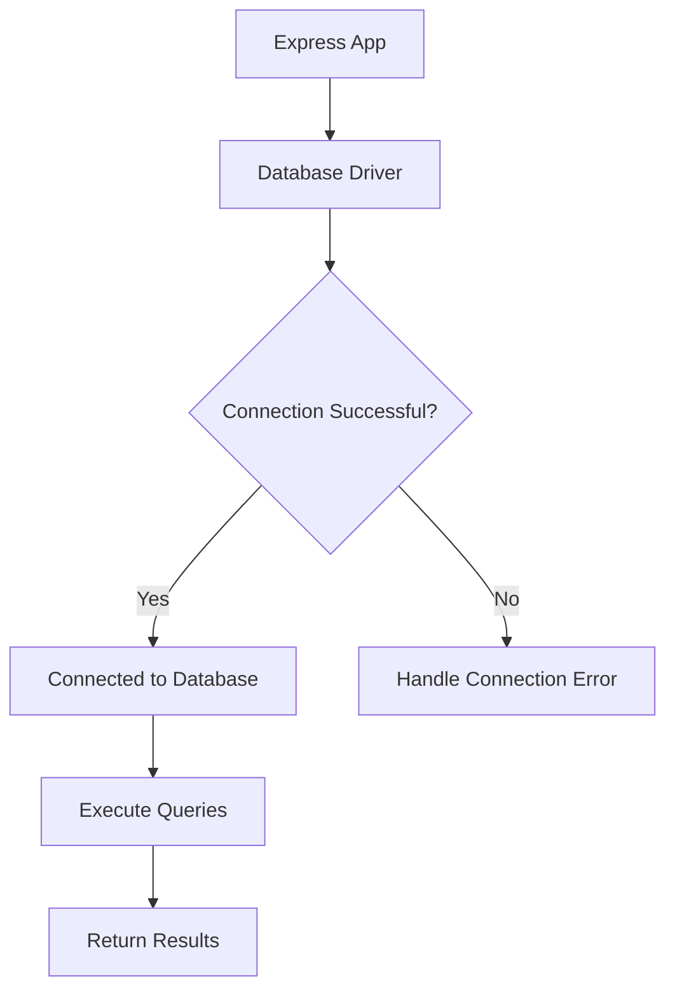
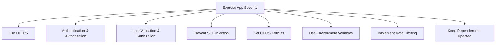
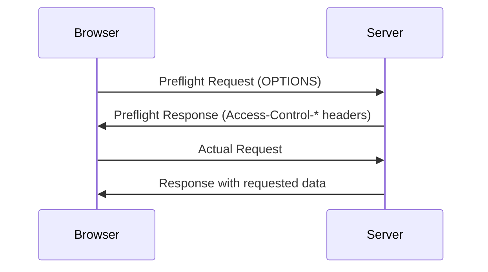

# 🚀 Express.js Interview Guide: From Novice to Expert 🚀

## Table of Contents
1. [Express.js Basics](#express-js-basics)
2. [Middleware Magic](#middleware-magic)
3. [Routing Revelations](#routing-revelations)
4. [Static Files and Beyond](#static-files-and-beyond)
5. [Error Handling Heroics](#error-handling-heroics)
6. [Data Manipulation Mastery](#data-manipulation-mastery)
7. [RESTful API Craftsmanship](#restful-api-craftsmanship)
8. [Session Sorcery](#session-sorcery)
9. [Database Wizardry](#database-wizardry)
10. [Security Shield](#security-shield)
11. [CORS Conquering](#cors-conquering)

Let's embark on this Express.js journey! 🌟

## Express.js Basics

### 1. What is Express.js and how does it differ from Node.js?

🎭 **Novice Explanation:**
Imagine you're building a house. Node.js is like the foundation and framework, while Express.js is the set of tools that help you build the rooms and decorate them easily.

🧠 **Expert Answer:**
Express.js is a minimal and flexible web application framework for Node.js. It provides a robust set of features for building single, multi-page, and hybrid web applications. 

Key differences from Node.js:
- Node.js is a runtime environment for executing JavaScript outside a browser.
- Express.js is a framework built on top of Node.js.
- Express.js simplifies the process of handling HTTP requests, routing, and middleware integration.



### 2. How do you create a simple Express.js application?

👶 **Novice Explanation:**
Creating an Express app is like setting up a lemonade stand. You need a table (server), a sign (routes), and your lemonade (responses).

🧙‍♂️ **Expert Answer:**
To create a simple Express.js application:

1. Initialize your project:
   ```bash
   npm init -y
   npm install express
   ```

2. Create an `app.js` file:

   ```javascript
   const express = require('express');
   const app = express();
   const port = 3000;

   app.get('/', (req, res) => {
     res.send('Hello, Express!');
   });

   app.listen(port, () => {
     console.log(`Server running at http://localhost:${port}`);
   });
   ```

3. Run the application:
   ```bash
   node app.js
   ```

This sets up a basic server that responds with "Hello, Express!" when you visit the root URL.

## Middleware Magic

### 3. Explain the role of middleware in Express.js.

🎭 **Novice Explanation:**
Middleware is like a series of checkpoints your request goes through before reaching its final destination. Each checkpoint can inspect, modify, or even stop the request.

🧠 **Expert Answer:**
Middleware functions are functions that have access to the request object (req), the response object (res), and the next middleware function in the application's request-response cycle, commonly denoted by a variable named `next`.

Middleware can:
- Execute any code.
- Make changes to the request and response objects.
- End the request-response cycle.
- Call the next middleware in the stack.

Example of a simple logging middleware:

```javascript
app.use((req, res, next) => {
  console.log(`${new Date().toISOString()} - ${req.method} ${req.url}`);
  next();
});
```

Middleware flow in Express:



### 4. What is the purpose of `app.use()` in Express.js?

👶 **Novice Explanation:**
`app.use()` is like setting up a general rule for your app. It's saying, "Hey, for every request that comes in, do this thing first!"

🧙‍♂️ **Expert Answer:**
`app.use()` is a method to mount middleware functions in the application's middleware stack. It can be used to:

1. Apply middleware to all routes:
   ```javascript
   app.use(express.json()); // Parse JSON bodies for all requests
   ```

2. Apply middleware to specific paths:
   ```javascript
   app.use('/api', apiRouter); // Use apiRouter for all routes starting with /api
   ```

3. Set up error-handling middleware:
   ```javascript
   app.use((err, req, res, next) => {
     console.error(err.stack);
     res.status(500).send('Something broke!');
   });
   ```

The order of `app.use()` calls is significant, as middleware functions are executed in the order they are defined.

## Routing Revelations

### 5. How do you handle routing in Express.js?

🎭 **Novice Explanation:**
Routing in Express is like creating a map for your website. You decide which paths lead to which destinations (functions).

🧠 **Expert Answer:**
Express provides a powerful routing mechanism through the `Router` class and app routing methods. Here are various ways to handle routing:

1. Basic routing:
   ```javascript
   app.get('/', (req, res) => {
     res.send('Home Page');
   });

   app.post('/submit', (req, res) => {
     res.send('Form submitted');
   });
   ```

2. Route parameters:
   ```javascript
   app.get('/users/:userId', (req, res) => {
     res.send(`User profile for ${req.params.userId}`);
   });
   ```

3. Route handlers with multiple callback functions:
   ```javascript
   app.get('/example', 
     (req, res, next) => {
       console.log('First handler');
       next();
     },
     (req, res) => {
       res.send('Second handler');
     }
   );
   ```

4. Express Router for modular routing:
   ```javascript
   const express = require('express');
   const router = express.Router();

   router.get('/profile', (req, res) => {
     res.send('User profile');
   });

   app.use('/user', router);
   ```

Routing structure visualization:



## Static Files and Beyond

### 6. How do you serve static files in Express.js?

👶 **Novice Explanation:**
Serving static files is like setting up a public library. You put all your books (files) in one place, and people can come and read them without asking you every time.

🧙‍♂️ **Expert Answer:**
Express provides the `express.static` middleware to serve static files. Here's how you can use it:

```javascript
app.use(express.static('public'));
```

This will serve all files in the 'public' directory. For example, if you have a file `public/images/logo.png`, it will be accessible at `http://localhost:3000/images/logo.png`.

You can also set a virtual path prefix:

```javascript
app.use('/static', express.static('public'));
```

Now, the same file would be accessible at `http://localhost:3000/static/images/logo.png`.

For better organization, you can use multiple static directories:

```javascript
app.use(express.static('public'));
app.use(express.static('uploads'));
app.use('/vendor', express.static('node_modules'));
```

Remember, Express looks up the files relative to the static directory, so the name of the static directory is not part of the URL.

## Error Handling Heroics

### 7. How do you handle error handling in Express.js?

🎭 **Novice Explanation:**
Error handling in Express is like having a safety net in a circus. If something goes wrong during the performance (request processing), the safety net (error handler) catches it and decides what to do next.

🧠 **Expert Answer:**
Express comes with a built-in error handler that takes care of any errors that might occur in the app. However, you can write your own error handling middleware to customize this behavior.

1. Default error handling:
   Express handles errors that occur in the synchronous code automatically.

2. Custom error-handling middleware:
   ```javascript
   app.use((err, req, res, next) => {
     console.error(err.stack);
     res.status(500).send('Something broke!');
   });
   ```

3. Handling errors in async functions:
   ```javascript
   app.get('/async', async (req, res, next) => {
     try {
       const result = await someAsyncOperation();
       res.json(result);
     } catch (error) {
       next(error); // Passes errors to Express
     }
   });
   ```

4. Using a wrapper for async route handlers:
   ```javascript
   const asyncHandler = fn => (req, res, next) =>
     Promise.resolve(fn(req, res, next)).catch(next);

   app.get('/users', asyncHandler(async (req, res) => {
     const users = await User.find();
     res.json(users);
   }));
   ```

Error handling flow:



### 8. What is the significance of the `next` function in middleware?

👶 **Novice Explanation:**
The `next` function is like a "PASS" card in a relay race. When one runner (middleware) finishes their part, they use the "PASS" card to let the next runner (middleware) start their job.

🧙‍♂️ **Expert Answer:**
The `next` function is a function in the Express router which, when invoked, executes the middleware succeeding the current middleware. 

Key points about `next`:

1. Passing control:
   ```javascript
   app.use((req, res, next) => {
     console.log('Time:', Date.now());
     next(); // Passes control to the next middleware
   });
   ```

2. Skipping the rest of the middleware stack:
   ```javascript
   app.use((req, res, next) => {
     if (req.params.id === '0') return next('route');
     next();
   });
   ```

3. Passing errors:
   ```javascript
   app.use((req, res, next) => {
     if (!req.headers.authorization) {
       return next(new Error('Unauthorized'));
     }
     next();
   });
   ```

4. Ending the request-response cycle:
   If `next()` is called without any arguments, and there are no more middleware functions left in the stack, it will end the request-response cycle.

Middleware execution flow:



## Data Manipulation Mastery

### 9. How do you handle form data (URL-encoded) and JSON data in Express.js?

🎭 **Novice Explanation:**
Handling different types of data in Express is like being a translator. Whether someone speaks to you in form-language or JSON-language, you need to understand and process it correctly.

🧙‍♂️ **Expert Answer:**
Express.js provides built-in middleware to handle both URL-encoded form data and JSON data:

1. Handling URL-encoded data:
   ```javascript
   app.use(express.urlencoded({ extended: true }));
   ```
   This middleware parses URL-encoded bodies and is based on `body-parser`.

2. Handling JSON data:
   ```javascript
   app.use(express.json());
   ```
   This middleware parses JSON payloads and is based on `body-parser`.

After applying these middleware, you can access the parsed data in your route handlers:

```javascript
app.post('/submit-form', (req, res) => {
  console.log(req.body); // Contains the parsed form data
  res.send('Form received');
});

app.post('/api/data', (req, res) => {
  console.log(req.body); // Contains the parsed JSON data
  res.json({ received: true });
});
```

For handling file uploads, you might want to use a package like `multer`:

```javascript
const multer = require('multer');
const upload = multer({ dest: 'uploads/' });

app.post('/profile', upload.single('avatar'), (req, res) => {
  console.log(req.file); // Contains the uploaded file
  console.log(req.body); // Contains the text fields
  res.send('Profile updated');
});
```

Data flow in Express:

```mermaid
graph TD
    A[Client Request] --> B{Content-Type}
    B -->|application/json| C[express.json()]
    B -->|application/x-www-form-urlencoded| D[express.urlencoded()]
    B -->|multipart/form-data| E[multer]
    C --> F[req.body]
    D --> F
    E --> G[req.file]
    E --> F
    F --> H[Route Handler]
    G --> H
```

## RESTful API Craftsmanship

### 10. How can you create a RESTful API using Express.js?

👶 **Novice Explanation:**
Creating a RESTful API is like designing a well-organized library. You have different sections (endpoints) for different types of books (resources), and clear rules on how to add, view, update, or remove books.

🧙‍♂️ **Expert Answer:**
Creating a RESTful API in Express involves setting up routes that correspond to standard HTTP methods for CRUD operations. Here's an example of a RESTful API for a "books" resource:

```javascript
const express = require('express');
const router = express.Router();

// GET all books
router.get('/books', (req, res) => {
  // Logic to retrieve all books
  res.json(books);
});

// GET a specific book
router.get('/books/:id', (req, res) => {
  const book = books.find(b => b.id === req.params.id);
  if (!book) return res.status(404).send('Book not found');
  res.json(book);
});

// POST a new book
router.post('/books', (req, res) => {
  const newBook = {
    id: books.length + 1,
    title: req.body.title,
    author: req.body.author
  };
  books.push(newBook);
  res.status(201).json(newBook);
});

// PUT (update) a book
router.put('/books/:id', (req, res) => {
  const book = books.find(b => b.id === req.params.id);
  if (!book) return res.status(404).send('Book not found');
  
  book.title = req.body.title;
  book.author = req.body.author;
  res.json(book);
});

// DELETE a book
router.delete('/books/:id', (req, res) => {
  const index = books.findIndex(b => b.id === req.params.id);
  if (index === -1) return res.status(404).send('Book not found');
  
  books.splice(index, 1);
  res.status(204).send();
});

app.use('/api', router);
```

This setup follows RESTful principles:
- Uses nouns (books) instead of verbs in endpoints
- Utilizes appropriate HTTP methods for different operations
- Returns proper status codes
- Uses nested resources for related data (e.g., `/books/:id/reviews`)

RESTful API structure:

```mermaid
graph TD
    A[/api/books] --> B[GET - Retrieve all books]
    A --> C[POST - Create a new book]
    D[/api/books/:id] --> E[GET - Retrieve a specific book]
    D --> F[PUT - Update a book]
    D --> G[DELETE - Delete a book]
```

### 11. What are the different HTTP methods supported by Express.js?

🎭 **Novice Explanation:**
HTTP methods in Express are like different types of requests you can make at a restaurant. GET is like asking for the menu, POST is like placing an order, PUT is like modifying your order, and DELETE is like canceling your order.

🧙‍♂️ **Expert Answer:**
Express.js supports all standard HTTP methods. The most commonly used ones are:

1. GET: Retrieve a resource
   ```javascript
   app.get('/users', (req, res) => { /* ... */ });
   ```

2. POST: Create a new resource
   ```javascript
   app.post('/users', (req, res) => { /* ... */ });
   ```

3. PUT: Update an existing resource (full update)
   ```javascript
   app.put('/users/:id', (req, res) => { /* ... */ });
   ```

4. PATCH: Partially update an existing resource
   ```javascript
   app.patch('/users/:id', (req, res) => { /* ... */ });
   ```

5. DELETE: Remove a resource
   ```javascript
   app.delete('/users/:id', (req, res) => { /* ... */ });
   ```

6. OPTIONS: Describe the communication options for the target resource
   ```javascript
   app.options('/users', (req, res) => { /* ... */ });
   ```

7. HEAD: Similar to GET but returns only headers, not the body
   ```javascript
   app.head('/users', (req, res) => { /* ... */ });
   ```

Express also provides an `app.all()` method that applies to all HTTP methods:

```javascript
app.all('/secret', (req, res, next) => {
  console.log('Accessing the secret section ...');
  next(); // pass control to the next handler
});
```

HTTP methods and their typical uses:



## Session Sorcery

### 12. How do you manage sessions in Express.js?

👶 **Novice Explanation:**
Managing sessions in Express is like giving each visitor to your website a special bracelet. This bracelet helps you remember who they are and what they're doing, even if they leave and come back later.

🧙‍♂️ **Expert Answer:**
Session management in Express.js typically involves using middleware like `express-session`. Here's how you can set it up:

1. Install the middleware:
   ```bash
   npm install express-session
   ```

2. Set up the middleware:
   ```javascript
   const session = require('express-session');

   app.use(session({
     secret: 'your secret key',
     resave: false,
     saveUninitialized: true,
     cookie: { secure: true, maxAge: 60000 } // 1 minute
   }));
   ```

3. Use the session in your routes:
   ```javascript
   app.get('/', (req, res) => {
     if (req.session.views) {
       req.session.views++;
       res.send(`You visited this page ${req.session.views} times`);
     } else {
       req.session.views = 1;
       res.send('Welcome to this page for the first time!');
     }
   });
   ```

For production use, you should use a session store like Redis or MongoDB instead of the default in-memory store:

```javascript
const MongoStore = require('connect-mongo');

app.use(session({
  store: MongoStore.create({ mongoUrl: 'mongodb://localhost/test-app' }),
  secret: 'your secret key',
  resave: false,
  saveUninitialized: true,
  cookie: { secure: true, maxAge: 60000 }
}));
```

Session flow in Express:



## Database Wizardry

### 13. How do you set up a database connection in an Express.js application?

🎭 **Novice Explanation:**
Setting up a database connection in Express is like establishing a direct phone line to your data storage. Once it's set up, you can easily make calls (queries) to get or update information.

🧙‍♂️ **Expert Answer:**
Setting up a database connection depends on the database you're using. Here's an example using MongoDB with Mongoose:

1. Install the required packages:
   ```bash
   npm install mongoose
   ```

2. Set up the connection:
   ```javascript
   const mongoose = require('mongoose');

   mongoose.connect('mongodb://localhost/myapp', {
     useNewUrlParser: true,
     useUnifiedTopology: true
   });

   const db = mongoose.connection;
   db.on('error', console.error.bind(console, 'connection error:'));
   db.once('open', function() {
     console.log('Connected to MongoDB');
   });
   ```

3. Define a model:
   ```javascript
   const userSchema = new mongoose.Schema({
     name: String,
     email: String
   });

   const User = mongoose.model('User', userSchema);
   ```

4. Use the model in your routes:
   ```javascript
   app.post('/users', async (req, res) => {
     try {
       const user = new User(req.body);
       await user.save();
       res.status(201).json(user);
     } catch (error) {
       res.status(400).json(error);
     }
   });

   app.get('/users', async (req, res) => {
     try {
       const users = await User.find();
       res.json(users);
     } catch (error) {
       res.status(500).json(error);
     }
   });
   ```

For SQL databases like PostgreSQL, you might use a package like `pg`:

```javascript
const { Pool } = require('pg');

const pool = new Pool({
  user: 'dbuser',
  host: 'database.server.com',
  database: 'mydb',
  password: 'secretpassword',
  port: 5432,
});

app.get('/users', async (req, res) => {
  try {
    const { rows } = await pool.query('SELECT * FROM users');
    res.json(rows);
  } catch (error) {
    res.status(500).json(error);
  }
});
```

Database connection flow:



## Security Shield

### 14. What are some common security practices you should follow when using Express.js?

👶 **Novice Explanation:**
Securing your Express app is like fortifying a castle. You need to close all the weak points, set up proper defenses, and always be on guard against potential attacks.

🧙‍♂️ **Expert Answer:**
Here are some essential security practices for Express.js applications:

1. Use HTTPS
   Always use HTTPS to protect data in transit. You can use packages like `helmet` to set security-related HTTP headers:
   ```javascript
   const helmet = require('helmet');
   app.use(helmet());
   ```

2. Implement proper authentication and authorization
   Use secure authentication methods and properly authorize users for different operations.

3. Validate and sanitize user inputs
   Use packages like `express-validator` to validate and sanitize user inputs:
   ```javascript
   const { body, validationResult } = require('express-validator');

   app.post('/user', [
     body('username').isEmail(),
     body('password').isLength({ min: 5 })
   ], (req, res) => {
     const errors = validationResult(req);
     if (!errors.isEmpty()) {
       return res.status(400).json({ errors: errors.array() });
     }
     // ... handle the request
   });
   ```

4. Prevent SQL injection
   Use parameterized queries or ORM/ODM libraries to prevent SQL injection attacks.

5. Set proper CORS policies
   Configure CORS to only allow necessary origins:
   ```javascript
   const cors = require('cors');
   app.use(cors({
     origin: 'https://yourdomain.com'
   }));
   ```

6. Use environment variables for sensitive data
   Store sensitive information like API keys and database credentials in environment variables, not in your code.

7. Implement rate limiting
   Use packages like `express-rate-limit` to prevent abuse:
   ```javascript
   const rateLimit = require("express-rate-limit");

   const apiLimiter = rateLimit({
     windowMs: 15 * 60 * 1000, // 15 minutes
     max: 100 // limit each IP to 100 requests per windowMs
   });

   app.use("/api/", apiLimiter);
   ```

8. Keep dependencies updated
   Regularly update your dependencies to patch known vulnerabilities:
   ```bash
   npm audit
   npm update
   ```

Security measures visualization:



## CORS Conquering

### 15. How do you implement CORS in an Express.js application?

🎭 **Novice Explanation:**
Implementing CORS is like setting up a guest list for your website party. You decide which other websites are allowed to interact with yours and what kind of interactions they can have.

🧙‍♂️ **Expert Answer:**
Cross-Origin Resource Sharing (CORS) can be implemented in Express.js using the `cors` middleware. Here's how to do it:

1. Install the cors package:
   ```bash
   npm install cors
   ```

2. Basic usage (allow all origins):
   ```javascript
   const express = require('express');
   const cors = require('cors');
   const app = express();

   app.use(cors());
   ```

3. Configure specific options:
   ```javascript
   app.use(cors({
     origin: 'https://yourdomain.com',
     methods: ['GET', 'POST'],
     allowedHeaders: ['Content-Type', 'Authorization']
   }));
   ```

4. Dynamic origin configuration:
   ```javascript
   const whitelist = ['https://example1.com', 'https://example2.com'];
   const corsOptions = {
     origin: function (origin, callback) {
       if (whitelist.indexOf(origin) !== -1 || !origin) {
         callback(null, true);
       } else {
         callback(new Error('Not allowed by CORS'));
       }
     }
   };

   app.use(cors(corsOptions));
   ```

5. Enable CORS for a specific route:
   ```javascript
   app.get('/products/:id', cors(), function (req, res, next) {
     res.json({msg: 'This is CORS-enabled for this route'});
   });
   ```

6. Handle preflight requests:
   ```javascript
   app.options('/products/:id', cors()); // enable pre-flight request for DELETE request
   app.delete('/products/:id', cors(), function (req, res, next) {
     res.json({msg: 'This is CORS-enabled for all origins!'});
   });
   ```

CORS request flow:



Remember, CORS is enforced by the browser, not the server. The server just needs to send the appropriate headers to allow or disallow the cross-origin requests.

---

