# Comprehensive JavaScript Interview Questions and Answers

## Additional Questions

## 1. What are generator functions and how do they work?

Generator functions are a special type of function that can be paused and resumed, allowing you to generate a sequence of values over time.

### Key Characteristics:
1. Defined using the `function*` syntax
2. Use the `yield` keyword to pause execution and return a value
3. Return a Generator object when called
4. Can be iterated over using `for...of` loops or the `.next()` method

### How They Work:
1. When called, a generator function doesn't run its code immediately.
2. Instead, it returns a Generator object.
3. The Generator object can be used to control the execution of the function.
4. Each time `yield` is encountered, the function's state is saved and a value is returned.
5. The function can be resumed from where it left off by calling `.next()` on the Generator object.

### Example:

```javascript
function* countToThree() {
  yield 1;
  yield 2;
  yield 3;
}

const generator = countToThree();
console.log(generator.next().value); // 1
console.log(generator.next().value); // 2
console.log(generator.next().value); // 3
console.log(generator.next().done);  // true
```

### Diagram:
```mermaid
graph TD
    A[Start] --> B[yield 1]
    B --> C[yield 2]
    C --> D[yield 3]
    D --> E[End]
    F[generator.next()] --> |Call 1| B
    F --> |Call 2| C
    F --> |Call 3| D
    F --> |Call 4| E
```

### Novice Explanation:
Imagine you're reading a book, but you can only read one page at a time. After each page, you put a bookmark in and close the book. A generator function is like this book. Each `yield` is like a page. When you call `.next()`, it's like opening the book to your bookmark, reading one page, and then closing it again. This allows you to control exactly when and how much of the "book" (function) you want to "read" (execute) at any given time.

## 2. Explain the concept of memory leaks in JavaScript.

Memory leaks occur when a program unintentionally retains references to objects that are no longer needed, preventing the JavaScript engine from freeing up the memory.

### Common Causes:
1. Unintended global variables
2. Forgotten timers or callbacks
3. Closures that reference larger outer scopes
4. Detached DOM elements

### Example of a Memory Leak:

```javascript
function createButtons() {
  let count = 0;
  
  function updateCount() {
    count++;
    console.log(count);
  }

  document.getElementById('button').addEventListener('click', updateCount);
}

createButtons();
// The updateCount function holds a reference to count, preventing it from being garbage collected
```

### Preventing Memory Leaks:
1. Use strict mode to catch unintended globals
2. Clear timers and event listeners when no longer needed
3. Be cautious with closures and ensure they don't retain unnecessary references
4. Use tools like Chrome DevTools Memory profiler to identify leaks

### Diagram:
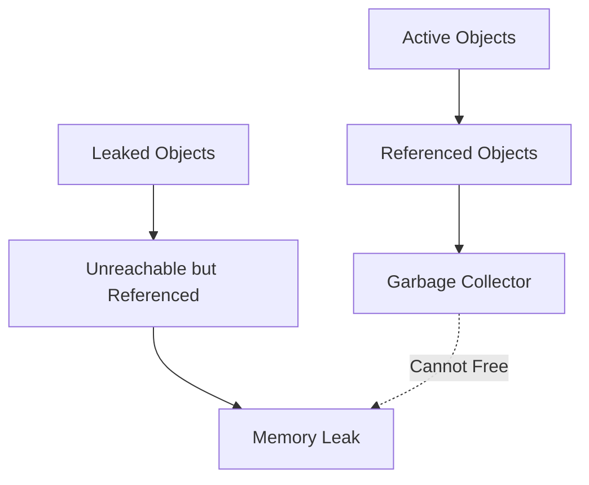

### Novice Explanation:
Imagine you're at a party and you keep getting handed balloons. Normally, when you're done with a balloon, you let it go and it floats away (this is like garbage collection in JavaScript). But what if someone tied all the balloons to your wrist? Even if you don't want the balloons anymore, you can't get rid of them. This is like a memory leak - the program is holding onto things it doesn't need anymore, but can't let go of them.

## 3. What is the Proxy object in JavaScript?

The Proxy object is used to define custom behavior for fundamental operations (e.g., property lookup, assignment, enumeration, function invocation, etc.) on an object.

### Key Concepts:
1. A Proxy is created with two parameters: the target object and a handler object.
2. The handler object contains "traps" - methods that define custom behavior for various operations.
3. When these operations are performed on the Proxy, the corresponding trap is invoked.

### Common Traps:
- `get`: For property lookup
- `set`: For property assignment
- `has`: For the `in` operator
- `deleteProperty`: For the `delete` operator
- `apply`: For function calls

### Example:

```javascript
const target = {
  name: "John",
  age: 30
};

const handler = {
  get: function(obj, prop) {
    return prop in obj ? obj[prop] : "Property not found";
  },
  set: function(obj, prop, value) {
    if (prop === "age" && typeof value !== "number") {
      throw new TypeError("Age must be a number");
    }
    obj[prop] = value;
    return true;
  }
};

const proxy = new Proxy(target, handler);

console.log(proxy.name);  // "John"
console.log(proxy.gender);  // "Property not found"
proxy.age = 31;  // OK
proxy.age = "thirty";  // Throws TypeError
```

### Diagram:
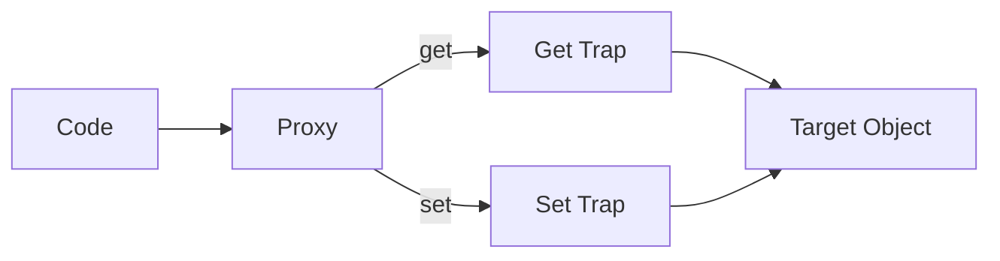

### Novice Explanation:
Think of a Proxy like a bouncer at a club. The club is your object, and the bouncer is the Proxy. When someone (your code) tries to enter the club (access or modify the object), they have to go through the bouncer first. The bouncer can decide to let them in as-is, modify their entry in some way, or even deny entry altogether. This allows you to control and customize how your object is interacted with.

## 4. How do you implement a singleton pattern in JavaScript?

The Singleton pattern is a design pattern that restricts the instantiation of a class to a single instance. This is useful when exactly one object is needed to coordinate actions across the system.

### Implementation Steps:
1. Create a class with a private constructor
2. Create a static method that returns the single instance
3. Ensure that only one instance is ever created

### Example:

```javascript
class Singleton {
  constructor() {
    if (Singleton.instance) {
      return Singleton.instance;
    }
    this.data = [];
    Singleton.instance = this;
  }

  addItem(item) {
    this.data.push(item);
  }

  getItems() {
    return this.data;
  }
}

// Usage
const instance1 = new Singleton();
const instance2 = new Singleton();

console.log(instance1 === instance2);  // true

instance1.addItem("apple");
console.log(instance2.getItems());  // ["apple"]
```

### Diagram:
```mermaid
graph TD
    A[Singleton Class] --> B[Private Constructor]
    A --> C[Static Instance]
    D[instance1 = new Singleton()] --> C
    E[instance2 = new Singleton()] --> C
```

### Novice Explanation:
Imagine you're in charge of a country. In most countries, there's only one president at a time. No matter how many times people try to elect a president, they always end up with the same person in charge until that person's term is over. A Singleton is like this president - no matter how many times you try to create a new instance of the class, you always get the same instance back. This is useful when you want to ensure that there's only one "thing" controlling or managing a particular aspect of your program.

## 5. What are Web Workers and how do they work?

Web Workers are a feature in web browsers that allow scripts to run in the background, separate from the main page script. This enables long-running scripts to be executed without affecting the performance of the page.

### Key Characteristics:
1. Run in a separate thread from the main page
2. Cannot access the DOM directly
3. Communicate with the main page via a messaging system

### Types of Web Workers:
1. Dedicated Workers: Used by a single script
2. Shared Workers: Can be accessed by multiple scripts from different windows, iframes, etc.
3. Service Workers: Act as proxy servers between web applications, the browser, and the network

### Example:

Main Page (main.js):
```javascript
const worker = new Worker('worker.js');

worker.postMessage('Start working');

worker.onmessage = function(e) {
  console.log('Received from worker:', e.data);
};
```

Worker (worker.js):
```javascript
self.onmessage = function(e) {
  console.log('Received from main script:', e.data);
  
  // Simulate some heavy computation
  let result = 0;
  for (let i = 0; i < 1000000000; i++) {
    result += i;
  }
  
  self.postMessage(result);
};
```

### Diagram:
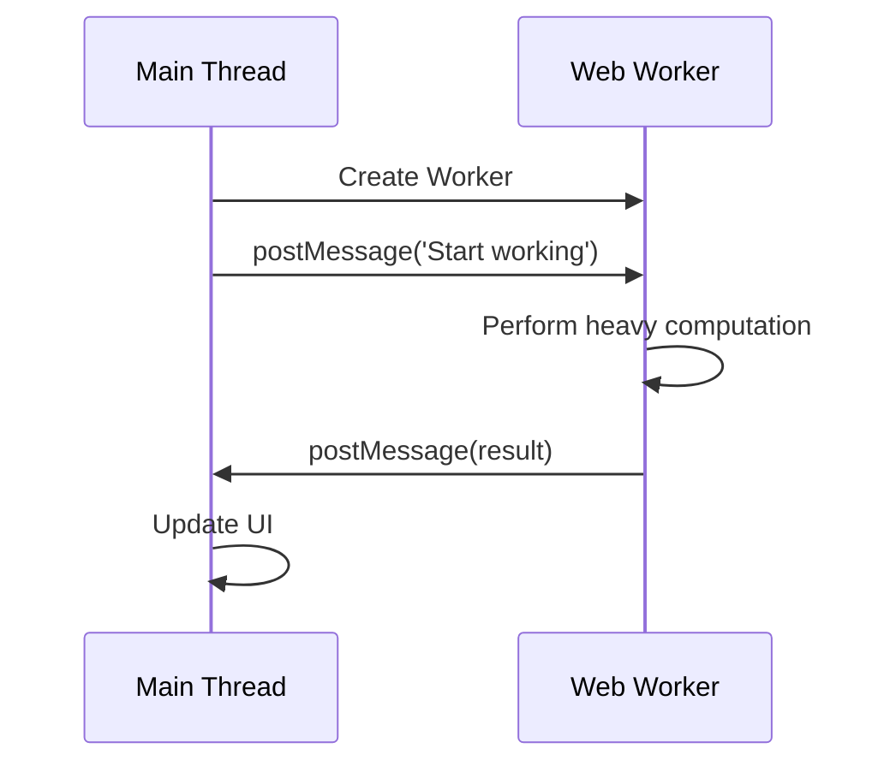

### Novice Explanation:
Imagine you're cooking a complex meal. Normally, you'd have to do everything yourself - chop vegetables, cook meat, prepare sauce, etc. This is like running everything in the main thread of JavaScript. Now imagine you have a helper in the kitchen. You can ask this helper to do some tasks (like chopping vegetables) while you focus on other parts of the meal. This helper is like a Web Worker. They can do work independently of you, and when they're done, they let you know. This allows you to get more done without getting overwhelmed or slowing down the main cooking process (or in the case of web pages, without freezing the UI).

## 6. Explain the differences between `let`, `const`, and `var`.

`let`, `const`, and `var` are all used for variable declarations in JavaScript, but they have different scoping rules and behaviors.

### var:
- Function-scoped or globally-scoped
- Can be redeclared and updated
- Hoisted to the top of its scope and initialized with `undefined`

### let:
- Block-scoped
- Can be updated but not redeclared in the same scope
- Not hoisted

### const:
- Block-scoped
- Cannot be updated or redeclared
- Must be initialized at declaration
- For objects and arrays, the reference is constant, but the content can be modified

### Example:

```javascript
// var
var x = 1;
if (true) {
    var x = 2;  // Same variable!
    console.log(x);  // 2
}
console.log(x);  // 2

// let
let y = 1;
if (true) {
    let y = 2;  // Different variable
    console.log(y);  // 2
}
console.log(y);  // 1

// const
const z = 1;
// z = 2;  // Error: Assignment to a constant variable

const obj = {prop: 1};
obj.prop = 2;  // OK
console.log(obj.prop);  // 2

// obj = {};  // Error: Assignment to a constant variable
```

### Diagram:
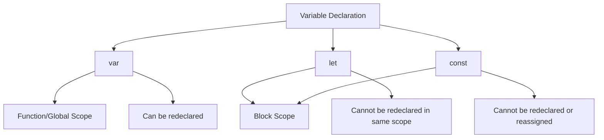

### Novice Explanation:
Think of variables like boxes for storing things:
- `var` is like a box that can be opened from anywhere in the room (function) and you can replace its contents as many times as you want.
- `let` is like a box that can only be opened within a specific area (block) of the room, and you can change what's inside, but you can't bring in a new box with the same name to that area.
- `const` is like a sealed box that can only be accessed within a specific area (block) of the room. Once you put something in it, you can't replace the entire contents, but if the contents are something like a list, you can still modify the list itself.

## 7. What is the difference between a function declaration and a function expression?

Function declarations and function expressions are two ways to define functions in JavaScript, but they have some key differences in how they are hoisted and when they can be used.

### Function Declaration:
- Hoisted to the top of their scope
- Can be called before they are defined in the code
- Always have a name

### Function Expression:
- Not hoisted
- Cannot be called before they are defined in the code
- Can be anonymous or named

### Example:

```javascript
// Function Declaration
console.log(sum(2, 3));  // Works! Outputs: 5

function sum(a, b) {
    return a + b;
}

// Function Expression
console.log(multiply(2, 3));  // Error: multiply is not a function

var multiply = function(a, b) {
    return a * b;
};

// Named Function Expression
var factorial = function fact(n) {
    return n <= 1 ? 1 : n * fact(n - 1);
};
```

### Diagram:
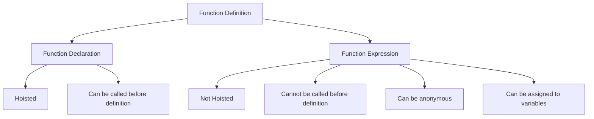

### Novice Explanation:
Think of function declarations like putting a sign on a building. As soon as the city (JavaScript environment) is built, all the signs are put up, so you can find and use any building right away. Function expressions, on the other hand, are like food trucks. They're not set up until the code reaches that point, so you can't order from them until they've arrived and set up shop.

## 8. How do you handle asynchronous operations in JavaScript?

Asynchronous operations in JavaScript are operations that take some time to complete and don't block the execution of the rest of the code. There are several ways to handle asynchronous operations:

### 1. Callbacks:
- The oldest method
- Can lead to "callback hell" with nested callbacks

### 2. Promises:
- Represent a value that may not be available yet
- Have three states: pending, fulfilled, or rejected
- Use `.then()` for success and `.catch()` for errors

### 3. Async/Await:
- Syntactic sugar on top of Promises
- Makes asynchronous code look and behave more like synchronous code
- Uses `try/catch` for error handling

### Example:

```javascript
// Callbacks
function fetchData(callback) {
    setTimeout(() => {
        callback('Data');
    }, 1000);
}

fetchData((data) => {
    console.log(data);
});

// Promises
function fetchDataPromise() {
    return new Promise((resolve, reject) => {
        setTimeout(() => {
            resolve('Data');
        }, 1000);
    });
}

fetchDataPromise()
    .then(data => console.log(data))
    .catch(error => console.error(error));

// Async/Await
async function fetchAndLogData() {
    try {
        const data = await fetchDataPromise();
        console.log(data);
    } catch (error) {
        console.error(error);
    }
}

fetchAndLogData();
```

### Diagram:
```mermaid
graph TD
    A[Asynchronous Operations] --> B[Callbacks]
    A --> C[Promises]
    A --> D[Async/Await]
    B --> E[Nested structure]
    C --> F[Chain of .then()]
    D --> G[Linear structure]
    C --> H[.catch() for errors]
    D --> I[try/catch for errors]
```

### Novice Explanation:
Imagine you're at a coffee shop:
1. Callbacks are like leaving your name and number, saying "Call me when my coffee is ready."
2. Promises are like taking a buzzer that will light up when your coffee is ready. You can decide what to do when it buzzes (`.then()`) or if something goes wrong (`.catch()`).
3. Async/Await is like saying "I'll wait here until my coffee is ready" but without actually blocking the line. You can do other things while waiting, and when the coffee is ready, you'll pick up right where you left off.

## 9. What are service workers and how do they enhance web applications?

Service Workers are scripts that run in the background, separate from a web page, opening the door to features that don't need a web page or user interaction.

### Key Features:
1. Offline functionality
2. Background sync
3. Push notifications
4. Caching of assets and API calls

### How They Work:
1. Service Worker is registered by the web application
2. It can intercept and handle network requests
3. It can access the cache and IndexedDB
4. It runs in the background and can be active even when the application is closed

### Example:

```javascript
// Registering a Service Worker
if ('serviceWorker' in navigator) {
  navigator.serviceWorker.register('/sw.js')
    .then(registration => {
      console.log('Service Worker registered with scope:', registration.scope);
    })
    .catch(error => {
      console.error('Service Worker registration failed:', error);
    });
}

// Service Worker script (sw.js)
self.addEventListener('install', event => {
  event.waitUntil(
    caches.open('my-cache').then(cache => {
      return cache.addAll([
        '/',
        '/styles/main.css',
        '/script/main.js'
      ]);
    })
  );
});

self.addEventListener('fetch', event => {
  event.respondWith(
    caches.match(event.request).then(response => {
      return response || fetch(event.request);
    })
  );
});
```

### Diagram:
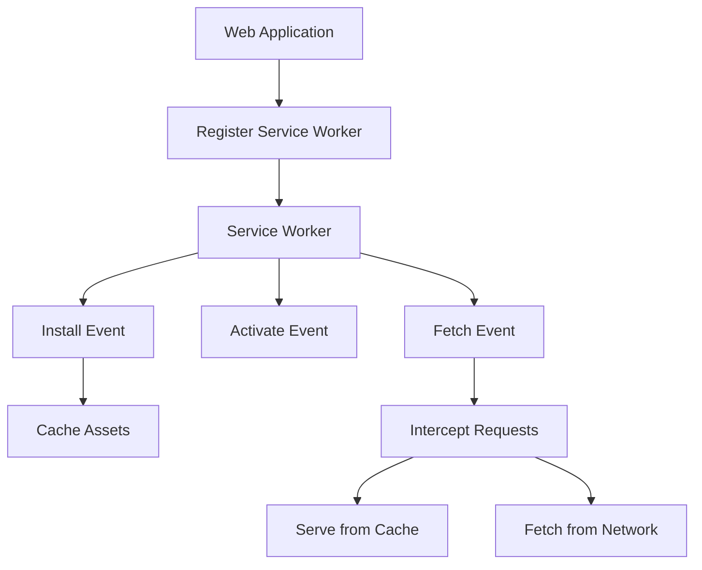

### Novice Explanation:
Imagine a Service Worker as a personal assistant for your web app. This assistant works behind the scenes, even when you're not actively using the app. They can:
1. Remember important information (caching), so you can access it even without internet.
2. Check for updates and new messages (background sync and push notifications).
3. Handle requests for information, deciding whether to get it from memory or ask for fresh data.
This makes your web app faster, more reliable, and able to work even when you're offline.

## 10. What is the purpose of the `Reflect` API in JavaScript?

The `Reflect` API in JavaScript provides methods for interceptable JavaScript operations. It's a built-in object that provides methods for interceptable JavaScript operations.

### Key Purposes:
1. More reliable way to perform certain object operations
2. A single place to access all reflection methods
3. Works well with the Proxy API

### Common Methods:
- `Reflect.get()`: Gets a property from an object
- `Reflect.set()`: Sets a property on an object
- `Reflect.has()`: Checks if a property exists on an object
- `Reflect.deleteProperty()`: Deletes a property from an object
- `Reflect.apply()`: Calls a function with given arguments

### Example:

```javascript
const person = {
  name: "Alice",
  age: 25
};

// Getting a property
console.log(Reflect.get(person, 'name'));  // "Alice"

// Setting a property
Reflect.set(person, 'job', 'Developer');
console.log(person.job);  // "Developer"

// Checking if a property exists
console.log(Reflect.has(person, 'age'));  // true

// Deleting a property
Reflect.deleteProperty(person, 'age');
console.log(person.age);  // undefined

// Applying a function
function greet(greeting) {
  return `${greeting}, ${this.name}!`;
}

console.log(Reflect.apply(greet, person, ['Hello']));  // "Hello, Alice!"
```

### Diagram:
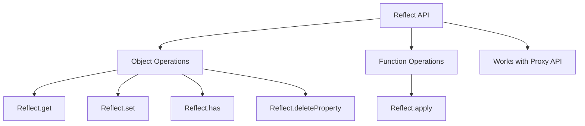

### Novice Explanation:
Think of the `Reflect` API as a Swiss Army knife for working with objects and functions in JavaScript. Instead of using different tools scattered around (like the dot notation, `delete` operator, `in` operator, etc.), `Reflect` gives you a single, organized toolkit. It's like having a professional handyman's toolbox instead of random tools spread around your house. This makes your code more organized and consistent, especially when you're doing complex operations on objects or working with the advanced features of JavaScript like Proxies.

## 11. What is an Immediately Invoked Function Expression (IIFE)?

An Immediately Invoked Function Expression (IIFE) is a JavaScript function that runs as soon as it is defined. It's a design pattern which is also known as a Self-Executing Anonymous Function.

#### Key Points:
1. It's a function expression that is invoked immediately after it's created.
2. It creates a new scope, helping to avoid polluting the global scope.
3. Variables defined inside an IIFE are not accessible from outside.
4. It's often used for initialization code or to create private variables and functions.

#### Example:

```javascript
(function() {
    var privateVar = "I'm private";
    console.log(privateVar);  // "I'm private"
})();

console.log(typeof privateVar);  // "undefined"

// IIFE with parameters
(function(name) {
    console.log("Hello, " + name);
})("John");  // "Hello, John"
```

#### Diagram:
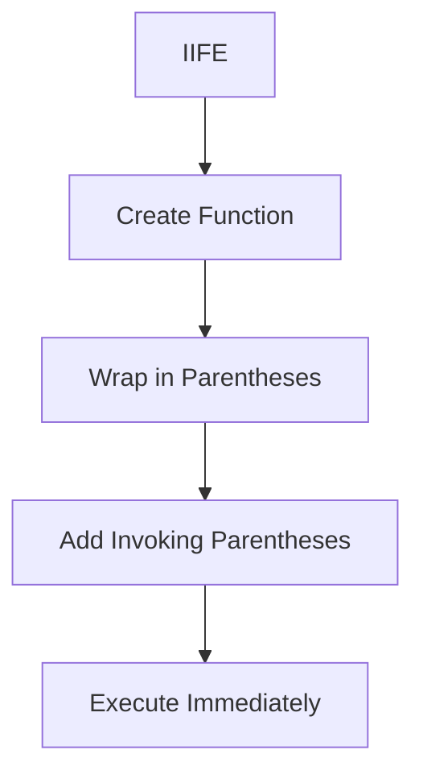

#### Novice Explanation:
Think of an IIFE like a self-destructing message in a spy movie. As soon as the spy opens the message (the function is defined), it plays (executes) and then destroys itself (the variables inside can't be accessed afterwards). This is useful when you want to run some code right away without leaving any traces (variables) that could interfere with other parts of your program.

### What are the different ways to declare variables in JavaScript?

In JavaScript, there are three main ways to declare variables: `var`, `let`, and `const`. Each has its own characteristics and use cases.

#### 1. var:
- Function-scoped or globally-scoped
- Can be redeclared and updated
- Hoisted to the top of its scope and initialized with `undefined`

#### 2. let:
- Block-scoped
- Can be updated but not redeclared in the same scope
- Not hoisted

#### 3. const:
- Block-scoped
- Cannot be updated or redeclared
- Must be initialized at declaration
- For objects and arrays, the reference is constant, but the content can be modified

#### Example:

```javascript
// var
var x = 1;
if (true) {
    var x = 2;  // Same variable!
    console.log(x);  // 2
}
console.log(x);  // 2

// let
let y = 1;
if (true) {
    let y = 2;  // Different variable
    console.log(y);  // 2
}
console.log(y);  // 1

// const
const z = 1;
// z = 2;  // Error: Assignment to a constant variable

const obj = {prop: 1};
obj.prop = 2;  // OK
console.log(obj.prop);  // 2

// obj = {};  // Error: Assignment to a constant variable
```

#### Diagram:


#### Novice Explanation:
Think of declaring variables like setting up different types of storage in your room:
- `var` is like a whiteboard that anyone can see and change from anywhere in the room.
- `let` is like a notebook that you can only write in when you're in a specific area of the room, and you can erase and rewrite in it.
- `const` is like a plaque on the wall. Once you put it up, you can't take it down or change what it says. But if it's a plaque with a list (an object or array), you can change the items on the list, just not replace the entire plaque.

## 12. What is the purpose of the `typeof` operator?

The `typeof` operator in JavaScript is used to determine the type of a variable or expression. It returns a string indicating the type of the unevaluated operand.

#### Key Points:
1. Returns a string representing the data type
2. Works with variables, literals, and expressions
3. Has some quirks and limitations (e.g., `typeof null` returns "object")
4. Useful for type checking and debugging

#### Example:

```javascript
console.log(typeof 42);           // "number"
console.log(typeof 'hello');      // "string"
console.log(typeof true);         // "boolean"
console.log(typeof undefined);    // "undefined"
console.log(typeof null);         // "object" (this is a known quirk)
console.log(typeof {});           // "object"
console.log(typeof []);           // "object"
console.log(typeof function(){}); // "function"
console.log(typeof Symbol());     // "symbol"

let x;
console.log(typeof x);            // "undefined"
```

#### Diagram:
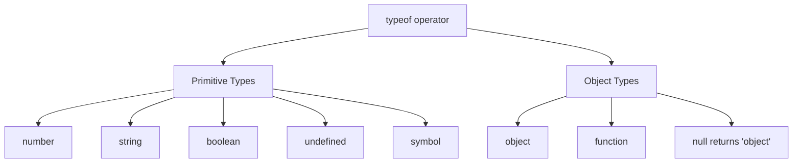

#### Novice Explanation:
Imagine you have a magic wand (the `typeof` operator) that can tell you what kind of thing you're pointing at. Wave it at a number, it says "number". Wave it at a word, it says "string". It's really helpful when you're not sure what kind of data you're dealing with. However, like all magic, it has some quirks - for example, if you wave it at nothing (`null`), it mistakenly says "object" instead of "null". Despite this, it's still a useful tool for figuring out what kind of data you're working with in your code.

## 13. What is the difference between `for...in` and `for...of` loops?

`for...in` and `for...of` are both looping constructs in JavaScript, but they are used for different purposes and behave differently.

#### for...in:
- Iterates over all enumerable properties of an object
- Used for objects (including arrays, but not recommended for arrays)
- Iterates over property names (keys)

#### for...of:
- Iterates over iterable objects (arrays, strings, maps, sets, etc.)
- Cannot be used with plain objects unless they implement the iterable protocol
- Iterates over property values

#### Example:

```javascript
// for...in
let obj = {a: 1, b: 2, c: 3};
for (let prop in obj) {
    console.log(prop + ': ' + obj[prop]);
}
// Output:
// a: 1
// b: 2
// c: 3

// for...of with array
let arr = ['a', 'b', 'c'];
for (let value of arr) {
    console.log(value);
}
// Output:
// a
// b
// c

// for...of with string
let str = 'hello';
for (let char of str) {
    console.log(char);
}
// Output:
// h
// e
// l
// l
// o
```

#### Diagram:
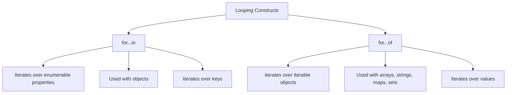

#### Novice Explanation:
Imagine you have a toy box (an object or array). 
- `for...in` is like looking at the labels on each compartment in the toy box. It tells you the names of the compartments, but not what's inside them.
- `for...of` is like taking out each toy one by one and looking at it. It lets you see the actual toys, but doesn't tell you which compartment they came from.

So, if you want to know the names of things, use `for...in`. If you want to see the actual things themselves, use `for...of`.

## 14. What are the differences between synchronous and asynchronous iteration?

Synchronous and asynchronous iteration are two different ways of looping through data in JavaScript, each with its own use cases and behaviors.

#### Synchronous Iteration:
- Processes items one at a time, in order
- Blocks execution until each iteration is complete
- Used with regular arrays and other iterable objects
- Uses `for...of` loops or array methods like `forEach`

#### Asynchronous Iteration:
- Allows processing of asynchronous data sources
- Doesn't block execution between iterations
- Used with asynchronous data streams or promises
- Uses `for await...of` loops or async generators

#### Example:

```javascript
// Synchronous Iteration
const numbers = [1, 2, 3, 4, 5];
for (const num of numbers) {
    console.log(num);
}

// Asynchronous Iteration
async function* asyncGenerator() {
    yield await Promise.resolve(1);
    yield await Promise.resolve(2);
    yield await Promise.resolve(3);
}

(async () => {
    for await (const num of asyncGenerator()) {
        console.log(num);
    }
})();
```

#### Diagram:
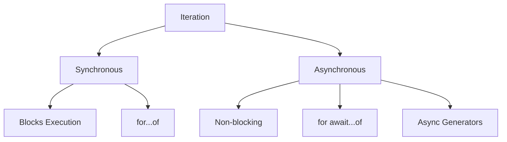

#### Novice Explanation:
Imagine you're reading a book (synchronous iteration) versus watching a TV series (asynchronous iteration).
- When reading a book, you read one page after another in order. You can't move to the next page until you've finished the current one. This is like synchronous iteration.
- When watching a TV series, you watch one episode, then wait for the next one to be released. You can do other things between episodes. This is like asynchronous iteration - you can process other tasks while waiting for the next piece of data.

## 15. How do you create a custom iterator?

A custom iterator in JavaScript is an object that defines a `next()` method, which returns an object with `value` and `done` properties. This allows you to create objects that can be iterated over using `for...of` loops or other iteration methods.

#### Steps to Create a Custom Iterator:
1. Define an object with a `[Symbol.iterator]()` method
2. The `[Symbol.iterator]()` method should return an iterator object
3. The iterator object should have a `next()` method
4. The `next()` method should return `{value: any, done: boolean}`

#### Example:

```javascript
const customIterator = {
    data: ['a', 'b', 'c'],
    [Symbol.iterator]() {
        let index = 0;
        return {
            next: () => {
                if (index < this.data.length) {
                    return { value: this.data[index++], done: false };
                } else {
                    return { done: true };
                }
            }
        };
    }
};

for (const item of customIterator) {
    console.log(item);
}
// Output:
// a
// b
// c
```

#### Diagram:
```mermaid
graph TD
    A[Custom Iterator] --> B[Object with Symbol.iterator]
    B --> C[Returns Iterator Object]
    C --> D[next() Method]
    D --> E[Returns {value, done}]
```

#### Novice Explanation:
Creating a custom iterator is like designing a custom vending machine. 
1. The vending machine itself is your iterable object.
2. The `[Symbol.iterator]()` method is like inserting a coin to start the vending process.
3. The iterator object returned is like the internal mechanism of the vending machine.
4. The `next()` method is like pressing the button to get the next item.
5. Each time you press the button (`next()`), you either get an item (`value`) or a message saying there are no more items (`done: true`).

## 16. What is the significance of the `Symbol` type in JavaScript?

The `Symbol` type in JavaScript was introduced in ECMAScript 2015 (ES6) and represents a unique identifier. Symbols are primitive values, similar to numbers or strings, but with some special characteristics.

#### Key Points:
1. Every Symbol value is unique and immutable
2. Symbols can be used as property keys in objects
3. Symbols are not enumerable in `for...in` loops
4. Symbols do not auto-convert to strings
5. Symbols can be used to define "hidden" properties on objects

#### Significance:
1. **Unique Identifiers**: Symbols guarantee uniqueness, which is useful for adding properties to objects without risking name collisions.
2. **Well-Known Symbols**: JavaScript uses built-in symbols (like `Symbol.iterator`) to define language-level behavior.
3. **Non-String Property Keys**: Symbols allow non-string values to be used as property keys.
4. **Privacy**: Symbols can create a level of privacy in objects, as they're not easily accessible without a reference to the symbol.

#### Example:

```javascript
const mySymbol = Symbol('mySymbol');
const obj = {
    [mySymbol]: 'Hello, Symbol!'
};

console.log(obj[mySymbol]);  // 'Hello, Symbol!'

// Symbols are not enumerable
for (let key in obj) {
    console.log(key);  // Nothing is logged
}

// Well-known Symbol usage
const iterable = {
    [Symbol.iterator]: function* () {
        yield 1;
        yield 2;
        yield 3;
    }
};

for (let value of iterable) {
    console.log(value);
}
// Output:
// 1
// 2
// 3
```

#### Diagram:
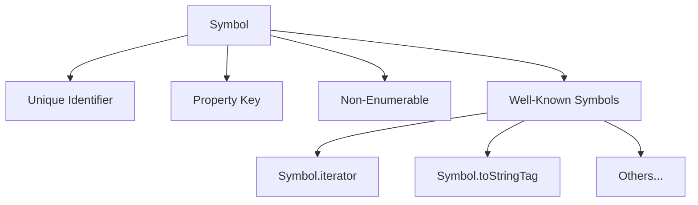

#### Novice Explanation:
Think of Symbols like secret handshakes. Each one is unique, and you can use them to access special "VIP areas" (properties) in objects. Just like how knowing a secret handshake might get you into an exclusive club, having a reference to a Symbol lets you access properties that others can't easily see or accidentally overwrite. They're also used by JavaScript itself for special behaviors, kind of like how certain official handshakes might have specific meanings in different organizations.

## 17. What are the use cases for `WeakMap` and `WeakSet`?

`WeakMap` and `WeakSet` are special kinds of collections in JavaScript that allow only objects as keys (for WeakMap) or values (for WeakSet) and hold "weak" references to these objects.

# WeakMap and WeakSet in JavaScript: Use Cases and Examples

## Introduction

`WeakMap` and `WeakSet` are special data structures in JavaScript that provide unique memory management features. They are particularly useful in scenarios where you need to associate data with objects without preventing those objects from being garbage collected. Let's dive into each of these structures and their use cases.

## WeakMap

### What is a WeakMap?

A `WeakMap` is a collection of key/value pairs where the keys must be objects and the values can be arbitrary values. The "weak" part refers to the fact that the keys are weakly referenced, meaning they can be garbage collected if there are no other references to them.

### Key Features

1. Keys must be objects
2. Keys are weakly referenced
3. Not enumerable (you can't loop over its keys)
4. No size property
5. No clear() method

### Use Cases

1. **Caching and Memoization**
   - Storing computed results associated with objects without causing memory leaks

2. **Storing Private Data**
   - Associating private data with objects in a way that doesn't interfere with garbage collection

3. **Managing Object Metadata**
   - Attaching additional information to objects without modifying them directly

4. **Implementing Object-related Caches**
   - Creating caches that don't prevent objects from being garbage collected when they're no longer needed

### Example: Caching Computed Results

```javascript
const cache = new WeakMap();

function expensiveOperation(obj) {
    if (cache.has(obj)) {
        console.log("Returning cached result");
        return cache.get(obj);
    }

    console.log("Performing expensive operation");
    const result = /* ... perform expensive operation ... */;
    cache.set(obj, result);
    return result;
}

let obj1 = { id: 1 };
let obj2 = { id: 2 };

expensiveOperation(obj1); // Logs: Performing expensive operation
expensiveOperation(obj1); // Logs: Returning cached result
expensiveOperation(obj2); // Logs: Performing expensive operation

obj1 = null; // obj1 can now be garbage collected, and its entry in the WeakMap will be automatically removed
```

## WeakSet

### What is a WeakSet?

A `WeakSet` is a collection of objects where each object may occur only once. Like `WeakMap`, the objects in a `WeakSet` are weakly referenced.

### Key Features

1. Can only contain objects
2. Objects are weakly referenced
3. Not enumerable
4. No size property
5. No clear() method

### Use Cases

1. **Tagging Objects**
   - Marking objects as having a certain property or state without modifying the objects themselves

2. **Storing Unique Object References**
   - Keeping track of a set of objects without preventing their garbage collection

3. **Implementing Object-related Sets**
   - Creating sets of objects that don't prevent those objects from being garbage collected when they're no longer needed elsewhere

### Example: Tagging Objects

```javascript
const visitedPages = new WeakSet();

class WebPage {
    constructor(url) {
        this.url = url;
    }

    visit() {
        if (visitedPages.has(this)) {
            console.log(`You've already visited ${this.url}`);
        } else {
            visitedPages.add(this);
            console.log(`Visiting ${this.url} for the first time`);
        }
    }
}

let page1 = new WebPage('https://example.com');
let page2 = new WebPage('https://another-example.com');

page1.visit(); // Logs: Visiting https://example.com for the first time
page1.visit(); // Logs: You've already visited https://example.com
page2.visit(); // Logs: Visiting https://another-example.com for the first time

page1 = null; // page1 can now be garbage collected, and its entry in the WeakSet will be automatically removed
```

## Comparison: WeakMap/WeakSet vs Map/Set

To better understand the unique features of `WeakMap` and `WeakSet`, let's compare them with their regular counterparts:

| Feature | WeakMap/WeakSet | Map/Set |
|---------|-----------------|---------|
| Key/Element Type | Only objects | Any value |
| Reference Type | Weak | Strong |
| Enumerable | No | Yes |
| Size Property | No | Yes |
| Clear Method | No | Yes |
| Garbage Collection | Allows GC of keys/elements | Prevents GC of keys/elements |

## Memory Management Diagram

Here's a simplified diagram illustrating how WeakMap/WeakSet allow for garbage collection:

```
[Regular Map/Set]     [WeakMap/WeakSet]
      |                     |
      v                     v
+------------+      +------------+
|  Object A  |<-----|  Object A  |
+------------+      +------------+
      ^                     |
      |                     |
[Reference Count: 2]        |
                            |
+------------+      +------------+
|  Object B  |<-----|  Object B  |
+------------+      +------------+
      ^
      |
[Reference Count: 1]

When all other references to Object B are removed:

[Regular Map/Set]     [WeakMap/WeakSet]
      |                     |
      v                     v
+------------+      +------------+
|  Object A  |<-----|  Object A  |
+------------+      +------------+
      ^
      |
[Reference Count: 2]

+------------+
|  Object B  |  (Garbage Collected)
+------------+
```

In this diagram, Object B is garbage collected in the WeakMap/WeakSet scenario because there are no strong references to it, while it's still retained in the regular Map/Set.


`WeakMap` and `WeakSet` are powerful tools in JavaScript for managing object references without interfering with garbage collection. They're particularly useful in scenarios involving caching, private data storage, and object tagging. While their use cases might seem niche, understanding these data structures can lead to more efficient memory management in complex applications.

