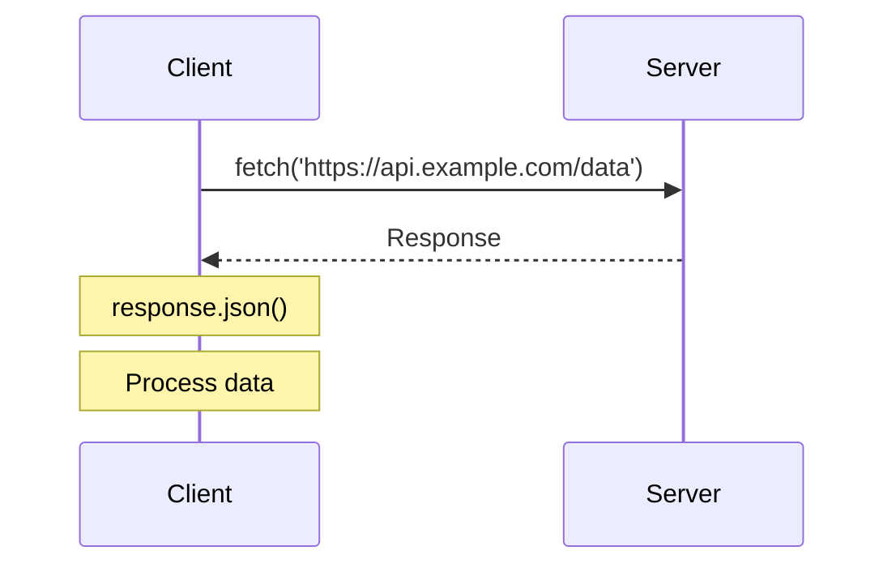
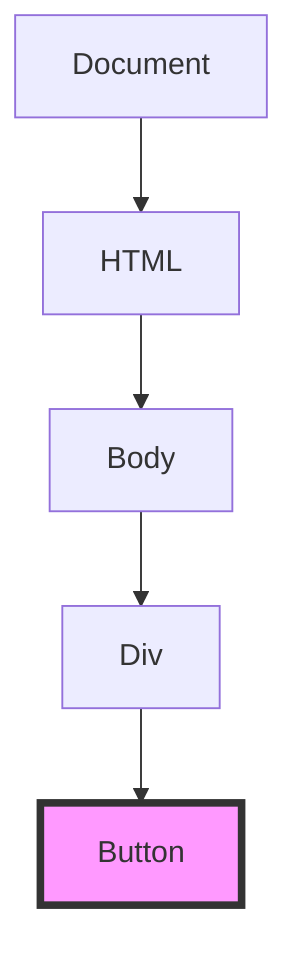
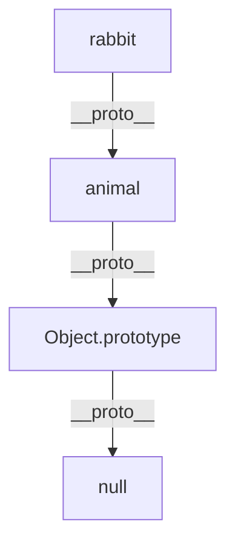
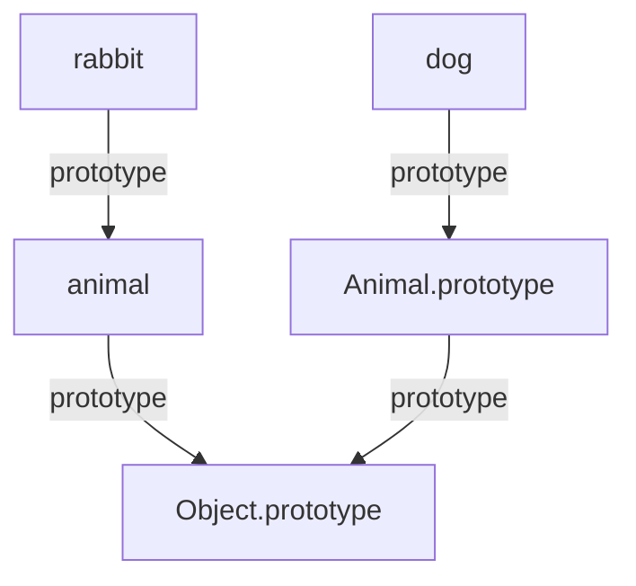
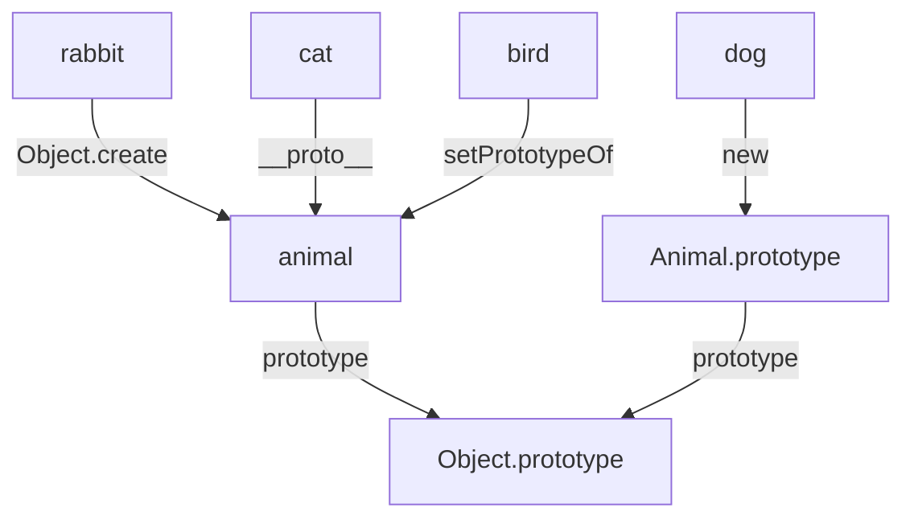
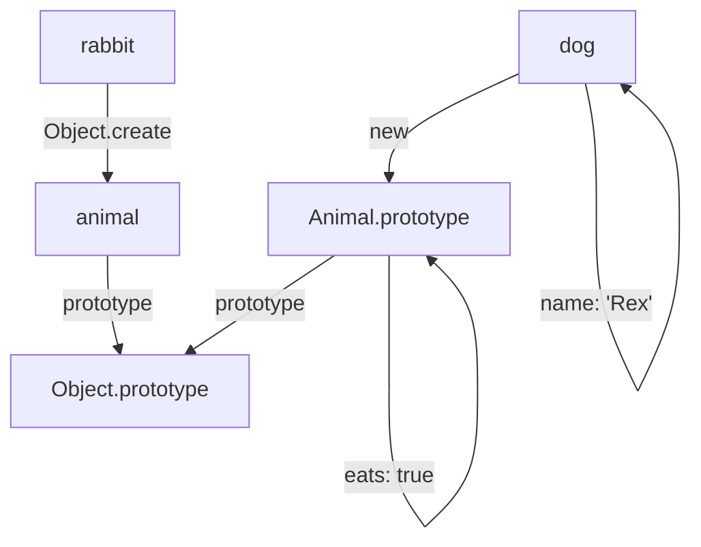
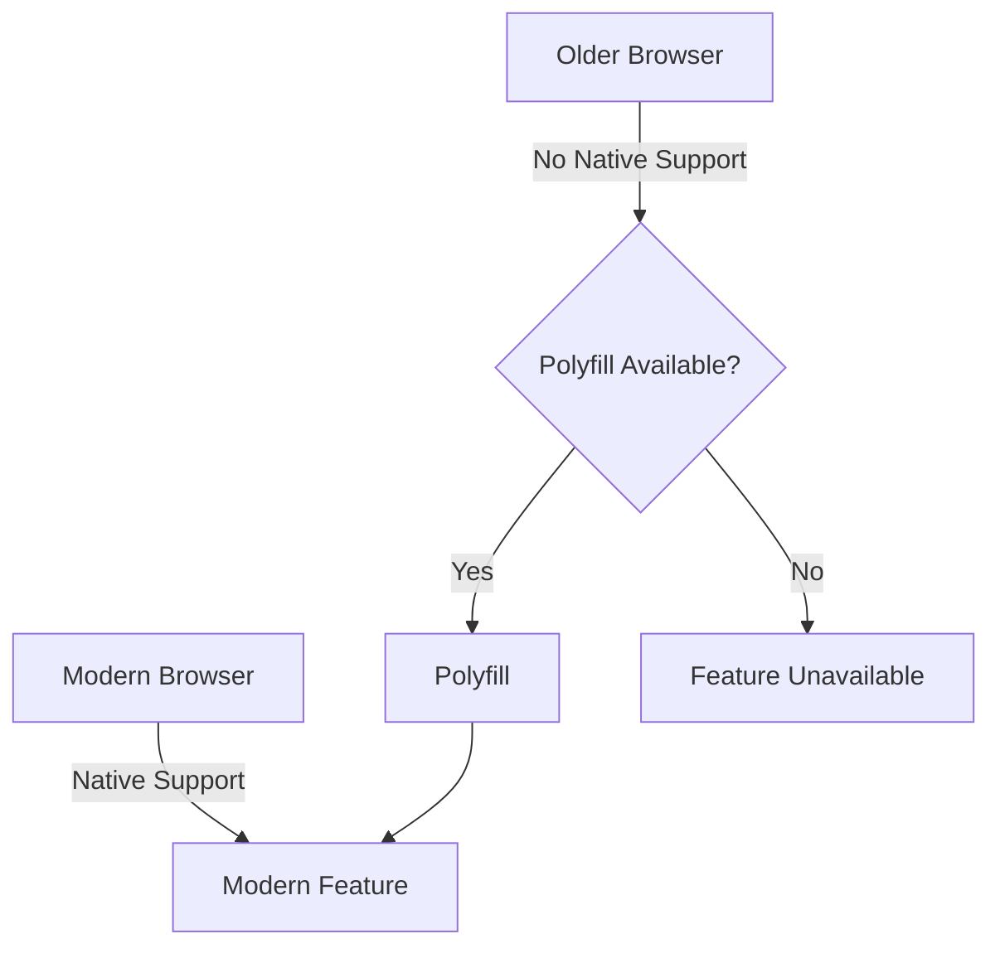
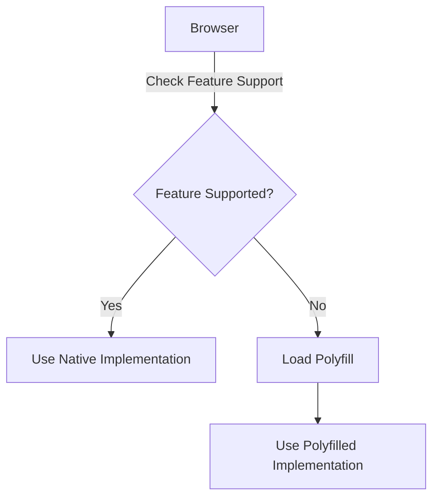
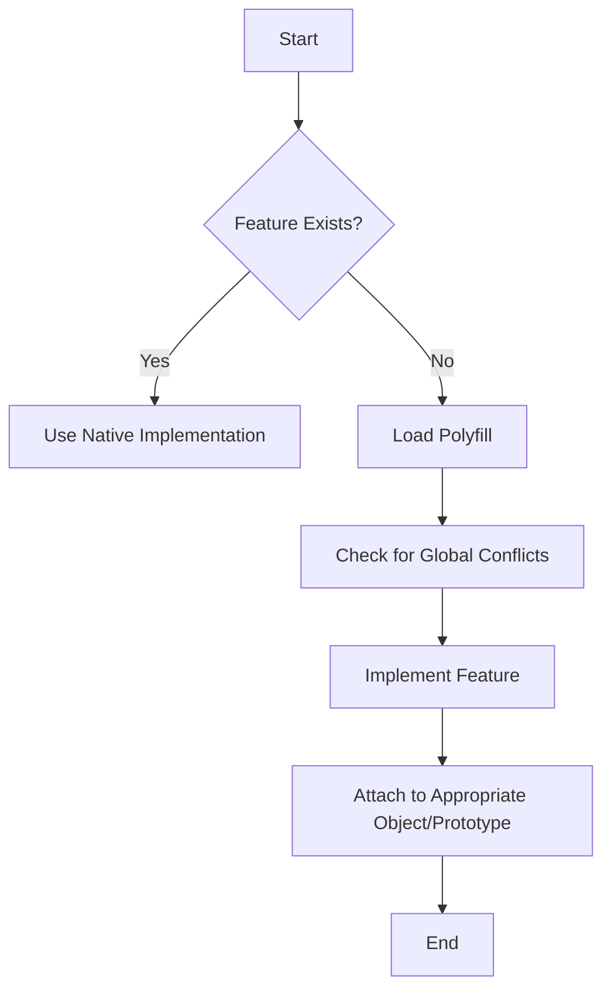

# Comprehensive JavaScript Interview Questions and Answers

## Advanced Questions

### 1. What is the difference between synchronous and asynchronous programming?

Synchronous and asynchronous programming are two different approaches to handling program flow and operations.

**Synchronous Programming:**
- Executes code sequentially, one operation at a time
- Each operation must complete before the next one starts
- Can lead to blocking behavior, especially with time-consuming tasks

**Asynchronous Programming:**
- Allows multiple operations to be in progress simultaneously
- Does not wait for an operation to complete before moving to the next one
- Uses callbacks, promises, or async/await to handle operation completion
- Prevents blocking, improving responsiveness in applications

**Example: Synchronous vs Asynchronous**

```javascript
// Synchronous
console.log("Start");
function syncOperation() {
  for (let i = 0; i < 1000000000; i++) {} // Time-consuming operation
  return "Sync completed";
}
console.log(syncOperation());
console.log("End");

// Output:
// Start
// (pause for several seconds)
// Sync completed
// End

// Asynchronous
console.log("Start");
function asyncOperation() {
  return new Promise(resolve => {
    setTimeout(() => resolve("Async completed"), 2000);
  });
}
asyncOperation().then(console.log);
console.log("End");

// Output:
// Start
// End
// (after 2 seconds)
// Async completed
```

**Diagram: Synchronous vs Asynchronous**
```
Synchronous:             Asynchronous:
┌─────┐                  ┌─────┐
│Task1│                  │Task1│──────────┐
└──┬──┘                  └─────┘          │
   │                     ┌─────┐          │
┌──▼──┐                  │Task2│──────┐   │
│Task2│                  └─────┘      │   │
└──┬──┘                  ┌─────┐      │   │
   │                     │Task3│      │   │
┌──▼──┐                  └─────┘      │   │
│Task3│                      ▲        │   │
└─────┘                      │        │   │
                         ┌───┴────────┴───▼──┐
                         │   Completion      │
                         └──────────────────┘
```

### 2. Explain the concept of debouncing and throttling.

Debouncing and throttling are techniques used to control how many times a function is called over time, often applied to optimize performance in event-driven programming.

**Debouncing:**
- Delays the execution of a function until after a certain amount of time has passed since the last invocation
- Useful for handling rapid, successive events (e.g., typing in a search box)

**Throttling:**
- Limits the rate at which a function can be called
- Ensures the function is called at most once in a specified time period
- Useful for consistent, periodic updates (e.g., infinite scrolling)

**Example: Debounce**

```javascript
function debounce(func, delay) {
  let timeoutId;
  return function (...args) {
    clearTimeout(timeoutId);
    timeoutId = setTimeout(() => func.apply(this, args), delay);
  };
}

const expensiveOperation = () => console.log('Expensive operation');
const debouncedOperation = debounce(expensiveOperation, 300);

// Rapid invocations
debouncedOperation();
debouncedOperation();
debouncedOperation();

// Only the last invocation will be executed after 300ms
```

**Example: Throttle**

```javascript
function throttle(func, limit) {
  let inThrottle;
  return function (...args) {
    if (!inThrottle) {
      func.apply(this, args);
      inThrottle = true;
      setTimeout(() => inThrottle = false, limit);
    }
  };
}

const scrollHandler = () => console.log('Scroll event');
const throttledScroll = throttle(scrollHandler, 1000);

// Attach to scroll event
window.addEventListener('scroll', throttledScroll);
```

**Diagram: Debounce vs Throttle**
```
Debounce:
Events:    │ │ │   │ │     │ │ │
           ▼ ▼ ▼   ▼ ▼     ▼ ▼ ▼
Execution:         │         │
           ────────┘         └────────▶ time

Throttle:
Events:    │ │ │   │ │     │ │ │
           ▼ ▼ ▼   ▼ ▼     ▼ ▼ ▼
Execution: │     │     │     │
           ▼     ▼     ▼     ▼
           ──────────────────────────▶ time
```

### 3. What is the difference between deep copy and shallow copy?

Understanding the difference between deep copy and shallow copy is crucial when working with complex data structures in JavaScript.

**Shallow Copy:**
- Creates a new object, but keeps references to nested objects
- Only the top-level properties are duplicated
- Changes to nested objects in the copy will affect the original

**Deep Copy:**
- Creates a completely independent copy of an object, including all nested objects
- Changes to the copy do not affect the original at any level

**Example: Shallow Copy vs Deep Copy**

```javascript
// Original object
const original = {
  name: "John",
  age: 30,
  address: {
    city: "New York",
    country: "USA"
  }
};

// Shallow copy
const shallowCopy = { ...original };

// Deep copy (simple implementation, not suitable for complex objects)
const deepCopy = JSON.parse(JSON.stringify(original));

// Modifying copies
shallowCopy.name = "Jane";
shallowCopy.address.city = "Los Angeles";

deepCopy.name = "Alice";
deepCopy.address.city = "Chicago";

console.log(original);
// Output: { name: "John", age: 30, address: { city: "Los Angeles", country: "USA" } }

console.log(shallowCopy);
// Output: { name: "Jane", age: 30, address: { city: "Los Angeles", country: "USA" } }

console.log(deepCopy);
// Output: { name: "Alice", age: 30, address: { city: "Chicago", country: "USA" } }
```

**Diagram: Shallow Copy vs Deep Copy**
```
Shallow Copy:                 Deep Copy:
┌────────────┐                ┌────────────┐
│  Original  │                │  Original  │
├────────────┤                ├────────────┤
│ name: John │                │ name: John │
│ age: 30    │                │ age: 30    │
│ address:   │◄───────┐       │ address:   │
└────────────┘        │       └────────────┘
      ▲               │             ▲
      │               │             │
┌─────┴──────┐  ┌─────┴─────┐ ┌─────┴──────┐
│ Shallow    │  │ address:  │ │ Deep Copy  │
│ Copy       │  │ city: NY  │ ├────────────┤
├────────────┤  │ country:  │ │ name: Alice│
│ name: Jane │  │   USA     │ │ age: 30    │
│ age: 30    │  └───────────┘ │ address:   │
│ address:   │──┐             └────────────┘
└────────────┘  │                   │
                │             ┌─────▼─────┐
                │             │ address:  │
                └──────────── │ city: Chi │
                              │ country:  │
                              │   USA     │
                              └───────────┘
```

In the diagram, you can see that the shallow copy shares the same reference to the nested `address` object with the original, while the deep copy creates a completely new structure.

### 4. How does error handling work in JavaScript?

Error handling in JavaScript is primarily done using the `try...catch` statement, along with the `throw` statement for custom error creation. This mechanism allows developers to gracefully handle and respond to runtime errors.

**Key components:**
1. `try` block: Contains the code that might throw an error
2. `catch` block: Handles the error if one occurs in the `try` block
3. `finally` block: Executes regardless of whether an error occurred (optional)
4. `throw` statement: Used to create custom errors

**Example: Basic Error Handling**

```javascript
function divide(a, b) {
  if (b === 0) {
    throw new Error("Division by zero");
  }
  return a / b;
}

try {
  console.log(divide(10, 2)); // Output: 5
  console.log(divide(10, 0)); // Throws an error
} catch (error) {
  console.error("An error occurred:", error.message);
} finally {
  console.log("Operation completed");
}

// Output:
// 5
// An error occurred: Division by zero
// Operation completed
```

**Types of Errors:**
1. `Error`: Base object for user-defined exceptions
2. `SyntaxError`: Raised for syntax errors
3. `ReferenceError`: Raised when using undefined variables
4. `TypeError`: Raised when a value is not of the expected type
5. `RangeError`: Raised when a value is not in the expected range
6. `URIError`: Raised when using global URI handling functions incorrectly

**Example: Custom Error**

```javascript
class ValidationError extends Error {
  constructor(message) {
    super(message);
    this.name = "ValidationError";
  }
}

function validateUser(user) {
  if (!user.name) {
    throw new ValidationError("Name is required");
  }
  if (user.age < 18) {
    throw new ValidationError("User must be at least 18 years old");
  }
}

try {
  validateUser({ name: "John", age: 16 });
} catch (error) {
  if (error instanceof ValidationError) {
    console.error("Validation failed:", error.message);
  } else {
    console.error("An unexpected error occurred:", error);
  }
}

// Output: Validation failed: User must be at least 18 years old
```

**Diagram: Error Handling Flow**
```
┌─────────────────┐
│    try block    │
│  ┌───────────┐  │
│  │   Code    │  │
│  └─────┬─────┘  │
└────────┼────────┘
         │ Error?
         ▼
┌─────────────────┐    ┌─────────────────┐
│   catch block   │◄───│  throw Error    │
│  ┌───────────┐  │    └─────────────────┘
│  │ Handle    │  │
│  │ Error     │  │
│  └───────────┘  │
└────────┬────────┘
         │
         ▼
┌─────────────────┐
│  finally block  │
│  (if present)   │
└─────────────────┘
```

This diagram illustrates the flow of execution in a try-catch-finally block, showing how errors are propagated and handled.

### 5. What is Strict mode in JavaScript?

Strict mode is a feature introduced in ECMAScript 5 that allows you to place a program, or a function, in a "strict" operating context. This strict context prevents certain actions from being taken and throws more exceptions.

**Key features of Strict mode:**
1. Eliminates some JavaScript silent errors by changing them to throw errors
2. Fixes mistakes that make it difficult for JavaScript engines to perform optimizations
3. Prohibits some syntax likely to be defined in future versions of ECMAScript

**How to enable Strict mode:**
- For entire scripts: Add `"use strict";` at the beginning of the script
- For functions: Add `"use strict";` at the beginning of the function body

**Example: Strict mode**

```javascript
"use strict";

// This will throw an error in strict mode
x = 3.14; // ReferenceError: x is not defined

function strictFunc() {
  "use strict";
  var y = 3.14; // This is okay
}

function nonStrictFunc() {
  z = 3.14; // This won't throw an error
}

strictFunc();
nonStrictFunc();
```

**Key differences in Strict mode:**
1. Variables must be declared before use
2. Function parameter names must be unique
3. `this` is undefined in the global context (not window in browsers)
4. Assigning to read-only properties throws an error
5. Deleting undeletable properties throws an error
6. `eval` cannot create variables in the surrounding scope

**Example: Strict mode behaviors**

```javascript
"use strict";

// 1. Variables must be declared
x = 5; // Throws ReferenceError

// 2. Duplicate parameter names are not allowed
function sum(a, a, c) { // Throws SyntaxError
  return a + a + c;
}

// 3. 'this' in functions is undefined, not the global object
function globalThis() {
  console.log(this);
}
globalThis(); // undefined, not window or global

// 4. Assigning to read-only properties throws error
var obj = {};
Object.defineProperty(obj, "x", { value: 42, writable: false });
obj.x = 9; // Throws TypeError

// 5. Deleting undeletable properties throws error
delete Object.prototype; // Throws TypeError

// 6. 'eval' doesn't create variables in the surrounding scope
eval("var y = 10;");
console.log(y); // Throws ReferenceError
```

Strict mode is a powerful tool for writing cleaner, more robust JavaScript code, and is especially useful when working on large projects or when preparing code for future compatibility.

### 6. Explain the differences between ES5 and ES6.

ES6 (ECMAScript 2015) introduced several new features and syntax improvements over ES5. Understanding these differences is crucial for modern JavaScript development.

**Key differences:**

1. **Block-scoped variables (`let` and `const`):**
   ES5: Only function-scoped variables (`var`)
   ES6: Introduced block-scoped variables (`let` and `const`)

   ```javascript
   // ES5
   var x = 10;
   
   // ES6
   let y = 20;
   const Z = 30;
   ```

2. **Arrow functions:**
   ES5: Regular function expressions
   ES6: Arrow functions with shorter syntax and lexical `this` binding

   ```javascript
   // ES5
   var sum = function(a, b) {
     return a + b;
   };
   
   // ES6
   const sum = (a, b) => a + b;
   ```

3. **Template literals:**
   ES5: String concatenation
   ES6: Template literals with backticks

   ```javascript
   // ES5
   var name = "John";
   var greeting = "Hello, " + name + "!";
   
   // ES6
   const name = "John";
   const greeting = `Hello, ${name}!`;
   ```

4. **Destructuring assignment:**
   ES5: Manual assignment
   ES6: Destructuring for arrays and objects

   ```javascript
   // ES5
   var person = { name: "John", age: 30 };
   var name = person.name;
   var age = person.age;
   
   // ES6
   const { name, age } = { name: "John", age: 30 };
   ```

5. **Default parameters:**
   ES5: Manual default value assignment
   ES6: Default parameters in function declarations

   ```javascript
   // ES5
   function greet(name) {
     name = name || "Guest";
     console.log("Hello, " + name);
   }
   
   // ES6
   function greet(name = "Guest") {
     console.log(`Hello, ${name}`);
   }
   ```

6. **Rest and Spread operators:**
   ES5: `arguments` object and `apply()` method
   ES6: Rest (`...`) and Spread (`...`) operators

   ```javascript
   // ES5
   function sum() {
     var numbers = Array.prototype.slice.call(arguments);
     return numbers.reduce(function(acc, num) { return acc + num; }, 0);
   }
   
   // ES6
   function sum(...numbers) {
     return numbers.reduce((acc, num) => acc + num, 0);
   }
   ```

7. **Classes:**
   ES5: Constructor functions and prototype-based inheritance
   ES6: Class syntax (syntactic sugar over prototype-based inheritance)

   ```javascript
   // ES5
   function Person(name) {
     this.name = name;
   }
   Person.prototype.greet = function() {
     console.log("Hello, " + this.name);
   };
   
   // ES6
   class Person {
     constructor(name) {
       this.name = name;
     }
     greet() {
       console.log(`Hello, ${this.name}`);
     }
   }
   ```

8. **Modules:**
   ES5: CommonJS or AMD modules
   ES6: Native module system with `import` and `export`

   ```javascript
   // ES5 (CommonJS)
   var math = require('./math');
   module.exports = math.sum;
   
   // ES6
   import { sum } from './math';
   export default sum;
   ```

9. **Promises:**
   ES5: Callback-based asynchronous programming
   ES6: Promise-based asynchronous programming

   ```javascript
   // ES5
   function fetchData(callback) {
     setTimeout(function() {
       callback(null, "Data");
     }, 1000);
   }
   
   // ES6
   function fetchData() {
     return new Promise((resolve) => {
       setTimeout(() => resolve("Data"), 1000);
     });
   }
   ```

10. **Enhanced object literals:**
    ES5: Standard object literal syntax
    ES6: Shorthand property and method definitions, computed property names

    ```javascript
    // ES5
    var name = "John";
    var person = {
      name: name,
      greet: function() {
        console.log("Hello");
      }
    };
    
    // ES6
    const name = "John";
    const person = {
      name,
      greet() {
        console.log("Hello");
      },
      ["say" + "Hi"]() {
        console.log("Hi");
      }
    };
    ```

These are some of the major differences between ES5 and ES6. ES6 brought significant improvements in terms of syntax, functionality, and developer experience, making JavaScript more powerful and expressive.

### 7. What are modules in JavaScript and how do you use them?

Modules in JavaScript are a way to organize code into separate files, making it easier to maintain, reuse, and avoid naming conflicts. ES6 introduced a native module system, which is now widely supported in modern browsers and Node.js.

**Key concepts:**
1. Each module has its own scope
2. Modules can export functionality (variables, functions, classes)
3. Other modules can import this exported functionality

**Syntax:**
- `export`: Used to expose functionality from a module
- `import`: Used to bring functionality from other modules into the current module

**Types of exports:**
1. Named exports
2. Default exports

**Example: Named exports and imports**

```javascript
// math.js
export const PI = 3.14159;

export function square(x) {
  return x * x;
}

export function cube(x) {
  return x * x * x;
}

// main.js
import { PI, square, cube } from './math.js';

console.log(PI);        // 3.14159
console.log(square(2)); // 4
console.log(cube(3));   // 27
```

**Example: Default export and import**

```javascript
// person.js
export default class Person {
  constructor(name) {
    this.name = name;
  }
  
  sayHello() {
    console.log(`Hello, I'm ${this.name}`);
  }
}

// main.js
import Person from './person.js';

const john = new Person("John");
john.sayHello(); // Hello, I'm John
```

**Example: Mixing named and default exports**

```javascript
// utils.js
export const VERSION = "1.0.0";

export function helper() {
  console.log("I'm a helper function");
}

export default function mainFunction() {
  console.log("I'm the main function");
}

// main.js
import mainFunction, { VERSION, helper as helperFunc } from './utils.js';

console.log(VERSION);   // 1.0.0
helperFunc();           // I'm a helper function
mainFunction();         // I'm the main function
```

**Benefits of using modules:**
1. Code organization: Each module can focus on a specific functionality
2. Encapsulation: Modules have their own scope, preventing global namespace pollution
3. Reusability: Modules can be easily shared across different parts of an application or even different projects
4. Dependency management: Clear dependencies between modules

**Diagram: Module System**
```
┌─────────────┐         ┌─────────────┐
│   Module A  │         │   Module B  │
│ ┌─────────┐ │ export  │ ┌─────────┐ │
│ │Function │ ├────────▶│ │Function │ │
│ └─────────┘ │  import │ └─────────┘ │
│ ┌─────────┐ │         │ ┌─────────┐ │
│ │ Class   │ │         │ │ Class   │ │
│ └─────────┘ │         │ └─────────┘ │
└─────────────┘         └─────────────┘
       ▲                       ▲
       │                       │
       │         ┌─────────────┴─┐
       └─────────┤    Main.js    │
                 └───────────────┘
```

This diagram illustrates how different modules can export and import functionality, and how a main file can use multiple modules to build an application.

### 8. How can you optimize the performance of a JavaScript application?

Optimizing the performance of a JavaScript application involves various strategies across different aspects of development. Here are some key approaches:

1. **Minimize DOM manipulation:**
   - Batch DOM updates
   - Use document fragments for multiple insertions
   - Utilize virtual DOM libraries like React for efficient updates

   ```javascript
   // Instead of this
   for (let i = 0; i < 1000; i++) {
     document.body.innerHTML += '<div>' + i + '</div>';
   }
   
   // Do this
   const fragment = document.createDocumentFragment();
   for (let i = 0; i < 1000; i++) {
     const div = document.createElement('div');
     div.textContent = i;
     fragment.appendChild(div);
   }
   document.body.appendChild(fragment);
   ```

2. **Use efficient selectors:**
   - Prefer ID and class selectors over complex CSS selectors
   - Cache DOM selections for repeated use

   ```javascript
   // Instead of this
   document.querySelectorAll('div.class p')[0].style.color = 'red';
   
   // Do this
   const element = document.getElementById('myElement');
   element.style.color = 'red';
   ```

3. **Optimize loops:**
   - Minimize work inside loops
   - Use `for` loops instead of `for...in` for arrays
   - Consider using array methods like `map`, `filter`, `reduce`

   ```javascript
   // Instead of this
   for (let i = 0; i < arr.length; i++) {
     // ...
   }
   
   // Do this
   const len = arr.length;
   for (let i = 0; i < len; i++) {
     // ...
   }
   ```

4. **Debounce and throttle event handlers:**
   - Use debounce for events that can fire rapidly (e.g., resize, scroll)
   - Use throttle for regular intervals

   ```javascript
   function debounce(func, delay) {
     let timeoutId;
     return function (...args) {
       clearTimeout(timeoutId);
       timeoutId = setTimeout(() => func.apply(this, args), delay);
     };
   }
   
   window.addEventListener('resize', debounce(() => {
     // Handle resize
   }, 250));
   ```

5. **Use Web Workers for CPU-intensive tasks:**
   - Offload heavy computations to background threads

   ```javascript
   // main.js
   const worker = new Worker('worker.js');
   worker.postMessage({ data: complexData });
   worker.onmessage = function(e) {
     console.log('Result:', e.data);
   };
   
   // worker.js
   self.onmessage = function(e) {
     const result = performComplexCalculation(e.data);
     self.postMessage(result);
   };
   ```

6. **Optimize asset loading:**
   - Minify and compress JavaScript files
   - Use lazy loading for non-critical resources
   - Implement code splitting in larger applications

7. **Utilize caching:**
   - Use memoization for expensive function calls
   - Leverage browser caching for static assets
   - Implement application-level caching where appropriate

   ```javascript
   function memoize(fn) {
     const cache = new Map();
     return function(...args) {
       const key = JSON.stringify(args);
       if (cache.has(key)) {
         return cache.get(key);
       }
       const result = fn.apply(this, args);
       cache.set(key, result);
       return result;
     }
   }
   
   const expensiveFunction = memoize(function(x, y) {
     // Some expensive operation
   });
   ```

8. **Use appropriate data structures:**
   - Choose the right data structure for your use case (e.g., Map for frequent lookups)
   - Consider using typed arrays for large numerical datasets

9. **Optimize rendering:**
   - Use CSS animations instead of JavaScript where possible
   - Implement virtual scrolling for long lists
   - Use `requestAnimationFrame` for smooth animations

   ```javascript
   function animate() {
     // Update animation
     requestAnimationFrame(animate);
   }
   requestAnimationFrame(animate);
   ```

10. **Profile and monitor performance:**
    - Use browser developer tools to identify bottlenecks
    - Implement performance monitoring in production

**Diagram: Performance Optimization Strategies**
```
┌─────────────────────────────────────────────────────────────────┐
│                   JavaScript Performance                        │
├─────────────────┬─────────────────┬─────────────┬──────────────┤
│ Code Efficiency │   DOM Handling  │   Network   │  Monitoring  │
├─────────────────┼─────────────────┼─────────────┼──────────────┤
│ - Optimize loops│ - Minimize      │ - Minify    │ - Use dev    │
│ - Use efficient │   manipulation  │ - Compress  │   tools      │
│   algorithms    │ - Batch updates │ - Lazy load │ - Implement  │
│ - Memoization   │ - Use fragments │ - Caching   │   production │
│ - Avoid bloat   │ - Virtual DOM   │ - CDN use   │   monitoring │
└─────────────────┴─────────────────┴─────────────┴──────────────┘
```
## 9. What is the purpose of the `fetch` API?

The `fetch` API is a modern interface for making network requests in JavaScript. It provides a more powerful and flexible feature set than older methods like XMLHttpRequest.

### Purpose:
1. To make HTTP requests (GET, POST, PUT, DELETE, etc.) to servers
2. To handle responses from these requests
3. To provide a simpler syntax for asynchronous operations

### Key Features:
- Returns Promises, allowing for easier chaining of asynchronous operations
- Provides a single consistent API for various types of requests
- Supports streaming responses
- Offers better error handling

### Example:

```javascript
fetch('https://api.example.com/data')
  .then(response => response.json())
  .then(data => console.log(data))
  .catch(error => console.error('Error:', error));
```

### Diagram:


### Novice Explanation:
Imagine you're at a restaurant. The `fetch` API is like a waiter. You (the JavaScript code) give the waiter (fetch) your order (the URL you want to get data from). The waiter goes to the kitchen (server), gets your food (data), and brings it back to you. Just like you might need to unwrap your food before eating it, you often need to process the response (like converting it to JSON) before you can use the data.

## 10. What is the difference between Event Capturing and Event Bubbling?

Event Capturing and Event Bubbling are two phases of event propagation in the DOM (Document Object Model).

### Event Bubbling:
- The event starts from the target element and bubbles up through its ancestors in the DOM tree.
- It's the default behavior in most browsers.
- Goes from the most specific element to the least specific.

### Event Capturing:
- The event starts from the root of the DOM tree and travels down to the target element.
- It's the opposite of bubbling.
- Goes from the least specific element to the most specific.

### Diagram:


In this diagram:
- Capturing phase: A -> B -> C -> D -> E
- Bubbling phase: E -> D -> C -> B -> A

### Example:

```html
<div id="outer">
  <div id="inner">
    <button id="button">Click me</button>
  </div>
</div>
```

```javascript
document.getElementById('outer').addEventListener('click', () => console.log('Outer'), true); // Capturing
document.getElementById('inner').addEventListener('click', () => console.log('Inner'), true); // Capturing
document.getElementById('button').addEventListener('click', () => console.log('Button')); // Bubbling
document.getElementById('inner').addEventListener('click', () => console.log('Inner')); // Bubbling
document.getElementById('outer').addEventListener('click', () => console.log('Outer')); // Bubbling
```

If you click the button, the console output will be:
```
Outer
Inner
Button
Inner
Outer
```

### Novice Explanation:
Think of a family tree. Event Capturing is like starting at the oldest ancestor and working your way down to the youngest. Event Bubbling is like starting with the youngest and working your way up to the oldest. In web pages, elements can be nested inside each other, forming a tree-like structure. When an event happens on an element, it can either "capture" down from the top of the tree or "bubble" up from where it happened.

## 11. Prototype-related Questions

### What is the prototype chain?

The prototype chain is a mechanism in JavaScript that allows objects to inherit properties and methods from other objects. Each object has an internal link to another object called its prototype. That prototype object has its own prototype, and so on, forming a chain that ends with an object whose prototype is null.

#### How it works:
1. When accessing a property or method on an object, JavaScript first looks for it on the object itself.
2. If not found, it looks on the object's prototype.
3. If still not found, it continues up the prototype chain until it reaches an object with a null prototype.
4. If the property or method is not found in the entire chain, undefined is returned.

#### Example:

```javascript
let animal = {
  eats: true
};

let rabbit = {
  jumps: true
};

rabbit.__proto__ = animal; // Sets animal as the prototype of rabbit

console.log(rabbit.eats); // true (inherited from animal)
console.log(rabbit.jumps); // true (own property)
```

#### Diagram:


#### Novice Explanation:
Imagine a family tree. You inherit traits from your parents, who inherited traits from their parents, and so on. In JavaScript, objects work similarly. If an object doesn't have a property, it checks its "parent" (prototype), then its "grandparent", and so on, until it either finds the property or reaches the end of the family tree.

### How does prototypal inheritance work?

Prototypal inheritance is a way for one object to inherit properties and methods from another object. It's the mechanism by which JavaScript objects can inherit features from one another.

#### Key Points:
1. Objects can inherit directly from other objects.
2. The `Object.create()` method can be used to create an object with a specific prototype.
3. Constructor functions can be used with the `new` keyword to create objects with a shared prototype.

#### Example:

```javascript
// Using Object.create()
let animal = {
  eats: true,
  walk() {
    console.log("Animal walks");
  }
};

let rabbit = Object.create(animal);
rabbit.jumps = true;

console.log(rabbit.eats); // true
rabbit.walk(); // "Animal walks"

// Using constructor functions
function Animal(name) {
  this.name = name;
}

Animal.prototype.speak = function() {
  console.log(this.name + ' makes a noise.');
};

let dog = new Animal('Rex');
dog.speak(); // "Rex makes a noise."
```

#### Diagram:


#### Novice Explanation:
Think of prototypal inheritance like a recipe book that gets passed down through generations. Each generation can add its own recipes (properties and methods) to the book. When you want to cook something (use a method or property), you first check your own recipes. If you don't have it, you look in the book you inherited from your parents, then grandparents, and so on.

### How can you create an object with a specific prototype?

There are several ways to create an object with a specific prototype in JavaScript:

1. Using `Object.create()`
2. Using constructor functions with `new`
3. Using the `__proto__` property (not recommended for production code)
4. Using `Object.setPrototypeOf()` (not recommended for performance reasons)

#### Example:

```javascript
// 1. Using Object.create()
let animal = {
  eats: true
};

let rabbit = Object.create(animal);
console.log(rabbit.eats); // true

// 2. Using constructor functions
function Animal(name) {
  this.name = name;
}

Animal.prototype.speak = function() {
  console.log(this.name + ' makes a noise.');
};

let dog = new Animal('Rex');
dog.speak(); // "Rex makes a noise."

// 3. Using __proto__ (not recommended)
let cat = {
  meows: true
};

cat.__proto__ = animal;
console.log(cat.eats); // true

// 4. Using Object.setPrototypeOf() (not recommended)
let bird = {
  flies: true
};

Object.setPrototypeOf(bird, animal);
console.log(bird.eats); // true
```

#### Diagram:


#### Novice Explanation:
Creating an object with a specific prototype is like choosing your mentor. You're saying, "I want to learn from this person and inherit their skills." In JavaScript, you have different ways to do this:
1. `Object.create()` is like formally becoming someone's apprentice.
2. Constructor functions with `new` are like joining a guild where everyone learns the same basic skills.
3. `__proto__` is like informally following someone around to learn from them (but it's not recommended because it can cause confusion).
4. `Object.setPrototypeOf()` is like changing your mentor after you've already started learning (it works, but it can slow things down).

### What is the difference between `Object.create()` and constructor functions?

Both `Object.create()` and constructor functions are used to create objects, but they work in slightly different ways:

#### Object.create():
1. Creates a new object with the specified prototype object
2. Allows direct specification of the new object's prototype
3. Can create objects with null prototype
4. Does not execute a constructor function

#### Constructor Functions:
1. Used with the `new` keyword to create objects
2. The function itself serves as a template for creating objects
3. Automatically sets up the prototype chain
4. Executes the function body as a constructor

#### Example:

```javascript
// Object.create()
let animal = {
  eats: true
};

let rabbit = Object.create(animal);
rabbit.jumps = true;

console.log(rabbit.eats); // true
console.log(rabbit.jumps); // true

// Constructor Function
function Animal(name) {
  this.name = name;
}

Animal.prototype.eats = true;

let dog = new Animal('Rex');
console.log(dog.name); // "Rex"
console.log(dog.eats); // true
```

#### Diagram:


#### Novice Explanation:
Think of `Object.create()` like adopting a child. The child (new object) inherits traits (properties and methods) from their adoptive parent (prototype object), but you can also give them their own unique traits.

Constructor functions, on the other hand, are like a baby-making machine. Each time you use `new`, it's like pressing a button on the machine to create a new baby (object). This baby automatically inherits traits from its parent (the prototype), and the machine (constructor function) can also give it some initial traits of its own.

## 12. Polyfills

### What is a polyfill and why is it used?

A polyfill is a piece of code (usually JavaScript on the Web) used to provide modern functionality on older browsers that do not natively support it. The term comes from polyfilla, a British product used to fill in cracks and holes in walls.

#### Key Points:
1. Polyfills "fill in" the gaps in functionality between newer and older browsers.
2. They allow developers to use modern APIs without worrying about browser compatibility.
3. Polyfills are typically applied only when the browser doesn't support a feature natively.

#### Why Polyfills are Used:
1. Backward Compatibility: To support older browsers while using modern JavaScript features.
2. Consistent Behavior: To ensure that all users have access to the same functionality, regardless of their browser.
3. Easier Development: Developers can write code using the latest standards without worrying about browser support.

#### Example:

```javascript
if (!Array.prototype.includes) {
  Array.prototype.includes = function(searchElement /*, fromIndex*/) {
    'use strict';
    if (this == null) {
      throw new TypeError('Array.prototype.includes called on null or undefined');
    }

    var O = Object(this);
    var len = parseInt(O.length, 10) || 0;
    if (len === 0) {
      return false;
    }
    var n = parseInt(arguments[1], 10) || 0;
    var k;
    if (n >= 0) {
      k = n;
    } else {
      k = len + n;
      if (k < 0) {k = 0;}
    }
    var currentElement;
    while (k < len) {
      currentElement = O[k];
      if (searchElement === currentElement ||
         (searchElement !== searchElement && currentElement !== currentElement)) { // NaN !== NaN
        return true;
      }
      k++;
    }
    return false;
  };
}
```

#### Diagram:


#### Novice Explanation:
Imagine you have an old car that doesn't have a USB port. A polyfill is like an adapter that you plug into the cigarette lighter to give you a USB port. It doesn't change your old car into a new one, but it does allow you to use modern devices with it. In the same way, polyfills allow old browsers to use new JavaScript features, making sure all users can enjoy the same functionality regardless of their browser's age.

### Can you provide examples of commonly used polyfills?

Certainly! Here are some examples of commonly used polyfills:

1. Array Methods:
   - `Array.prototype.forEach`
   - `Array.prototype.map`
   - `Array.prototype.filter`
   - `Array.prototype.reduce`

2. Promise:
   - For browsers that don't support Promises natively

3. Fetch API:
   - For browsers that don't support the Fetch API

4. Object Methods:
   - `Object.create`
   - `Object.keys`
   - `Object.assign`

5. String Methods:
   - `String.prototype.trim`
   - `String.prototype.includes`

#### Example: Polyfill for Array.prototype.map

```javascript
if (!Array.prototype.map) {
  Array.prototype.map = function(callback/*, thisArg*/) {
    var T, A, k;
    if (this == null) {
      throw new TypeError('this is null or not defined');
    }
    var O = Object(this);
    var len = O.length >>> 0;
    if (typeof callback !== 'function') {
      throw new TypeError(callback + ' is not a function');
    }
    if (arguments.length > 1) {
      T = arguments[1];
    }
    A = new Array(len);
    k = 0;
    while (k < len) {
      var kValue, mappedValue;
      if (k in O) {
        kValue = O[k];
        mappedValue = callback.call(T, kValue, k, O);
        A[k] = mappedValue;
      }
      k++;
    }
    return A;
  };
}
```

#### Example: Polyfill for Promise

```javascript
if (typeof Promise !== 'function') {
  window.Promise = function(executor) {
    var callbacks = [];
    var state = 'pending';
    var value;

    function resolve(result) {
      if (state !== 'pending') return;
      state = 'fulfilled';
      value = result;
      callbacks.forEach(function(callback) {
        callback(value);
      });
    }

    function reject(error) {
      if (state !== 'pending') return;
      state = 'rejected';
      value = error;
      callbacks.forEach(function(callback) {
        callback(value);
      });
    }

    this.then = function(onFulfilled) {
      if (state === 'pending') {
        callbacks.push(onFulfilled);
      } else {
        onFulfilled(value);
      }
      return this;
    };

    executor(resolve, reject);
  };
}
```

#### Diagram:


#### Novice Explanation:
Think of polyfills like universal adapters for different electrical outlets around the world. When you travel, you might encounter outlets that don't fit your devices. These adapters (polyfills) allow your devices (modern JavaScript code) to work in any country (browser), regardless of the type of outlet (feature support) available. The examples above are like specific adapters for different types of outlets, each allowing a modern feature to work in an older environment.

### How do polyfills work under the hood?

Polyfills work by adding missing functionality to older environments, typically by checking if a feature exists and providing an implementation if it doesn't. Here's a step-by-step explanation of how polyfills typically work:

1. Feature Detection: The polyfill first checks if the feature is already supported by the browser.
2. Conditional Implementation: If the feature is not supported, the polyfill adds its own implementation to the global scope or the appropriate prototype.
3. Mimicking Native Behavior: The polyfill tries to replicate the behavior of the native implementation as closely as possible.
4. Performance Considerations: Well-written polyfills try to be as performant as possible, but may not be as optimized as native implementations.

#### Example: How a polyfill for Array.prototype.includes might work

```javascript
if (!Array.prototype.includes) {
  Array.prototype.includes = function(searchElement /*, fromIndex*/) {
    'use strict';
    // 1. Feature detection is done in the if statement above

    // 2. Conditional implementation
    var O = Object(this);
    var len = parseInt(O.length, 10) || 0;
    if (len === 0) {
      return false;
    }
    var n = parseInt(arguments[1], 10) || 0;
    var k;
    if (n >= 0) {
      k = n;
    } else {
      k = len + n;
      if (k < 0) {k = 0;}
    }
    var currentElement;
    while (k < len) {
      currentElement = O[k];
      // 3. Mimicking native behavior, including NaN handling
      if (searchElement === currentElement ||
         (searchElement !== searchElement && currentElement !== currentElement)) {
        return true;
      }
      k++;
    }
    return false;
  };
}
```

#### Diagram:


#### Novice Explanation (continued):
Imagine you're learning to cook in a kitchen that's missing some modern appliances. A polyfill is like a chef who checks what's missing and then shows you how to achieve the same result with the tools you do have. For example, if you don't have a food processor, the chef might show you how to chop ingredients finely by hand to get a similar result. The chef (polyfill) first checks what's available in your kitchen (feature detection), then teaches you a technique (implements the feature) that mimics what the modern appliance would do, allowing you to follow modern recipes (use modern JavaScript) even in an old-fashioned kitchen (older browser).
