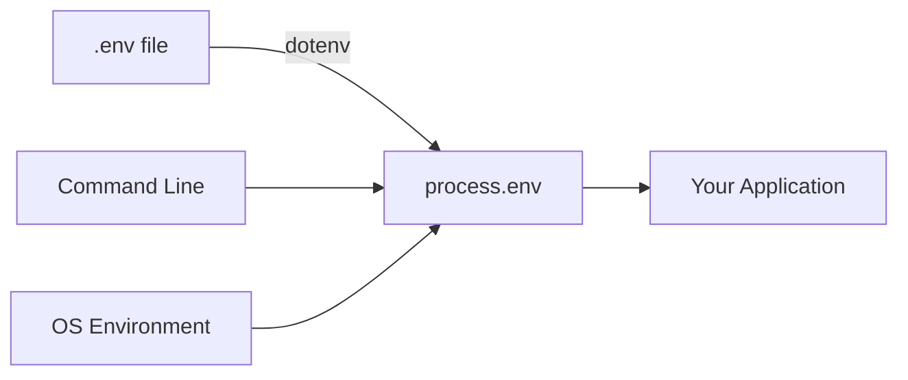
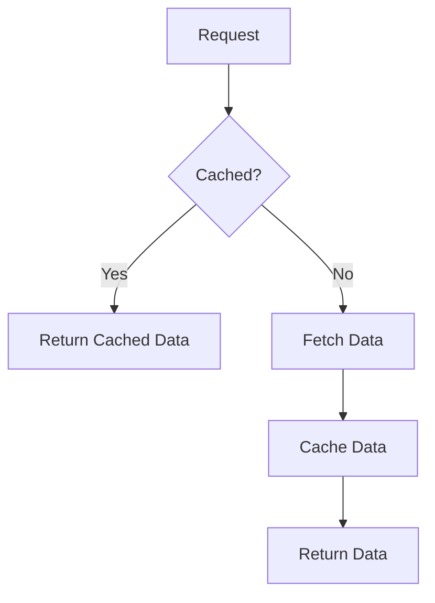
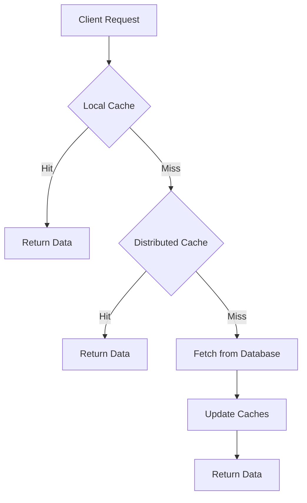
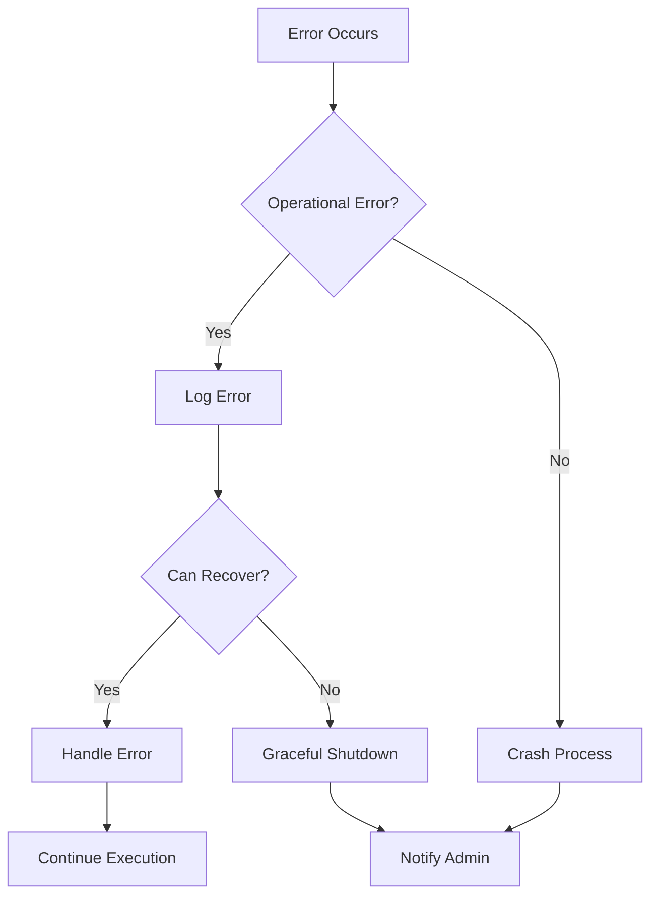

# Node.js Interview Questions and Answers 🚀

## Additional Questions

### What is the role of the `dotenv` package in Node.js?

🌟 **Novice Explanation**: 
The `dotenv` package is like a secret keeper for your Node.js app. It helps you store important information (like passwords) separately from your code, so you can keep your secrets safe while your app still knows how to use them!

🚀 **Expert Explanation**:
The `dotenv` package is a zero-dependency module that loads environment variables from a `.env` file into `process.env`. This is particularly useful for:

1. **Managing Configuration**:
   - Keeps sensitive information out of your codebase.
   - Allows different configurations for different environments (development, staging, production).

2. **Security**:
   - Prevents sensitive data from being committed to version control.
   - Follows the Twelve-Factor App methodology for config management.

3. **Ease of Use**:
   - Simplifies the process of working with environment variables.
   - Makes it easy to switch between different environments.

Here's how to use `dotenv`:

1. Install the package:
   ```bash
   npm install dotenv
   ```

2. Create a `.env` file in the root of your project:
   ```
   DB_HOST=localhost
   DB_USER=root
   DB_PASS=s1mpl3
   ```

3. As early as possible in your application, require and configure dotenv:
   ```javascript
   require('dotenv').config()
   ```

4. Use the environment variables in your application:
   ```javascript
   const db = require('db')
   db.connect({
     host: process.env.DB_HOST,
     username: process.env.DB_USER,
     password: process.env.DB_PASS
   })
   ```

Best Practices:

1. **Never commit `.env` files to version control**:
   - Add `.env` to your `.gitignore` file.
   - Provide a `.env.example` file with dummy values as a template.

2. **Use different `.env` files for different environments**:
   ```javascript
   require('dotenv').config({ path: `.env.${process.env.NODE_ENV}` })
   ```

3. **Validate required environment variables**:
   ```javascript
   const assert = require('assert')
   assert(process.env.API_KEY, 'API_KEY is required')
   ```

4. **Use with TypeScript**:
   For TypeScript projects, you might want to declare the environment variables to get type checking:

   ```typescript
   declare global {
     namespace NodeJS {
       interface ProcessEnv {
         NODE_ENV: 'development' | 'production' | 'test'
         DB_HOST: string
         DB_USER: string
         DB_PASS: string
       }
     }
   }
   ```

5. **Use with custom paths or multiple files**:
   ```javascript
   require('dotenv').config({ path: '/custom/path/to/.env' })
   // Or load multiple files
   require('dotenv').config({ path: '.env.defaults' })
   require('dotenv').config({ path: '.env' })
   ```

6. **Preload dotenv**:
   Instead of requiring and configuring dotenv in your application code, you can preload it:
   ```bash
   node -r dotenv/config your_script.js
   ```

7. **Use with `dotenv-expand` for variable expansion**:
   ```javascript
   const dotenv = require('dotenv')
   const dotenvExpand = require('dotenv-expand')

   const myEnv = dotenv.config()
   dotenvExpand(myEnv)
   ```

   This allows you to use variables within your `.env` file:
   ```
   BASE_URL=http://localhost
   API_URL=${BASE_URL}/api
   ```

Environment Variables Flow:



Remember, while `dotenv` is great for development, in production environments, it's often better to set environment variables through the hosting platform or container orchestration system. This provides better security and easier management of secrets across multiple instances of your application.

---

### How do you implement caching in a Node.js application?

🌟 **Novice Explanation**: 
Caching in Node.js is like having a really good memory. Instead of looking up information every time someone asks for it, you remember the answer and tell them right away. This makes your app much faster!

🚀 **Expert Explanation**:
Implementing caching in a Node.js application can significantly improve performance by reducing the need to repeatedly perform expensive operations. There are several ways to implement caching, depending on your specific needs:

1. **In-Memory Caching**:
   - Fastest option, but limited by available RAM.
   - Good for small to medium-sized datasets.
   - Can use built-in `Map` or libraries like `node-cache`.

   Example using `node-cache`:
   ```javascript
   const NodeCache = require('node-cache');
   const myCache = new NodeCache({ stdTTL: 100, checkperiod: 120 });

   function getCachedData(key, fetchFunction) {
     const value = myCache.get(key);
     if (value) {
       return Promise.resolve(value);
     }
     return fetchFunction().then((result) => {
       myCache.set(key, result);
       return result;
     });
   }

   // Usage
   getCachedData('user:1', () => fetchUserFromDatabase(1))
     .then(user => console.log(user));
   ```

2. **Distributed Caching**:
   - Uses external caching systems like Redis or Memcached.
   - Suitable for large-scale applications and microservices architectures.
   - Allows sharing cache across multiple instances or services.

   Example using Redis with `ioredis`:
   ```javascript
   const Redis = require('ioredis');
   const redis = new Redis();

   async function getCachedData(key, fetchFunction) {
     const cachedValue = await redis.get(key);
     if (cachedValue) {
       return JSON.parse(cachedValue);
     }
     const result = await fetchFunction();
     await redis.set(key, JSON.stringify(result), 'EX', 3600); // Expire in 1 hour
     return result;
   }

   // Usage
   getCachedData('user:1', () => fetchUserFromDatabase(1))
     .then(user => console.log(user));
   ```

3. **HTTP Caching**:
   - Implements caching headers for HTTP responses.
   - Reduces server load and improves client-side performance.
   - Can be implemented using middleware in Express.js.

   Example using `apicache` middleware:
   ```javascript
   const express = require('express');
   const apicache = require('apicache');

   const app = express();
   const cache = apicache.middleware;

   app.get('/api/users', cache('5 minutes'), (req, res) => {
     // Fetch and return users
   });
   ```

4. **Content Delivery Network (CDN)**:
   - Caches static assets across multiple geographical locations.
   - Improves load times for users across different regions.
   - Can be implemented using services like Cloudflare, Amazon CloudFront, or Fastly.

5. **Database Query Caching**:
   - Caches the results of expensive database queries.
   - Can be implemented at the ORM level or using database-specific features.

   Example using Sequelize with Redis:
   ```javascript
   const { Sequelize } = require('sequelize');
   const Redis = require('ioredis');
   const redis = new Redis();

   const sequelize = new Sequelize(/* your config here */);

   sequelize.addHook('afterFind', async (instances, options) => {
     if (options.cache) {
       const key = `query:${options.cache.key}`;
       await redis.set(key, JSON.stringify(instances), 'EX', options.cache.ttl);
     }
   });

   async function findWithCache(model, options) {
     const cacheKey = `query:${options.cache.key}`;
     const cached = await redis.get(cacheKey);
     if (cached) {
       return JSON.parse(cached);
     }
     return model.findAll({ ...options, cache: { key: options.cache.key, ttl: 3600 } });
   }

   // Usage
   findWithCache(User, { where: { status: 'active' }, cache: { key: 'active-users' } })
     .then(users => console.log(users));
   ```

6. **Memoization**:
   - Caches the results of expensive function calls.
   - Useful for CPU-intensive operations.

   Example using a simple memoize function:
   ```javascript
   function memoize(fn) {
     const cache = new Map();
     return function(...args) {
       const key = JSON.stringify(args);
       if (cache.has(key)) {
         return cache.get(key);
       }
       const result = fn.apply(this, args);
       cache.set(key, result);
       return result;
     }
   }

   const expensiveOperation = memoize((n) => {
     console.log('Calculating...');
     return n * n;
   });

   console.log(expensiveOperation(4)); // Calculates and caches
   console.log(expensiveOperation(4)); // Returns cached result
   ```

7. **Cache Invalidation Strategies**:
   - Time-based expiration
   - LRU (Least Recently Used) eviction
   - Manual invalidation on data updates

   Example of manual invalidation with Redis:
   ```javascript
   async function updateUser(id, data) {
     await User.update(data, { where: { id } });
     await redis.del(`user:${id}`);
   }
   ```

Caching Decision Flow:



Best Practices for Caching:

1. **Choose the Right Caching Strategy**: Consider your application's needs, data volatility, and scale.
2. **Set Appropriate TTLs**: Balance between data freshness and performance.
3. **Use Cache Keys Wisely**: Create unique and meaningful cache keys.
4. **Implement Cache Stampede Protection**: Prevent multiple simultaneous requests from overwhelming your system when cache expires.

   Example using a lock mechanism:
   ```javascript
   const { promisify } = require('util');
   const redis = new Redis();
   const setex = promisify(redis.setex).bind(redis);
   const get = promisify(redis.get).bind(redis);

   async function getCachedData(key, fetchFunction) {
     const cachedValue = await get(key);
     if (cachedValue) {
       return JSON.parse(cachedValue);
     }

     const lockKey = `lock:${key}`;
     const acquireLock = await redis.set(lockKey, '1', 'NX', 'EX', 10);

     if (acquireLock === 'OK') {
       try {
         const result = await fetchFunction();
         await setex(key, 3600, JSON.stringify(result));
         return result;
       } finally {
         await redis.del(lockKey);
       }
     } else {
       // Wait and retry if another process is updating the cache
       await new Promise(resolve => setTimeout(resolve, 50));
       return getCachedData(key, fetchFunction);
     }
   }
   ```

5. **Monitor Cache Performance**: Use metrics to track cache hit rates, miss rates, and latency.

6. **Implement Cache Warming**: Pre-populate cache with frequently accessed data to improve initial performance.

   Example of cache warming on application startup:
   ```javascript
   async function warmCache() {
     const popularProducts = await Product.findAll({ where: { popular: true } });
     for (const product of popularProducts) {
       await redis.set(`product:${product.id}`, JSON.stringify(product), 'EX', 3600);
     }
     console.log('Cache warmed up');
   }

   // Call this function when your app starts
   warmCache().catch(console.error);
   ```

7. **Use Compression**: Compress cached data to reduce memory usage and network transfer times.

   Example using zlib compression with Redis:
   ```javascript
   const zlib = require('zlib');
   const { promisify } = require('util');
   const gzip = promisify(zlib.gzip);
   const gunzip = promisify(zlib.gunzip);

   async function setCachedData(key, data, ttl) {
     const compressed = await gzip(JSON.stringify(data));
     await redis.set(key, compressed, 'EX', ttl);
   }

   async function getCachedData(key) {
     const compressed = await redis.getBuffer(key);
     if (!compressed) return null;
     const decompressed = await gunzip(compressed);
     return JSON.parse(decompressed.toString());
   }
   ```

8. **Implement Multi-Level Caching**: Combine different caching strategies for optimal performance.

   Example of multi-level caching with in-memory and Redis:
   ```javascript
   const NodeCache = require('node-cache');
   const Redis = require('ioredis');

   const localCache = new NodeCache({ stdTTL: 100 });
   const redis = new Redis();

   async function getMultiLevelCache(key, fetchFunction) {
     // Check local cache first
     const localValue = localCache.get(key);
     if (localValue) return localValue;

     // Check Redis cache
     const redisValue = await redis.get(key);
     if (redisValue) {
       const parsed = JSON.parse(redisValue);
       localCache.set(key, parsed);
       return parsed;
     }

     // Fetch and cache if not found
     const result = await fetchFunction();
     localCache.set(key, result);
     await redis.set(key, JSON.stringify(result), 'EX', 3600);
     return result;
   }
   ```

Advanced Caching Techniques:

1. **Partial Caching**: Cache parts of the response instead of the entire object.

   Example:
   ```javascript
   function partialCache(req, res, next) {
     const key = `partial:${req.url}`;
     const cachedPart = cache.get(key);
     if (cachedPart) {
       res.partialResponse = cachedPart;
     }
     next();
   }

   app.get('/api/dashboard', partialCache, (req, res) => {
     if (res.partialResponse) {
       // Combine cached part with fresh data
       return res.json({
         ...res.partialResponse,
         realtimeData: fetchRealtimeData()
       });
     }
     // Full response logic
   });
   ```

2. **Cache Versioning**: Use versions to invalidate entire sets of cached data.

   Example:
   ```javascript
   let cacheVersion = 1;

   function getCachedData(key) {
     return redis.get(`v${cacheVersion}:${key}`);
   }

   function setCachedData(key, value) {
     return redis.set(`v${cacheVersion}:${key}`, value);
   }

   function invalidateCache() {
     cacheVersion++;
   }
   ```

3. **Predictive Caching**: Cache data based on predicted user behavior.

   Example:
   ```javascript
   async function cacheRelatedProducts(productId) {
     const relatedIds = await getRelatedProductIds(productId);
     for (const id of relatedIds) {
       const product = await fetchProduct(id);
       await redis.set(`product:${id}`, JSON.stringify(product), 'EX', 3600);
     }
   }

   app.get('/api/products/:id', async (req, res) => {
     const product = await getCachedProduct(req.params.id);
     res.json(product);
     // Predictively cache related products
     cacheRelatedProducts(req.params.id).catch(console.error);
   });
   ```

4. **Intelligent Cache Expiration**: Adjust TTL based on data volatility or access patterns.

   Example:
   ```javascript
   function getDynamicTTL(key, baseTime) {
     const accessCount = accessCounters.get(key) || 0;
     return baseTime * Math.log2(accessCount + 1);
   }

   async function setCachedDataWithDynamicTTL(key, value) {
     const ttl = getDynamicTTL(key, 3600); // Base time of 1 hour
     await redis.set(key, JSON.stringify(value), 'EX', ttl);
     accessCounters.set(key, (accessCounters.get(key) || 0) + 1);
   }
   ```

Caching Architecture Diagram:



Remember, while caching can dramatically improve performance, it also introduces complexity and potential consistency issues. Always consider the trade-offs and choose the caching strategy that best fits your application's needs and constraints.

When implementing caching, also consider:
- Data consistency requirements
- Cache eviction policies
- Cache size limits
- Debugging and monitoring strategies
- Handling cache failures gracefully

By carefully implementing and managing your caching strategy, you can significantly improve your Node.js application's performance, reduce load on your database, and enhance user experience.

---

### What are the best practices for error handling in Node.js?

🌟 **Novice Explanation**: 
Error handling in Node.js is like having a safety net when you're walking on a tightrope. It catches you when something goes wrong, tells you what happened, and helps you figure out how to fix it!

🚀 **Expert Explanation**:
Effective error handling is crucial for building robust and maintainable Node.js applications. Here are some best practices for error handling in Node.js:

1. **Use Async/Await with Try/Catch**:
   - Provides cleaner and more readable error handling for asynchronous code.

   Example:
   ```javascript
   async function fetchData() {
     try {
       const result = await someAsyncOperation();
       return result;
     } catch (error) {
       console.error('Error fetching data:', error);
       throw error; // Re-throw if you want calling code to handle it
     }
   }
   ```

2. **Create Custom Error Classes**:
   - Allows for more specific error types and better error handling.

   Example:
   ```javascript
   class DatabaseError extends Error {
     constructor(message) {
       super(message);
       this.name = 'DatabaseError';
     }
   }

   class ValidationError extends Error {
     constructor(message) {
       super(message);
       this.name = 'ValidationError';
     }
   }

   // Usage
   if (!isValid(data)) {
     throw new ValidationError('Invalid data format');
   }
   ```

3. **Use a Central Error Handler in Express.js**:
   - Provides a consistent way to handle errors across your application.

   Example:
   ```javascript
   const express = require('express');
   const app = express();

   app.use((req, res, next) => {
     next(new Error('Not Found'));
   });

   app.use((err, req, res, next) => {
     console.error(err.stack);
     res.status(err.status || 500).json({
       error: {
         message: err.message,
         status: err.status
       }
     });
   });
   ```

4. **Handle Promise Rejections and Uncaught Exceptions**:
   - Prevents crashes due to unhandled rejections or exceptions.

   Example:
   ```javascript
   process.on('unhandledRejection', (reason, promise) => {
     console.error('Unhandled Rejection at:', promise, 'reason:', reason);
     // Application specific logging, throwing an error, or other logic here
   });

   process.on('uncaughtException', (error) => {
     console.error('Uncaught Exception:', error);
     // Application specific logging, throwing an error, or other logic here
     process.exit(1); // Exit with failure
   });
   ```

5. **Use Operational and Programmer Errors**:
   - Distinguish between operational errors (e.g., network issues) and programmer errors (e.g., TypeError).

   Example:
   ```javascript
   function handleError(err) {
     if (err instanceof OperationalError) {
       // Log the error and continue
       console.error('Operational error:', err);
     } else {
       // Programmer error, crash the process
       console.error('Critical error, exiting:', err);
       process.exit(1);
     }
   }
   ```

6. **Implement Proper Logging**:
   - Use a logging library like Winston or Bunyan for better error tracking.

   Example using Winston:
   ```javascript
   const winston = require('winston');

   const logger = winston.createLogger({
     level: 'info',
     format: winston.format.json(),
     defaultMeta: { service: 'user-service' },
     transports: [
       new winston.transports.File({ filename: 'error.log', level: 'error' }),
       new winston.transports.File({ filename: 'combined.log' })
     ]
   });

   // Usage
   try {
     throw new Error('Something went wrong');
   } catch (error) {
     logger.error('Error caught:', { error });
   }
   ```

7. **Use `util.promisify` for Callback-Based APIs**:
   - Converts callback-based functions to promise-based for easier error handling.

   Example:
   ```javascript
   const util = require('util');
   const fs = require('fs');

   const readFile = util.promisify(fs.readFile);

   async function readConfig() {
     try {
       const data = await readFile('config.json', 'utf8');
       return JSON.parse(data);
     } catch (error) {
       console.error('Error reading config:', error);
       throw error;
     }
   }
   ```

8. **Validate Input Data**:
   - Prevent errors by validating input early.

   Example using Joi:
   ```javascript
   const Joi = require('joi');

   const schema = Joi.object({
     username: Joi.string().alphanum().min(3).max(30).required(),
     email: Joi.string().email().required()
   });

   function validateUser(user) {
     const { error, value } = schema.validate(user);
     if (error) {
       throw new ValidationError(error.details[0].message);
     }
     return value;
   }
   ```

9. **Use Try-Catch in Synchronous Code**:
   - Handle errors in synchronous operations.

   Example:
   ```javascript
   function parseJSON(data) {
     try {
       return JSON.parse(data);
     } catch (error) {
       console.error('Error parsing JSON:', error);
       return null;
     }
   }
   ```

10. **Implement Circuit Breaker Pattern for External Services**:
    - Prevent cascading failures when calling external services.

    Example using `opossum`:
    ```javascript
    const CircuitBreaker = require('opossum');

    const breaker = new CircuitBreaker(callExternalService, {
      timeout: 3000,
      errorThresholdPercentage: 50,
      resetTimeout: 30000
    });

    breaker.fire()
      .then(console.log)
      .catch(console.error);

    breaker.on('open', () => console.log('Circuit Breaker opened'));
    breaker.on('close', () => console.log('Circuit Breaker closed'));
    ```

Error Handling Flow:



Additional Considerations:

- **Use Error Monitoring Services**: Implement services like Sentry or New Relic for real-time error tracking and notifications.
- **Implement Graceful Shutdown**: Handle process termination signals to close database connections and finish ongoing requests.
- **Use TypeScript**: Leverage TypeScript's static typing to catch type-related errors during development.
- **Implement Retry Mechanisms**: For transient errors, implement retry logic with exponential backoff.
- **Document Error Codes**: Maintain a list of error codes and their meanings for easier debugging and support.

Remember, good error handling not only prevents your application from crashing but also provides valuable information for debugging and improving your application's reliability. It's an ongoing process that should be refined as your application grows and evolves.

---

### What is the purpose of the `child_process` module? 👶

The `child_process` module in Node.js provides the ability to spawn child processes. It's particularly useful when you need to execute system commands or run scripts in languages other than JavaScript.

**Novice Explanation:**
Think of it like delegating tasks. Sometimes, you need to ask someone else (another process) to do a job for you, especially if it's something Node.js can't do directly.

**Advanced Explanation:**
The `child_process` module offers several methods to create child processes:

1. `spawn()`: Launches a new process with a given command.
2. `exec()`: Spawns a shell and runs a command within that shell.
3. `execFile()`: Similar to `exec()`, but doesn't spawn a shell.
4. `fork()`: Spawns a new Node.js process and invokes a specified module.

Here's an example using `spawn()`:

```javascript
const { spawn } = require('child_process');

const ls = spawn('ls', ['-lh', '/usr']);

ls.stdout.on('data', (data) => {
  console.log(`stdout: ${data}`);
});

ls.stderr.on('data', (data) => {
  console.error(`stderr: ${data}`);
});

ls.on('close', (code) => {
  console.log(`child process exited with code ${code}`);
});
```

This script spawns a new process that runs the `ls -lh /usr` command and handles its output.

### What is the significance of the `async` and `await` keywords? ⏳

The `async` and `await` keywords are part of the ECMAScript 2017 (ES8) standard and provide a more elegant way to work with asynchronous code.

**Novice Explanation:**
Imagine you're baking a cake. You don't stand and watch the cake bake; you do other tasks while waiting. `async` is like saying "this recipe involves waiting," and `await` is like saying "wait at this step before moving on."

**Advanced Explanation:**
`async` functions always return a Promise. The `await` keyword can only be used inside an `async` function and makes JavaScript wait until that Promise settles before continuing.

Here's an example:

```javascript
async function fetchUserData(userId) {
  try {
    const user = await database.users.get(userId);
    const posts = await database.posts.getByUser(user.id);
    return { user, posts };
  } catch (error) {
    console.error('Error fetching user data:', error);
    throw error;
  }
}

fetchUserData(123)
  .then(data => console.log(data))
  .catch(error => console.error(error));
```

This code fetches a user and their posts from a database asynchronously, handling errors if they occur.

## Advanced Topics

### 4. How does the `cluster` module work in Node.js? 🖥️🖥️🖥️

The `cluster` module in Node.js allows you to create child processes (workers) that share server ports. It's useful for taking advantage of multi-core systems to handle load.

**Novice Explanation:**
Imagine you're running a restaurant. As it gets busier, you hire more chefs (workers) to handle the increased number of orders. Each chef can work independently, but they're all part of the same restaurant.

**Advanced Explanation:**
The `cluster` module works by creating worker processes that share the same server port. The master process is responsible for spawning workers and distributing incoming connections among them.

Here's a basic example:

```javascript
const cluster = require('cluster');
const http = require('http');
const numCPUs = require('os').cpus().length;

if (cluster.isMaster) {
  console.log(`Master ${process.pid} is running`);

  // Fork workers.
  for (let i = 0; i < numCPUs; i++) {
    cluster.fork();
  }

  cluster.on('exit', (worker, code, signal) => {
    console.log(`worker ${worker.process.pid} died`);
  });
} else {
  // Workers can share any TCP connection
  // In this case it is an HTTP server
  http.createServer((req, res) => {
    res.writeHead(200);
    res.end('hello world\n');
  }).listen(8000);

  console.log(`Worker ${process.pid} started`);
}
```

This script creates a worker for each CPU core, allowing the Node.js application to handle more concurrent connections.

## Security

### 5. How can you secure a Node.js application? 🔒

Securing a Node.js application involves multiple layers of protection. Here are some key areas to focus on:

1. **Keep dependencies up to date:** Regularly update your npm packages to patch known vulnerabilities.

2. **Use HTTPS:** Always use HTTPS to encrypt data in transit.

3. **Implement proper authentication and authorization:** Use strong authentication mechanisms and ensure proper access control.

4. **Validate and sanitize user input:** Never trust user input. Always validate and sanitize it to prevent injection attacks.

5. **Set secure HTTP headers:** Use headers like `Helmet` to set various HTTP headers that help secure your app.

6. **Use environment variables for sensitive data:** Never hardcode sensitive information like API keys or database credentials.

7. **Implement rate limiting:** Protect your APIs from abuse by implementing rate limiting.

8. **Use security linters:** Tools like `eslint-plugin-security` can help identify potential security issues in your code.

Here's an example of using Helmet to set secure headers:

```javascript
const express = require('express');
const helmet = require('helmet');

const app = express();

// Use Helmet!
app.use(helmet());

// ... rest of your app
```

### 6. What are some common security vulnerabilities in Node.js applications? 🐛

1. **Injection Attacks:** These occur when untrusted data is sent to an interpreter as part of a command or query. In Node.js, this could be SQL injection or command injection.

2. **Cross-Site Scripting (XSS):** This vulnerability allows attackers to inject client-side scripts into web pages viewed by other users.

3. **Broken Authentication:** Weak authentication mechanisms can lead to unauthorized access to user accounts.

4. **Sensitive Data Exposure:** Improper handling of sensitive data can lead to data breaches.

5. **XML External Entities (XXE):** Poorly configured XML parsers can be exploited to disclose internal files.

6. **Broken Access Control:** Improperly implemented access controls can allow users to perform actions they shouldn't be able to.

7. **Security Misconfiguration:** This includes using default configurations, incomplete or ad hoc configurations, open cloud storage, misconfigured HTTP headers, etc.

8. **Using Components with Known Vulnerabilities:** Using outdated or vulnerable npm packages can introduce vulnerabilities to your application.

To mitigate these, always follow security best practices, keep your dependencies updated, and regularly perform security audits.

## Deployment and Environment Management

### 7. How do you deploy a Node.js application? 🚀

Deploying a Node.js application involves several steps:

1. **Prepare your application:**
   - Ensure all dependencies are listed in `package.json`
   - Set up environment variables for configuration
   - Implement proper error handling and logging

2. **Choose a hosting platform:** Options include Heroku, AWS, DigitalOcean, Google Cloud Platform, etc.

3. **Set up version control:** Use Git for version control and connect it to your chosen hosting platform.

4. **Configure your environment:**
   - Set up environment variables on your hosting platform
   - Configure your database connection

5. **Set up continuous integration/continuous deployment (CI/CD):** This automates your testing and deployment process.

6. **Monitor your application:** Use tools like PM2 or Docker for process management and monitoring.

Here's a basic example of a `Dockerfile` for deploying a Node.js app:

```dockerfile
FROM node:14

WORKDIR /usr/src/app

COPY package*.json ./

RUN npm install

COPY . .

EXPOSE 8080

CMD [ "node", "server.js" ]
```

### 8. How do you manage environment variables in Node.js? 🌿

Environment variables are a great way to handle configuration in your Node.js applications. Here are some best practices:

1. **Use the `dotenv` package:** This allows you to store environment variables in a `.env` file.

2. **Never commit `.env` files to version control:** Add `.env` to your `.gitignore` file.

3. **Use different `.env` files for different environments:** For example, `.env.development`, `.env.production`.

4. **Validate environment variables:** Check that all required variables are set when your app starts.

Here's an example of using `dotenv`:

```javascript
require('dotenv').config();

const dbHost = process.env.DB_HOST;
const dbUser = process.env.DB_USER;
const dbPass = process.env.DB_PASS;

// Use these variables to connect to your database
```

And here's how you might validate environment variables:

```javascript
const requiredEnvVars = ['DB_HOST', 'DB_USER', 'DB_PASS'];

for (const envVar of requiredEnvVars) {
  if (!process.env[envVar]) {
    console.error(`Error: Environment variable ${envVar} is not set`);
    process.exit(1);
  }
}
```

## Performance Optimization

### 9. How can you improve the performance of a Node.js application? ⚡

1. **Use asynchronous programming:** Leverage Node.js's non-blocking I/O to handle concurrent operations efficiently.

2. **Implement caching:** Use in-memory caching (like Redis) to store frequently accessed data.

3. **Optimize database queries:** Use indexing, limit the data you're fetching, and use database-specific optimizations.

4. **Use a load balancer:** Distribute incoming traffic across multiple instances of your application.

5. **Implement HTTP compression:** Use compression middleware like `compression` in Express to reduce the size of the response body.

6. **Optimize your code:** Use tools like `clinic.js` to profile your application and identify bottlenecks.

7. **Use a reverse proxy:** Nginx can handle tasks like serving static files, load balancing, and SSL termination more efficiently than Node.js.

Here's an example of implementing compression in Express:

```javascript
const express = require('express');
const compression = require('compression');

const app = express();

// Use compression
app.use(compression());

// ... rest of your app
```

### 10. What is the purpose of the `Buffer` class in Node.js? 📦

The `Buffer` class in Node.js is used to handle binary data. It's particularly useful when dealing with I/O operations or working with protocols that use binary data.

**Novice Explanation:**
Think of a `Buffer` as a container that can hold raw data. It's like a box where you can put in numbers, letters, or any other kind of information, and it keeps everything organized in bytes.

**Advanced Explanation:**
Buffers are instances of the `Uint8Array` class and represent fixed-length sequences of bytes. They're useful for:

1. File system operations
2. Network operations
3. Cryptography
4. Working with binary protocols

Here's an example of using `Buffer`:

```javascript
// Create a buffer from a string
const buf1 = Buffer.from('Hello, World!');

// Create a buffer of a specific size
const buf2 = Buffer.alloc(10);

// Write to a buffer
buf2.write('Hello');

console.log(buf1.toString()); // Outputs: Hello, World!
console.log(buf2.toString()); // Outputs: Hello
```

Buffers are essential when working with streams or when you need to manipulate binary data efficiently.