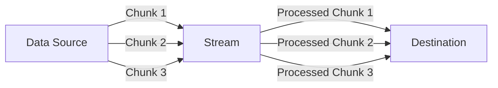
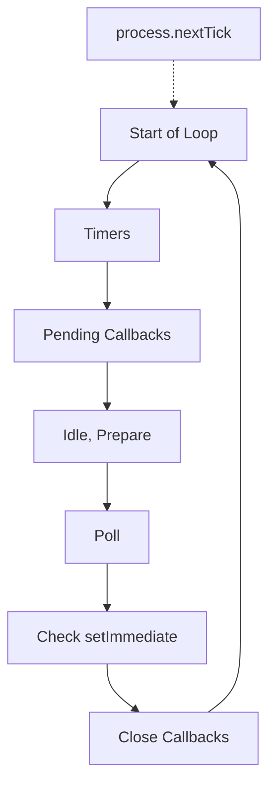
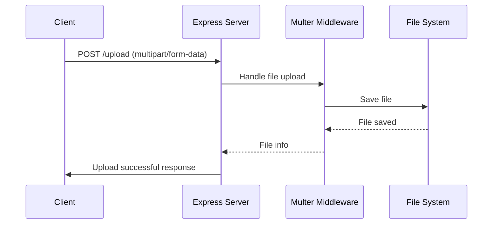
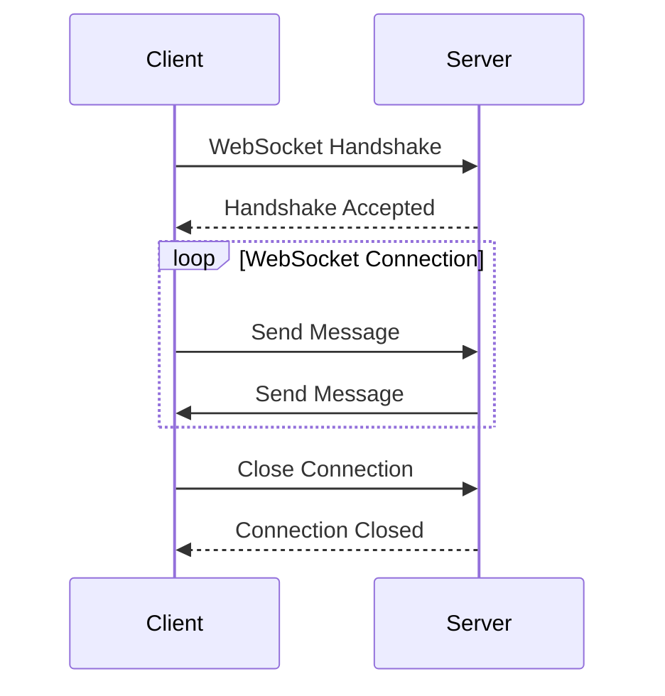
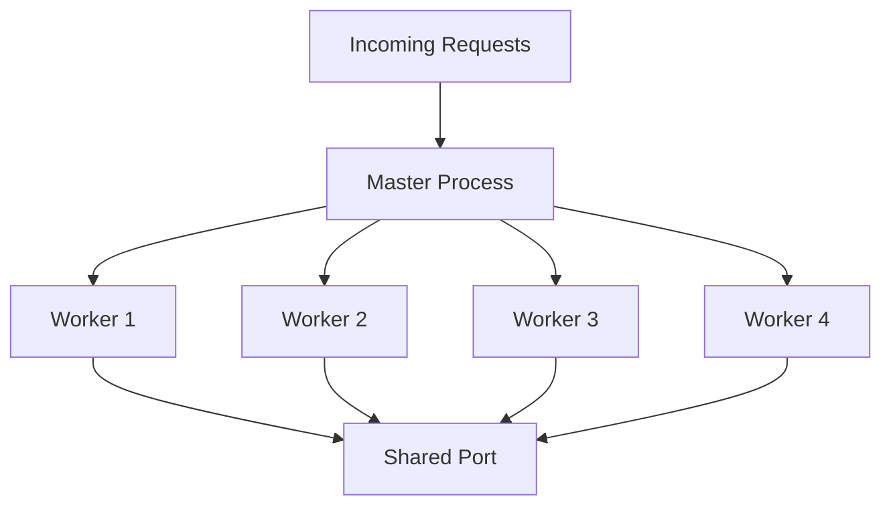
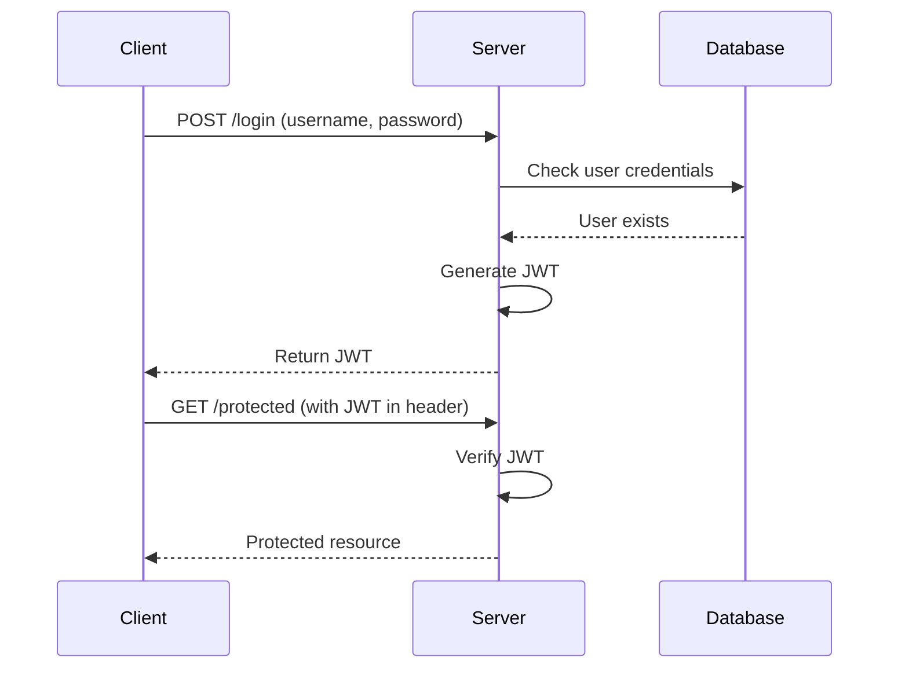
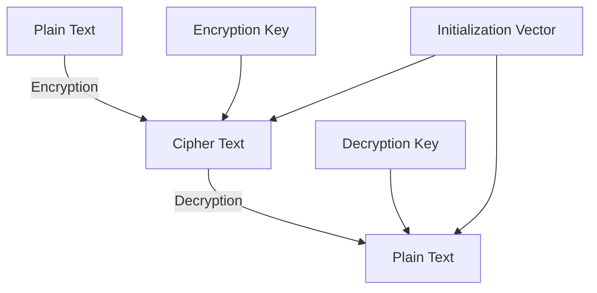
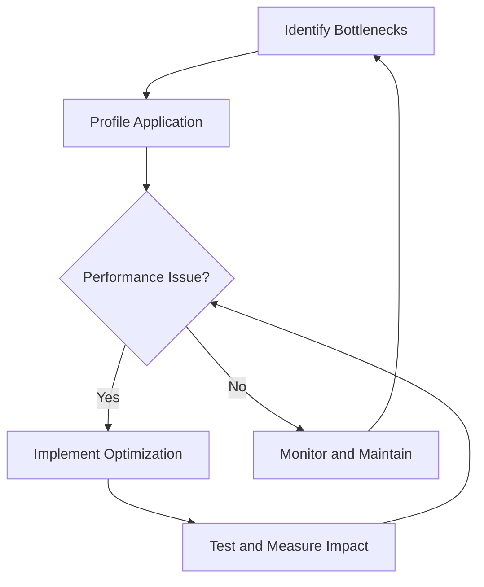
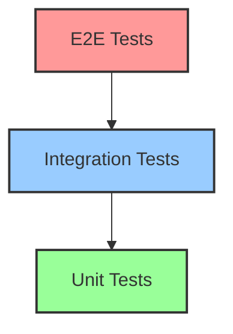

# Node.js Interview Questions and Answers 🚀

## Advanced Questions

### 1. What are streams in Node.js? 🌊

Streams are one of the fundamental concepts in Node.js. They are objects that let you read data from a source or write data to a destination in continuous fashion.

#### Key Points:
1. **Types of Streams**:
   - Readable: for reading data (e.g., `fs.createReadStream()`)
   - Writable: for writing data (e.g., `fs.createWriteStream()`)
   - Duplex: for both reading and writing (e.g., net.Socket)
   - Transform: for modifying data as it's written or read (e.g., zlib.createGzip())

2. **Advantages**:
   - Memory Efficiency: Process large amounts of data without loading it all into memory
   - Time Efficiency: Start processing data as soon as it's available

3. **Events**: Streams are EventEmitters, emitting events like 'data', 'end', 'error', etc.

#### Example: Using Streams to Copy a File

```javascript
const fs = require('fs');

const readStream = fs.createReadStream('source.txt');
const writeStream = fs.createWriteStream('destination.txt');

readStream.pipe(writeStream);

readStream.on('end', () => {
  console.log('File copy completed');
});
```

#### Diagram: Stream Processing



#### Novice Explanation:
Imagine you're moving water from one big tank to another using a hose 🚰. Streams in Node.js work similarly:

- The source tank is your data source (like a big file).
- The hose is the stream.
- The destination tank is where your data ends up (like a new file or a network connection).

Instead of moving all the water at once (which would be heavy and difficult), you let it flow through the hose bit by bit. This is exactly what Node.js streams do with data!

- You can start using the water as it arrives, without waiting for the whole tank to fill up.
- If there's a problem (like a kink in the hose), you can handle it immediately.
- You can even transform the water as it flows (like adding a filter to the hose).

This makes handling large amounts of data much more efficient and flexible, just like a well-designed plumbing system! 🚿💧

### 2. What is the difference between `process.nextTick()` and `setImmediate()`? ⏭️

Both `process.nextTick()` and `setImmediate()` are used to schedule code execution in Node.js, but they work differently and are processed at different phases of the event loop.

#### Key Differences:

1. **Execution Timing**:
   - `process.nextTick()`: Executes in the current iteration of the event loop, before I/O events.
   - `setImmediate()`: Executes in the next iteration of the event loop, after I/O events.

2. **Queue Priority**:
   - `process.nextTick()`: Adds callbacks to the nextTick queue, which is processed before the I/O phase.
   - `setImmediate()`: Adds callbacks to the check queue, which is processed after the I/O phase.

3. **Use Cases**:
   - `process.nextTick()`: For things that need to happen right after the current operation, before anything else.
   - `setImmediate()`: For things that can wait until after pending I/O operations.

4. **Potential Issues**:
   - `process.nextTick()`: Can block the event loop if used recursively.
   - `setImmediate()`: Less likely to block the event loop, even when used recursively.

#### Example:

```javascript
console.log('Start');

process.nextTick(() => {
  console.log('nextTick callback');
});

setImmediate(() => {
  console.log('setImmediate callback');
});

console.log('End');

// Output:
// Start
// End
// nextTick callback
// setImmediate callback
```

#### Diagram: Event Loop with nextTick and setImmediate



#### Novice Explanation:
Imagine you're in a busy restaurant kitchen 🍳. 

- `process.nextTick()` is like telling the chef, "Do this right after you're done with what you're cooking right now, before you start any new orders."
- `setImmediate()` is more like saying, "When you get a chance, after you've dealt with any pending orders, do this task."

Both get things done quickly, but `nextTick` is for urgent, can't-wait tasks, while `setImmediate` is for tasks that are important but can wait a tiny bit if the kitchen (Node.js) is busy with other critical tasks.

Just like in a kitchen, using `nextTick` too much can hold up everything else (like a chef constantly doing small tasks and never getting to main dishes), while `setImmediate` allows for a more balanced workflow. Choose wisely to keep your Node.js kitchen running smoothly! 👨‍🍳👩‍🍳

### 3. How do you handle file uploads in Node.js? 📤

Handling file uploads in Node.js typically involves using a middleware in your web framework (like Express) to process multipart form data. One popular library for this is `multer`.

#### Steps to Handle File Uploads:

1. Install necessary packages (e.g., Express and Multer)
2. Set up the server and configure Multer middleware
3. Create a route to handle file uploads
4. Process and store the uploaded files

#### Example using Express and Multer:

1. Install packages:
   ```bash
   npm install express multer
   ```

2. Set up the server:
   ```javascript
   const express = require('express');
   const multer = require('multer');
   const path = require('path');

   const app = express();

   // Configure storage
   const storage = multer.diskStorage({
     destination: function (req, file, cb) {
       cb(null, 'uploads/') // Files will be saved in the 'uploads' directory
     },
     filename: function (req, file, cb) {
       cb(null, file.fieldname + '-' + Date.now() + path.extname(file.originalname))
     }
   });

   // Initialize upload
   const upload = multer({ storage: storage });

   // Create upload route
   app.post('/upload', upload.single('file'), (req, res) => {
     if (req.file) {
       res.send('File uploaded successfully');
     } else {
       res.status(400).send('No file uploaded');
     }
   });

   app.listen(3000, () => console.log('Server started on port 3000'));
   ```

3. Handle multiple file uploads:
   ```javascript
   // For multiple files
   app.post('/upload-multiple', upload.array('files', 5), (req, res) => {
     if (req.files && req.files.length > 0) {
       res.send('Files uploaded successfully');
     } else {
       res.status(400).send('No files uploaded');
     }
   });
   ```

#### Best Practices:
1. Validate file types and sizes
2. Use virus scanning for uploaded files
3. Store files in a secure location
4. Consider using cloud storage solutions for scalability

#### Diagram: File Upload Process



#### Novice Explanation:
Imagine you're running a photo booth 📸 at a party. Here's how file uploads work in Node.js:

1. Your photo booth is the server, ready to receive pictures.
2. Multer is like your assistant, handling the actual process of receiving and storing photos.
3. When someone wants to upload a photo (file), they send it to your booth (server).
4. Your assistant (Multer) takes the photo, gives it a unique name, and stores it in a specific album (folder).
5. If everything goes well, you (the server) tell the person their photo has been saved successfully.
6. If there's a problem (like if they didn't actually send a photo), you let them know something went wrong.

Just like you'd want to make sure people aren't sending inappropriate pictures or files that are too large for your album, you need to add similar checks in your Node.js application to keep everything running smoothly and securely. It's all about managing the flow of data, just like managing the flow of partygoers in your photo booth! 🎉📸

### 4. What are WebSockets and how do you implement them in Node.js? 🔌

WebSockets provide a full-duplex, bidirectional communication channel between a client (typically a web browser) and a server. Unlike HTTP, which is request-response based, WebSockets allow for real-time data transfer in both directions.

#### Key Points:
1. **Full-duplex Communication**: Both client and server can send messages at any time.
2. **Real-time**: Low latency, suitable for live updates and interactive applications.
3. **Efficient**: Reduced overhead compared to polling or long-polling techniques.
4. **Persistent Connection**: Maintains a single TCP connection for the lifetime of the WebSocket connection.

#### Implementing WebSockets in Node.js:
One popular library for implementing WebSockets in Node.js is `socket.io`. Here's how you can use it:

1. Install necessary packages:
   ```bash
   npm install express socket.io
   ```

2. Set up the server:
   ```javascript
   const express = require('express');
   const app = express();
   const http = require('http').createServer(app);
   const io = require('socket.io')(http);

   app.get('/', (req, res) => {
     res.sendFile(__dirname + '/index.html');
   });

   io.on('connection', (socket) => {
     console.log('A user connected');

     socket.on('chat message', (msg) => {
       io.emit('chat message', msg);
     });

     socket.on('disconnect', () => {
       console.log('User disconnected');
     });
   });

   http.listen(3000, () => {
     console.log('listening on *:3000');
   });
   ```

3. Create a simple HTML client:
   ```html
   <!DOCTYPE html>
   <html>
   <head>
     <title>Socket.IO chat</title>
   </head>
   <body>
     <ul id="messages"></ul>
     <form id="chat-form">
       <input id="chat-input" type="text" autocomplete="off" />
       <button>Send</button>
     </form>
     <script src="/socket.io/socket.io.js"></script>
     <script>
       const socket = io();
       const form = document.getElementById('chat-form');
       const input = document.getElementById('chat-input');
       const messages = document.getElementById('messages');

       form.addEventListener('submit', (e) => {
         e.preventDefault();
         if (input.value) {
           socket.emit('chat message', input.value);
           input.value = '';
         }
       });

       socket.on('chat message', (msg) => {
         const li = document.createElement('li');
         li.textContent = msg;
         messages.appendChild(li);
       });
     </script>
   </body>
   </html>
   ```

#### Diagram: WebSocket Communication



#### Novice Explanation:
Imagine you're playing a two-way walkie-talkie game with a friend 📻. 

- Traditional web communication (HTTP) is like leaving voicemails: you send a message, then wait for a reply.
- WebSockets are like keeping the walkie-talkie channel open all the time. Both you and your friend can speak and listen whenever you want, without having to take turns or wait.

In our code example:
1. We set up a "walkie-talkie station" (the server).
2. When someone connects, it's like they've turned on their walkie-talkie.
3. Anyone can send a message at any time (the 'chat message' event).
4. When the server receives a message, it broadcasts it to everyone connected.
5. If someone "turns off" their walkie-talkie, we know they've disconnected.

This is great for things like chat apps, live sports updates, or multiplayer games – anything where you need quick, two-way communication without the delay of constantly asking "Any updates?" 🚀💬

### 5. What is clustering in Node.js and why is it used?

🌟 **Novice Explanation**: 
Imagine you're running a restaurant. As it gets busier, you hire more chefs to handle more orders simultaneously. Clustering in Node.js is like hiring more chefs for your application!

🚀 **Expert Explanation**:
Clustering in Node.js is a technique used to create multiple worker processes that share the same server port. It leverages the multi-core systems available on most machines today, allowing a Node.js application to handle more load and scale better.

The `cluster` module in Node.js facilitates this process. Here's how it works:

1. The master process creates worker processes.
2. These worker processes share the same server port.
3. The master process distributes incoming connections among the workers.

Here's a simple example of clustering:

```javascript
const cluster = require('cluster');
const http = require('http');
const numCPUs = require('os').cpus().length;

if (cluster.isMaster) {
  console.log(`Master ${process.pid} is running`);

  // Fork workers.
  for (let i = 0; i < numCPUs; i++) {
    cluster.fork();
  }

  cluster.on('exit', (worker, code, signal) => {
    console.log(`worker ${worker.process.pid} died`);
  });
} else {
  // Workers can share any TCP connection
  // In this case it is an HTTP server
  http.createServer((req, res) => {
    res.writeHead(200);
    res.end('hello world\n');
  }).listen(8000);

  console.log(`Worker ${process.pid} started`);
}
```

Benefits of clustering:
1. **Improved Performance**: Utilizes multi-core systems effectively.
2. **High Availability**: If one worker crashes, others can continue handling requests.
3. **Easy Scaling**: Can adjust the number of workers based on system resources.

Use cases for clustering:
- High-traffic web servers
- Real-time data processing applications
- CPU-intensive operations in web applications

Diagram of Node.js Clustering:



---

### 6. How do you implement authentication in a Node.js application?

🌟 **Novice Explanation**: 
Authentication is like having a bouncer at a club. They check your ID (username and password) before letting you in. In a Node.js app, we set up our own digital bouncer to check if users are allowed in!

🚀 **Expert Explanation**:
Implementing authentication in a Node.js application typically involves several steps and can be done using various strategies. One common approach is using JSON Web Tokens (JWT) with Passport.js, a popular authentication middleware for Node.js.

Here's a step-by-step guide to implement JWT authentication:

1. Install required packages:
   ```bash
   npm install express jsonwebtoken passport passport-jwt bcrypt
   ```

2. Set up your Express app and configure Passport:

```javascript
const express = require('express');
const passport = require('passport');
const JwtStrategy = require('passport-jwt').Strategy;
const ExtractJwt = require('passport-jwt').ExtractJwt;
const jwt = require('jsonwebtoken');
const bcrypt = require('bcrypt');

const app = express();
app.use(express.json());

const SECRET_KEY = 'your_secret_key';

// Configure Passport JWT strategy
const opts = {
  jwtFromRequest: ExtractJwt.fromAuthHeaderAsBearerToken(),
  secretOrKey: SECRET_KEY,
};

passport.use(
  new JwtStrategy(opts, (jwt_payload, done) => {
    // Here you would typically find the user in your database
    // For this example, we'll just check if the id exists in the payload
    if (jwt_payload.id) {
      return done(null, jwt_payload);
    }
    return done(null, false);
  })
);

app.use(passport.initialize());
```

3. Create login and protected routes:

```javascript
// Mock user data (in a real app, this would be in a database)
const users = [
  { id: 1, username: 'user1', password: '$2b$10$Uf5...', // hashed password
];

app.post('/login', async (req, res) => {
  const { username, password } = req.body;
  const user = users.find(u => u.username === username);
  
  if (!user) {
    return res.status(401).json({ message: 'User not found' });
  }

  const isMatch = await bcrypt.compare(password, user.password);
  if (!isMatch) {
    return res.status(401).json({ message: 'Incorrect password' });
  }

  const token = jwt.sign({ id: user.id, username: user.username }, SECRET_KEY, { expiresIn: '1h' });
  res.json({ token });
});

app.get('/protected', passport.authenticate('jwt', { session: false }), (req, res) => {
  res.json({ message: 'You have access to this protected route!', user: req.user });
});
```

4. Start the server:

```javascript
app.listen(3000, () => console.log('Server running on port 3000'));
```

This implementation:
- Uses bcrypt for secure password hashing
- Generates JWTs for authenticated users
- Uses Passport with the JWT strategy to protect routes

Additional considerations:
- Store user data and hashed passwords in a database
- Implement refresh tokens for better security
- Use HTTPS to encrypt data in transit
- Implement rate limiting to prevent brute-force attacks

Authentication flow diagram:



---

### 7. What is the purpose of the `crypto` module in Node.js?

🌟 **Novice Explanation**: 
The `crypto` module in Node.js is like a secret code maker and breaker. It helps you create and solve puzzles to keep your data safe from prying eyes!

🚀 **Expert Explanation**:
The `crypto` module in Node.js provides cryptographic functionality that includes a set of wrappers for OpenSSL's hash, HMAC, cipher, decipher, sign, and verify functions. It's essential for implementing security features in Node.js applications.

Key features and use cases of the `crypto` module:

1. **Hashing**: 
   - Purpose: Generate fixed-length, unique representations of data.
   - Use case: Password storage, data integrity verification.
   
   Example:
   ```javascript
   const crypto = require('crypto');
   
   function hashPassword(password) {
     return crypto.createHash('sha256').update(password).digest('hex');
   }
   
   console.log(hashPassword('myPassword')); // Outputs a 64-character hexadecimal string
   ```

2. **Encryption and Decryption**:
   - Purpose: Secure data by converting it into a code that can only be read with a key.
   - Use case: Protecting sensitive data in transit or at rest.
   
   Example:
   ```javascript
   const crypto = require('crypto');
   
   const algorithm = 'aes-256-cbc';
   const key = crypto.randomBytes(32);
   const iv = crypto.randomBytes(16);
   
   function encrypt(text) {
     let cipher = crypto.createCipheriv(algorithm, Buffer.from(key), iv);
     let encrypted = cipher.update(text);
     encrypted = Buffer.concat([encrypted, cipher.final()]);
     return { iv: iv.toString('hex'), encryptedData: encrypted.toString('hex') };
   }
   
   function decrypt(text) {
     let iv = Buffer.from(text.iv, 'hex');
     let encryptedText = Buffer.from(text.encryptedData, 'hex');
     let decipher = crypto.createDecipheriv(algorithm, Buffer.from(key), iv);
     let decrypted = decipher.update(encryptedText);
     decrypted = Buffer.concat([decrypted, decipher.final()]);
     return decrypted.toString();
   }
   
   const myText = 'Sensitive data';
   const encrypted = encrypt(myText);
   console.log(encrypted);
   console.log(decrypt(encrypted));
   ```

3. **Digital Signatures**:
   - Purpose: Verify the authenticity and integrity of messages or documents.
   - Use case: Ensuring non-repudiation in communications.
   
   Example:
   ```javascript
   const crypto = require('crypto');
   
   // Generate key pair
   const { privateKey, publicKey } = crypto.generateKeyPairSync('rsa', {
     modulusLength: 2048,
   });
   
   function sign(data, privateKey) {
     const sign = crypto.createSign('SHA256');
     sign.update(data);
     return sign.sign(privateKey, 'hex');
   }
   
   function verify(data, signature, publicKey) {
     const verify = crypto.createVerify('SHA256');
     verify.update(data);
     return verify.verify(publicKey, signature, 'hex');
   }
   
   const data = 'Important message';
   const signature = sign(data, privateKey);
   console.log('Signature:', signature);
   console.log('Verified:', verify(data, signature, publicKey));
   ```

4. **Generating Random Data**:
   - Purpose: Create cryptographically strong pseudo-random data.
   - Use case: Generating keys, initialization vectors, or nonces.
   
   Example:
   ```javascript
   const crypto = require('crypto');
   
   const randomBytes = crypto.randomBytes(16);
   console.log('Random bytes:', randomBytes.toString('hex'));
   ```

The `crypto` module is crucial for:
- Implementing secure authentication systems
- Protecting sensitive data in databases
- Ensuring secure communications in web applications
- Creating blockchain and cryptocurrency applications

When using the `crypto` module, it's important to:
- Keep up with best practices in cryptography
- Use sufficiently strong keys and algorithms
- Properly manage and secure cryptographic keys
- Be aware of export regulations related to cryptography

Diagram of Encryption/Decryption Process:



Remember, while the `crypto` module provides powerful tools, implementing cryptography correctly requires expertise. For highly sensitive applications, it's recommended to consult with security experts.

---

### 8. How can you optimize performance in a Node.js application?

🌟 **Novice Explanation**: 
Optimizing a Node.js app is like tuning up a car. You check all the parts, fix what's slowing it down, and make sure everything runs smoothly. This makes your app faster and more efficient!

🚀 **Expert Explanation**:
Optimizing performance in a Node.js application involves various strategies targeting different aspects of the application. Here are some key approaches:

1. **Use Asynchronous Programming**:
   - Leverage Node.js's non-blocking I/O model.
   - Use `async/await` or Promises for cleaner asynchronous code.

Example:
   ```javascript
   // Async/Await
   async function fetchData() {
     try {
       const result = await someAsyncOperation();
       return result;
     } catch (error) {
       console.error('Error:', error);
     }
   }
   ```

2. **Implement Caching**:
   - Use in-memory caching (e.g., Redis) for frequently accessed data.
   - Implement response caching for API endpoints.

   Example using Node-Cache:
   ```javascript
   const NodeCache = require('node-cache');
   const myCache = new NodeCache({ stdTTL: 100, checkperiod: 120 });

   function getCachedData(key, fetchFunction) {
     const value = myCache.get(key);
     if (value) {
       return Promise.resolve(value);
     }
     return fetchFunction().then((result) => {
       myCache.set(key, result);
       return result;
     });
   }
   ```

3. **Optimize Database Queries**:
   - Use indexing for frequently queried fields.
   - Implement database connection pooling.
   - Use ORM (Object-Relational Mapping) tools efficiently.

   Example using Sequelize ORM:
   ```javascript
   const { Sequelize, Model, DataTypes } = require('sequelize');
   const sequelize = new Sequelize('database', 'username', 'password', {
     dialect: 'mysql',
     pool: {
       max: 5,
       min: 0,
       acquire: 30000,
       idle: 10000
     }
   });

   class User extends Model {}
   User.init({
     username: DataTypes.STRING,
     email: {
       type: DataTypes.STRING,
       unique: true,
       allowNull: false
     }
   }, { sequelize, modelName: 'user' });

   // Efficient querying
   const users = await User.findAll({
     attributes: ['id', 'username'],
     where: {
       status: 'active'
     },
     limit: 10
   });
   ```

4. **Use Clustering**:
   - Leverage multi-core systems by creating worker processes.
   - Implement load balancing across multiple instances.

   Example:
   ```javascript
   const cluster = require('cluster');
   const http = require('http');
   const numCPUs = require('os').cpus().length;

   if (cluster.isMaster) {
     console.log(`Master ${process.pid} is running`);
     for (let i = 0; i < numCPUs; i++) {
       cluster.fork();
     }
   } else {
     http.createServer((req, res) => {
       res.writeHead(200);
       res.end('Hello World\n');
     }).listen(8000);
     console.log(`Worker ${process.pid} started`);
   }
   ```

5. **Implement Compression**:
   - Use gzip compression for HTTP responses.

   Example using Express:
   ```javascript
   const express = require('express');
   const compression = require('compression');
   const app = express();

   app.use(compression());
   ```

6. **Optimize Frontend Assets**:
   - Minify and bundle JavaScript and CSS files.
   - Use CDNs for static assets.

   Example using webpack:
   ```javascript
   // webpack.config.js
   const path = require('path');
   const TerserPlugin = require('terser-webpack-plugin');

   module.exports = {
     entry: './src/index.js',
     output: {
       filename: 'bundle.min.js',
       path: path.resolve(__dirname, 'dist'),
     },
     optimization: {
       minimize: true,
       minimizer: [new TerserPlugin()],
     },
   };
   ```

7. **Use Streams for Large Data**:
   - Process data in chunks instead of loading everything into memory.

   Example:
   ```javascript
   const fs = require('fs');
   const zlib = require('zlib');

   fs.createReadStream('input.txt')
     .pipe(zlib.createGzip())
     .pipe(fs.createWriteStream('input.txt.gz'));
   ```

8. **Implement Proper Error Handling**:
   - Use try-catch blocks for synchronous code.
   - Handle Promise rejections for asynchronous code.

   Example:
   ```javascript
   process.on('unhandledRejection', (reason, promise) => {
     console.log('Unhandled Rejection at:', promise, 'reason:', reason);
     // Application specific logging, throwing an error, or other logic here
   });
   ```

9. **Use PM2 for Process Management**:
   - Ensure your application stays up and running.
   - Implement zero-downtime deployments.

   Example PM2 configuration:
   ```javascript
   // ecosystem.config.js
   module.exports = {
     apps: [{
       name: "app",
       script: "./app.js",
       instances: "max",
       exec_mode: "cluster",
       watch: true,
       env: {
         NODE_ENV: "development",
       },
       env_production: {
         NODE_ENV: "production",
       }
     }]
   }
   ```

10. **Profile and Monitor Your Application**:
    - Use tools like New Relic, AppDynamics, or open-source alternatives.
    - Implement logging for important events and errors.

    Example using Winston for logging:
    ```javascript
    const winston = require('winston');

    const logger = winston.createLogger({
      level: 'info',
      format: winston.format.json(),
      defaultMeta: { service: 'user-service' },
      transports: [
        new winston.transports.File({ filename: 'error.log', level: 'error' }),
        new winston.transports.File({ filename: 'combined.log' })
      ]
    });

    if (process.env.NODE_ENV !== 'production') {
      logger.add(new winston.transports.Console({
        format: winston.format.simple()
      }));
    }

    logger.log({
      level: 'info',
      message: 'Hello distributed log files!'
    });
    ```

Performance Optimization Workflow:



Remember, optimization is an iterative process. Always measure the impact of your optimizations to ensure they're providing the expected benefits. Some optimizations might have trade-offs, so it's important to understand the specific needs of your application.

---

### 9. What are the advantages of using TypeScript with Node.js?

🌟 **Novice Explanation**: 
TypeScript is like adding training wheels to your bicycle (JavaScript). It helps you avoid common mistakes and makes it easier to build big, complex applications without falling over!

🚀 **Expert Explanation**:
TypeScript, a statically typed superset of JavaScript, offers several advantages when used with Node.js:

1. **Static Typing**:
   - Catches type-related errors at compile-time.
   - Improves code quality and reduces runtime errors.

   Example:
   ```typescript
   function greet(name: string): string {
     return `Hello, ${name}!`;
   }

   console.log(greet("World")); // OK
   console.log(greet(42)); // Error: Argument of type 'number' is not assignable to parameter of type 'string'.
   ```

2. **Enhanced IDE Support**:
   - Provides better code completion and IntelliSense.
   - Facilitates easier refactoring.

3. **Object-Oriented Programming Features**:
   - Supports interfaces, generics, and decorators.
   - Enables better code organization and reusability.

   Example:
   ```typescript
   interface User {
     id: number;
     name: string;
     email: string;
   }

   class UserService {
     private users: User[] = [];

     addUser(user: User): void {
       this.users.push(user);
     }

     getUser(id: number): User | undefined {
       return this.users.find(user => user.id === id);
     }
   }
   ```

4. **Better Documentation**:
   - Type annotations serve as inline documentation.
   - Generates declaration files (.d.ts) for JavaScript libraries.

5. **Easier Maintenance**:
   - Type information makes it easier to understand and maintain large codebases.
   - Refactoring is safer with static type checking.

6. **Compatibility with JavaScript**:
   - Can use existing JavaScript libraries with type definitions.
   - Gradual adoption is possible in existing projects.

7. **Modern ECMAScript Features**:
   - Supports the latest ECMAScript features and compiles them to older versions for compatibility.

   Example:
   ```typescript
   // Using modern features like optional chaining and nullish coalescing
   const userDisplayName = user?.name ?? "Anonymous";
   ```

8. **Configurable Compiler**:
   - `tsconfig.json` allows fine-tuning of the TypeScript compiler.

   Example `tsconfig.json`:
   ```json
   {
     "compilerOptions": {
       "target": "es2020",
       "module": "commonjs",
       "strict": true,
       "esModuleInterop": true,
       "outDir": "./dist"
     },
     "include": ["src/**/*"],
     "exclude": ["node_modules", "**/*.spec.ts"]
   }
   ```

9. **Decorators for Metadata Programming**:
   - Useful for frameworks like NestJS that leverage decorators.

   Example:
   ```typescript
   function log(target: any, key: string, descriptor: PropertyDescriptor) {
     const original = descriptor.value;
     descriptor.value = function(...args: any[]) {
       console.log(`Calling ${key} with`, args);
       return original.apply(this, args);
     };
     return descriptor;
   }

   class Calculator {
     @log
     add(a: number, b: number): number {
       return a + b;
     }
   }
   ```

10. **Better Support for Asynchronous Programming**:
    - Improved typing for Promises and async/await.

    Example:
    ```typescript
    async function fetchUserData(id: number): Promise<User> {
      const response = await fetch(`/api/users/${id}`);
      if (!response.ok) {
        throw new Error(`HTTP error! status: ${response.status}`);
      }
      return await response.json() as User;
    }
    ```

TypeScript and JavaScript Relationship:

```mermaid
venn diagram
    A[JavaScript]
    B[TypeScript]
    A - "Dynamic Typing"
    B - "Static Typing"
    A ∩ B "ECMAScript Features"
    A ∩ B "Node.js Compatibility"
    A ∩ B "NPM Ecosystem"
```

When using TypeScript with Node.js:
- Install TypeScript: `npm install -g typescript`
- Compile TypeScript files: `tsc filename.ts`
- Use `ts-node` for direct execution: `npm install -g ts-node`
- Configure your IDE for TypeScript support

While TypeScript offers many advantages, it's important to consider:
- There's a learning curve for developers new to static typing.
- Build step is required to compile TypeScript to JavaScript.
- Potential overhead in development time for type annotations.

Overall, TypeScript can significantly improve the development experience and code quality in larger Node.js projects, especially as they scale in size and complexity.

---

### 10. How do you test a Node.js application?

🌟 **Novice Explanation**: 
Testing a Node.js app is like being a food taster for a king. You try out small portions of the app to make sure everything tastes good (works correctly) before serving the whole meal (releasing the app)!

🚀 **Expert Explanation**:
Testing a Node.js application involves several levels of testing, each serving a different purpose. Here's a comprehensive approach to testing Node.js applications:

1. **Unit Testing**:
   - Tests individual functions or methods in isolation.
   - Popular libraries: Jest, Mocha with Chai

   Example using Jest:
   ```javascript
   // math.js
   function add(a, b) {
     return a + b;
   }

   module.exports = { add };

   // math.test.js
   const { add } = require('./math');

   test('adds 1 + 2 to equal 3', () => {
     expect(add(1, 2)).toBe(3);
   });
   ```

2. **Integration Testing**:
   - Tests how different parts of the application work together.
   - May involve database operations, file system access, etc.

   Example using Mocha and Chai:
   ```javascript
   const chai = require('chai');
   const chaiHttp = require('chai-http');
   const app = require('../app');

   chai.use(chaiHttp);
   const expect = chai.expect;

   describe('User API', () => {
     it('should create a new user', (done) => {
       chai.request(app)
         .post('/api/users')
         .send({ name: 'John Doe', email: 'john@example.com' })
         .end((err, res) => {
           expect(res).to.have.status(201);
           expect(res.body).to.be.an('object');
           expect(res.body).to.have.property('name', 'John Doe');
           done();
         });
     });
   });
   ```

3. **End-to-End (E2E) Testing**:
   - Tests the entire application flow from start to finish.
   - Tools: Cypress, Puppeteer

   Example using Cypress:
   ```javascript
   describe('Login Flow', () => {
     it('should login successfully', () => {
       cy.visit('/login');
       cy.get('input[name="username"]').type('testuser');
       cy.get('input[name="password"]').type('password123');
       cy.get('button[type="submit"]').click();
       cy.url().should('include', '/dashboard');
       cy.get('h1').should('contain', 'Welcome, testuser');
     });
   });
   ```

4. **API Testing**:
   - Tests API endpoints for correct responses and error handling.
   - Tools: Supertest, Postman

   Example using Supertest:
   ```javascript
   const request = require('supertest');
   const app = require('../app');

   describe('GET /api/users', () => {
     it('responds with json containing a list of users', (done) => {
       request(app)
         .get('/api/users')
         .set('Accept', 'application/json')
         .expect('Content-Type', /json/)
         .expect(200, done);
     });
   });
   ```

5. **Load Testing**:
   - Tests how the application performs under high load.
   - Tools: Apache JMeter, Artillery

   Example using Artillery:
   ```yaml
   # load-test.yml
   config:
     target: "http://localhost:3000"
     phases:
       - duration: 60
         arrivalRate: 20
   scenarios:
     - flow:
         - get:
             url: "/api/users"
   ```

6. **Code Coverage**:
   - Measures how much of your code is covered by tests.
   - Tools: Istanbul (nyc)

   Example using Istanbul with Mocha:
   ```json
   {
     "scripts": {
       "test": "nyc mocha"
     }
   }
   ```

7. **Static Analysis**:
   - Analyzes code without executing it to find potential issues.
   - Tools: ESLint, TSLint (for TypeScript)

   Example ESLint configuration:
   ```json
   // .eslintrc.json
   {
     "env": {
       "node": true,
       "es2021": true
     },
     "extends": "eslint:recommended",
     "rules": {
       "no-unused-vars": "error",
       "no-console": "warn"
     }
   }
   ```

8. **Mocking and Stubbing**:
   - Simulates behavior of external dependencies.
   - Useful for testing modules in isolation.
   - Libraries: Sinon.js, Jest mocks

   Example using Jest:
   ```javascript
   // user-service.js
   const axios = require('axios');

   async function getUser(id) {
     const response = await axios.get(`https://api.example.com/users/${id}`);
     return response.data;
   }

   module.exports = { getUser };

   // user-service.test.js
   jest.mock('axios');
   const axios = require('axios');
   const { getUser } = require('./user-service');

   test('should fetch user data', async () => {
     const user = { id: 1, name: 'John Doe' };
     axios.get.mockResolvedValue({ data: user });

     const result = await getUser(1);
     expect(result).toEqual(user);
     expect(axios.get).toHaveBeenCalledWith('https://api.example.com/users/1');
   });
   ```

9. **Property-Based Testing**:
   - Generates test cases based on properties that should hold true for your functions.
   - Library: fast-check

   Example using fast-check:
   ```javascript
   const fc = require('fast-check');
   const { add } = require('./math');

   test('commutativity of addition', () => {
     fc.assert(
       fc.property(fc.integer(), fc.integer(), (a, b) => {
         return add(a, b) === add(b, a);
       })
     );
   });
   ```

10. **Snapshot Testing**:
    - Captures a snapshot of data structures or component output and compares it in future tests.
    - Useful for detecting unintended changes in output.
    - Supported by Jest

    Example:
    ```javascript
    const { render } = require('@testing-library/react');
    const UserProfile = require('./UserProfile');

    it('renders user profile correctly', () => {
      const user = { name: 'John Doe', email: 'john@example.com' };
      const { asFragment } = render(<UserProfile user={user} />);
      expect(asFragment()).toMatchSnapshot();
    });
    ```

Best Practices for Testing Node.js Applications:

1. **Write Testable Code**:
   - Use dependency injection to make components easier to test in isolation.
   - Keep functions small and focused on a single responsibility.

2. **Use Test Driven Development (TDD) When Appropriate**:
   - Write tests before implementing features.
   - Helps ensure code meets requirements and is testable.

3. **Maintain a Good Test Coverage**:
   - Aim for high test coverage, but focus on critical paths.
   - Don't obsess over 100% coverage if it doesn't add value.

4. **Use Continuous Integration (CI)**:
   - Run tests automatically on every push or pull request.
   - Catch issues early in the development process.

   Example using GitHub Actions:
   ```yaml
   # .github/workflows/node.js.yml
   name: Node.js CI

   on: [push, pull_request]

   jobs:
     build:
       runs-on: ubuntu-latest
       steps:
       - uses: actions/checkout@v2
       - name: Use Node.js
         uses: actions/setup-node@v2
         with:
           node-version: '14.x'
       - run: npm ci
       - run: npm run build --if-present
       - run: npm test
   ```

5. **Test Both Happy and Unhappy Paths**:
   - Don't just test when everything works correctly.
   - Include tests for error conditions and edge cases.

6. **Keep Tests Fast**:
   - Optimize slow tests or move them to a separate test suite.
   - Fast tests encourage developers to run them frequently.

7. **Use Realistic Test Data**:
   - Create factories or fixtures for generating test data.
   - Avoid using production data in tests.

8. **Isolate Test Environments**:
   - Use separate databases for testing.
   - Reset the test environment before each test run.

9. **Regularly Update and Maintain Tests**:
   - Treat tests as first-class citizens in your codebase.
   - Refactor tests along with the main code.

10. **Use Linting for Tests**:
    - Apply the same code quality standards to your tests as your main code.

Test Pyramid:



Remember, the goal of testing is not just to catch bugs, but to make your codebase more maintainable and to give you confidence when making changes. A well-tested Node.js application is more robust, easier to refactor, and generally of higher quality.

---

