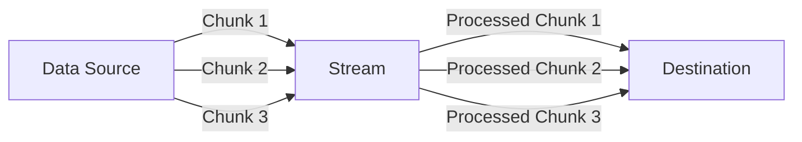
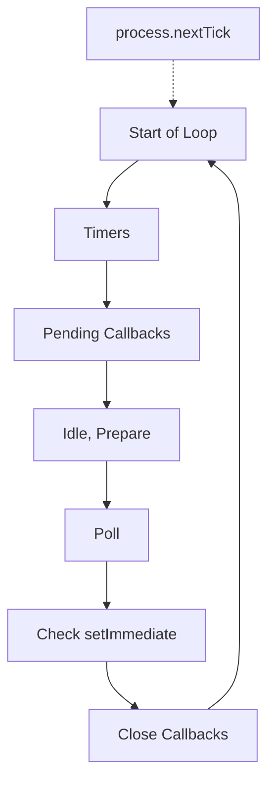
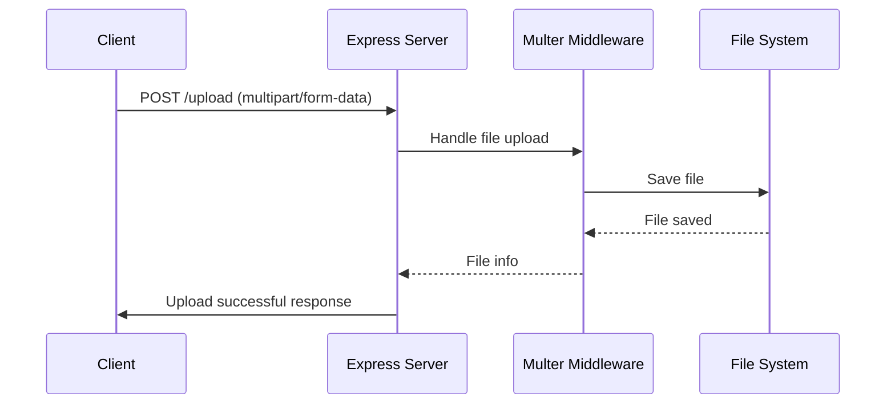
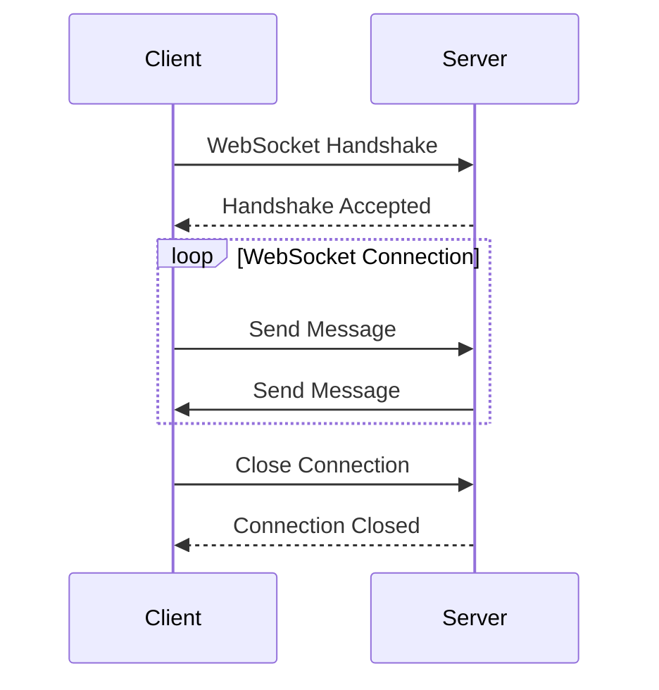

# Node.js Interview Questions and Answers 🚀

## Advanced Questions

### 1. What are streams in Node.js? 🌊

Streams are one of the fundamental concepts in Node.js. They are objects that let you read data from a source or write data to a destination in continuous fashion.

#### Key Points:
1. **Types of Streams**:
   - Readable: for reading data (e.g., `fs.createReadStream()`)
   - Writable: for writing data (e.g., `fs.createWriteStream()`)
   - Duplex: for both reading and writing (e.g., net.Socket)
   - Transform: for modifying data as it's written or read (e.g., zlib.createGzip())

2. **Advantages**:
   - Memory Efficiency: Process large amounts of data without loading it all into memory
   - Time Efficiency: Start processing data as soon as it's available

3. **Events**: Streams are EventEmitters, emitting events like 'data', 'end', 'error', etc.

#### Example: Using Streams to Copy a File

```javascript
const fs = require('fs');

const readStream = fs.createReadStream('source.txt');
const writeStream = fs.createWriteStream('destination.txt');

readStream.pipe(writeStream);

readStream.on('end', () => {
  console.log('File copy completed');
});
```

#### Diagram: Stream Processing



#### Novice Explanation:
Imagine you're moving water from one big tank to another using a hose 🚰. Streams in Node.js work similarly:

- The source tank is your data source (like a big file).
- The hose is the stream.
- The destination tank is where your data ends up (like a new file or a network connection).

Instead of moving all the water at once (which would be heavy and difficult), you let it flow through the hose bit by bit. This is exactly what Node.js streams do with data!

- You can start using the water as it arrives, without waiting for the whole tank to fill up.
- If there's a problem (like a kink in the hose), you can handle it immediately.
- You can even transform the water as it flows (like adding a filter to the hose).

This makes handling large amounts of data much more efficient and flexible, just like a well-designed plumbing system! 🚿💧

### 2. What is the difference between `process.nextTick()` and `setImmediate()`? ⏭️

Both `process.nextTick()` and `setImmediate()` are used to schedule code execution in Node.js, but they work differently and are processed at different phases of the event loop.

#### Key Differences:

1. **Execution Timing**:
   - `process.nextTick()`: Executes in the current iteration of the event loop, before I/O events.
   - `setImmediate()`: Executes in the next iteration of the event loop, after I/O events.

2. **Queue Priority**:
   - `process.nextTick()`: Adds callbacks to the nextTick queue, which is processed before the I/O phase.
   - `setImmediate()`: Adds callbacks to the check queue, which is processed after the I/O phase.

3. **Use Cases**:
   - `process.nextTick()`: For things that need to happen right after the current operation, before anything else.
   - `setImmediate()`: For things that can wait until after pending I/O operations.

4. **Potential Issues**:
   - `process.nextTick()`: Can block the event loop if used recursively.
   - `setImmediate()`: Less likely to block the event loop, even when used recursively.

#### Example:

```javascript
console.log('Start');

process.nextTick(() => {
  console.log('nextTick callback');
});

setImmediate(() => {
  console.log('setImmediate callback');
});

console.log('End');

// Output:
// Start
// End
// nextTick callback
// setImmediate callback
```

#### Diagram: Event Loop with nextTick and setImmediate



#### Novice Explanation:
Imagine you're in a busy restaurant kitchen 🍳. 

- `process.nextTick()` is like telling the chef, "Do this right after you're done with what you're cooking right now, before you start any new orders."
- `setImmediate()` is more like saying, "When you get a chance, after you've dealt with any pending orders, do this task."

Both get things done quickly, but `nextTick` is for urgent, can't-wait tasks, while `setImmediate` is for tasks that are important but can wait a tiny bit if the kitchen (Node.js) is busy with other critical tasks.

Just like in a kitchen, using `nextTick` too much can hold up everything else (like a chef constantly doing small tasks and never getting to main dishes), while `setImmediate` allows for a more balanced workflow. Choose wisely to keep your Node.js kitchen running smoothly! 👨‍🍳👩‍🍳

### 3. How do you handle file uploads in Node.js? 📤

Handling file uploads in Node.js typically involves using a middleware in your web framework (like Express) to process multipart form data. One popular library for this is `multer`.

#### Steps to Handle File Uploads:

1. Install necessary packages (e.g., Express and Multer)
2. Set up the server and configure Multer middleware
3. Create a route to handle file uploads
4. Process and store the uploaded files

#### Example using Express and Multer:

1. Install packages:
   ```bash
   npm install express multer
   ```

2. Set up the server:
   ```javascript
   const express = require('express');
   const multer = require('multer');
   const path = require('path');

   const app = express();

   // Configure storage
   const storage = multer.diskStorage({
     destination: function (req, file, cb) {
       cb(null, 'uploads/') // Files will be saved in the 'uploads' directory
     },
     filename: function (req, file, cb) {
       cb(null, file.fieldname + '-' + Date.now() + path.extname(file.originalname))
     }
   });

   // Initialize upload
   const upload = multer({ storage: storage });

   // Create upload route
   app.post('/upload', upload.single('file'), (req, res) => {
     if (req.file) {
       res.send('File uploaded successfully');
     } else {
       res.status(400).send('No file uploaded');
     }
   });

   app.listen(3000, () => console.log('Server started on port 3000'));
   ```

3. Handle multiple file uploads:
   ```javascript
   // For multiple files
   app.post('/upload-multiple', upload.array('files', 5), (req, res) => {
     if (req.files && req.files.length > 0) {
       res.send('Files uploaded successfully');
     } else {
       res.status(400).send('No files uploaded');
     }
   });
   ```

#### Best Practices:
1. Validate file types and sizes
2. Use virus scanning for uploaded files
3. Store files in a secure location
4. Consider using cloud storage solutions for scalability

#### Diagram: File Upload Process



#### Novice Explanation:
Imagine you're running a photo booth 📸 at a party. Here's how file uploads work in Node.js:

1. Your photo booth is the server, ready to receive pictures.
2. Multer is like your assistant, handling the actual process of receiving and storing photos.
3. When someone wants to upload a photo (file), they send it to your booth (server).
4. Your assistant (Multer) takes the photo, gives it a unique name, and stores it in a specific album (folder).
5. If everything goes well, you (the server) tell the person their photo has been saved successfully.
6. If there's a problem (like if they didn't actually send a photo), you let them know something went wrong.

Just like you'd want to make sure people aren't sending inappropriate pictures or files that are too large for your album, you need to add similar checks in your Node.js application to keep everything running smoothly and securely. It's all about managing the flow of data, just like managing the flow of partygoers in your photo booth! 🎉📸

### 4. What are WebSockets and how do you implement them in Node.js? 🔌

WebSockets provide a full-duplex, bidirectional communication channel between a client (typically a web browser) and a server. Unlike HTTP, which is request-response based, WebSockets allow for real-time data transfer in both directions.

#### Key Points:
1. **Full-duplex Communication**: Both client and server can send messages at any time.
2. **Real-time**: Low latency, suitable for live updates and interactive applications.
3. **Efficient**: Reduced overhead compared to polling or long-polling techniques.
4. **Persistent Connection**: Maintains a single TCP connection for the lifetime of the WebSocket connection.

#### Implementing WebSockets in Node.js:
One popular library for implementing WebSockets in Node.js is `socket.io`. Here's how you can use it:

1. Install necessary packages:
   ```bash
   npm install express socket.io
   ```

2. Set up the server:
   ```javascript
   const express = require('express');
   const app = express();
   const http = require('http').createServer(app);
   const io = require('socket.io')(http);

   app.get('/', (req, res) => {
     res.sendFile(__dirname + '/index.html');
   });

   io.on('connection', (socket) => {
     console.log('A user connected');

     socket.on('chat message', (msg) => {
       io.emit('chat message', msg);
     });

     socket.on('disconnect', () => {
       console.log('User disconnected');
     });
   });

   http.listen(3000, () => {
     console.log('listening on *:3000');
   });
   ```

3. Create a simple HTML client:
   ```html
   <!DOCTYPE html>
   <html>
   <head>
     <title>Socket.IO chat</title>
   </head>
   <body>
     <ul id="messages"></ul>
     <form id="chat-form">
       <input id="chat-input" type="text" autocomplete="off" />
       <button>Send</button>
     </form>
     <script src="/socket.io/socket.io.js"></script>
     <script>
       const socket = io();
       const form = document.getElementById('chat-form');
       const input = document.getElementById('chat-input');
       const messages = document.getElementById('messages');

       form.addEventListener('submit', (e) => {
         e.preventDefault();
         if (input.value) {
           socket.emit('chat message', input.value);
           input.value = '';
         }
       });

       socket.on('chat message', (msg) => {
         const li = document.createElement('li');
         li.textContent = msg;
         messages.appendChild(li);
       });
     </script>
   </body>
   </html>
   ```

#### Diagram: WebSocket Communication



#### Novice Explanation:
Imagine you're playing a two-way walkie-talkie game with a friend 📻. 

- Traditional web communication (HTTP) is like leaving voicemails: you send a message, then wait for a reply.
- WebSockets are like keeping the walkie-talkie channel open all the time. Both you and your friend can speak and listen whenever you want, without having to take turns or wait.

In our code example:
1. We set up a "walkie-talkie station" (the server).
2. When someone connects, it's like they've turned on their walkie-talkie.
3. Anyone can send a message at any time (the 'chat message' event).
4. When the server receives a message, it broadcasts it to everyone connected.
5. If someone "turns off" their walkie-talkie, we know they've disconnected.

This is great for things like chat apps, live sports updates, or multiplayer games – anything where you need quick, two-way communication without the delay of constantly asking "Any updates?" 🚀💬