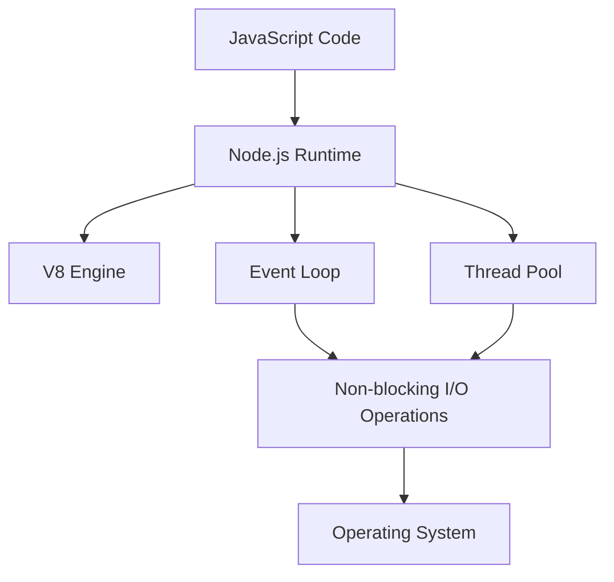
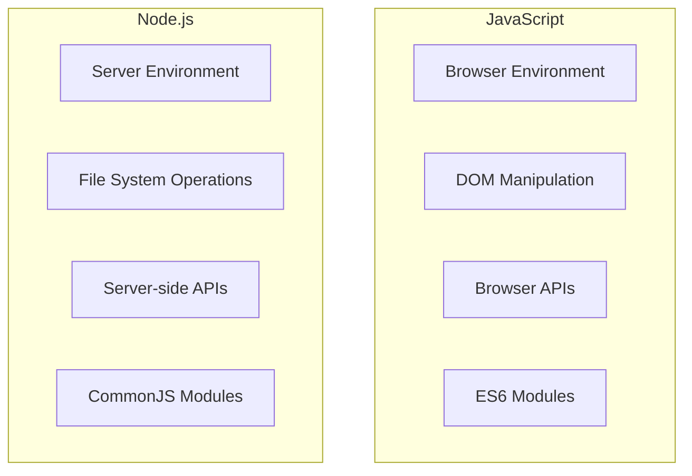
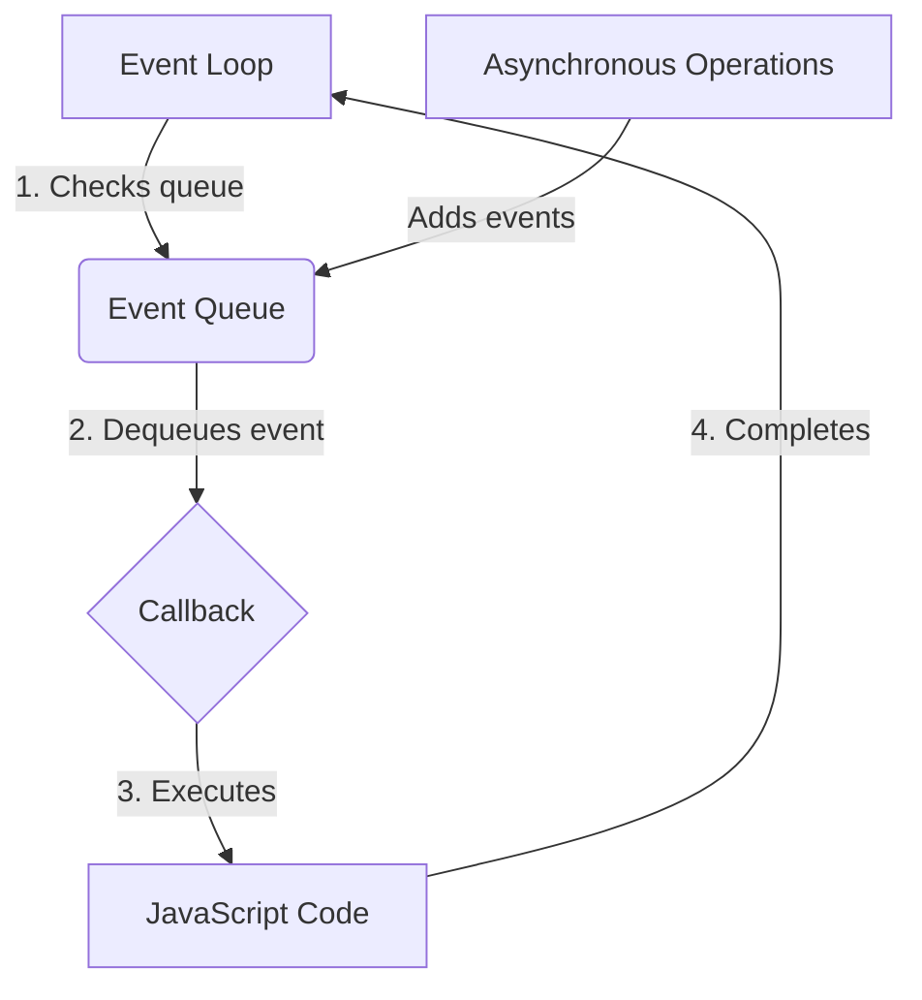
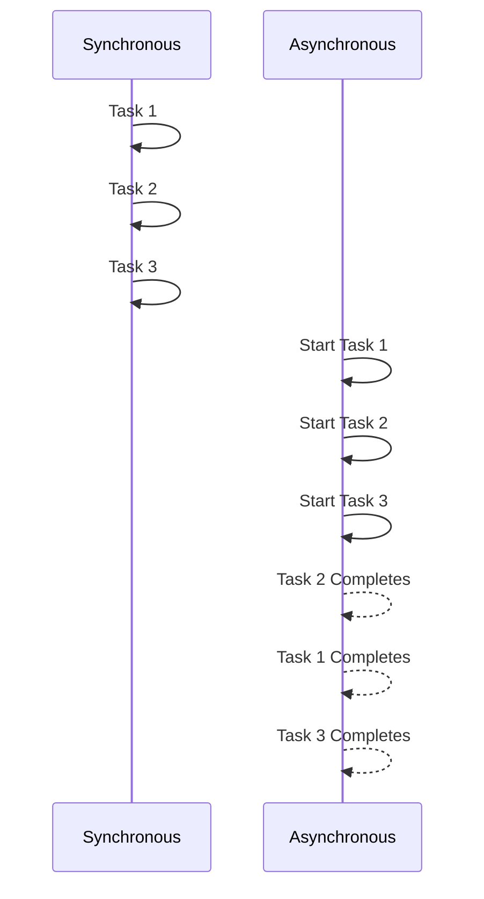

# Node.js Interview Questions and Answers 🚀

## Basic Questions

### 1. What is Node.js and how does it work? 🤔

Node.js is an open-source, cross-platform JavaScript runtime environment that executes JavaScript code outside of a web browser. It allows developers to use JavaScript to write command-line tools and for server-side scripting.

#### How it works:

1. **V8 Engine**: Node.js uses Google's V8 JavaScript engine to execute code. The V8 engine compiles JavaScript into native machine code for faster execution.

2. **Event Loop**: Node.js operates on a single-threaded event loop model. This allows it to handle multiple concurrent operations without the need for multi-threading.

3. **Non-blocking I/O**: Node.js uses non-blocking I/O operations, which means it can handle many connections concurrently without the overhead of managing thread concurrency.

4. **Built-in Modules**: Node.js comes with a rich set of built-in modules (like `fs` for file system operations, `http` for creating web servers, etc.) that simplify development.

#### Diagram: Node.js Architecture



#### Novice Explanation:
Imagine Node.js as a special kitchen where JavaScript is the chef 👨‍🍳. In this kitchen, the chef can cook many dishes (run many tasks) at once without getting overwhelmed. The kitchen has a magical oven (V8 engine) that cooks dishes super fast, and a smart assistant (event loop) that helps manage all the cooking tasks efficiently.

### 2. What are the key features of Node.js? 🌟

1. **Asynchronous and Event-Driven**: All APIs of Node.js are asynchronous (non-blocking). This means a Node.js based server never waits for an API to return data.

2. **Very Fast**: Being built on Google Chrome's V8 JavaScript Engine, Node.js has a fast code execution.

3. **Single Threaded but Highly Scalable**: Node.js uses a single threaded model with event looping. The event mechanism helps the server to respond in a non-blocking way and makes the server highly scalable.

4. **No Buffering**: Node.js applications never buffer any data. These applications simply output the data in chunks.

5. **License**: Node.js is released under the MIT license.

#### Example:
```javascript
const http = require('http');

const server = http.createServer((req, res) => {
  res.writeHead(200, { 'Content-Type': 'text/plain' });
  res.end('Hello World!');
});

server.listen(3000, () => {
  console.log('Server running on port 3000');
});
```

This simple example showcases the asynchronous nature of Node.js. The server doesn't block while waiting for connections; it continues to handle other operations.

### 3. What is the difference between Node.js and JavaScript? 🔄

While Node.js and JavaScript are closely related, they have some key differences:

1. **Environment**:
   - JavaScript: Primarily runs in web browsers.
   - Node.js: Runs on the server-side.

2. **DOM Manipulation**:
   - JavaScript: Can manipulate the Document Object Model (DOM) in browsers.
   - Node.js: Cannot interact with the DOM as it runs outside the browser.

3. **API Access**:
   - JavaScript: Has access to browser APIs like `window`, `document`, etc.
   - Node.js: Has access to server-side APIs like `fs` for file system operations.

4. **Modules**:
   - JavaScript: Uses ES6 modules (`import`/`export`).
   - Node.js: Uses CommonJS module system (`require`/`module.exports`), though ES6 modules are also supported in recent versions.

5. **Purpose**:
   - JavaScript: Client-side scripting, enhancing user interfaces.
   - Node.js: Server-side applications, command-line tools, etc.

#### Diagram: JavaScript vs Node.js



#### Novice Explanation:
Think of JavaScript as a versatile language that can be spoken in different places. When it's spoken in a web browser, it can do things like change what you see on a webpage. But when it's spoken in Node.js, it's like JavaScript has gone to a different country (the server) where it can do new things like read files from a computer or create web servers. Same language, different superpowers! 🦸‍♂️

### 4. What is the purpose of the `package.json` file? 📦

The `package.json` file is a crucial component in Node.js projects. It serves as a manifest for your project, containing metadata and configuration information.

Key purposes:

1. **Project Metadata**: Stores project name, version, description, author, etc.
2. **Dependencies**: Lists project dependencies and their versions.
3. **Scripts**: Defines custom scripts for various tasks (e.g., starting the app, running tests).
4. **Version Control**: Helps in managing versions of your package.
5. **npm Configuration**: Configures how npm should behave when installing packages.

#### Example `package.json`:

```json
{
  "name": "my-awesome-project",
  "version": "1.0.0",
  "description": "An awesome Node.js project",
  "main": "index.js",
  "scripts": {
    "start": "node index.js",
    "test": "jest"
  },
  "dependencies": {
    "express": "^4.17.1"
  },
  "devDependencies": {
    "jest": "^26.6.3"
  },
  "author": "Jane Doe",
  "license": "MIT"
}
```

#### Novice Explanation:
Imagine `package.json` as a recipe book for your project 📚. It tells other chefs (developers) what ingredients (dependencies) they need, how to cook the dish (run scripts), who created the recipe (author), and other important details. Just like a recipe keeps everything organized in the kitchen, `package.json` keeps your Node.js project organized and easy to understand.

### 5. How do you manage packages in Node.js? 📦🔧

Package management in Node.js is primarily done using npm (Node Package Manager) or Yarn. Here's how you can manage packages:

1. **Installing Packages**:
   ```bash
   npm install package-name
   # or
   yarn add package-name
   ```

2. **Updating Packages**:
   ```bash
   npm update package-name
   # or
   yarn upgrade package-name
   ```

3. **Removing Packages**:
   ```bash
   npm uninstall package-name
   # or
   yarn remove package-name
   ```

4. **Installing Dependencies from `package.json`**:
   ```bash
   npm install
   # or
   yarn install
   ```

5. **Adding Dev Dependencies**:
   ```bash
   npm install package-name --save-dev
   # or
   yarn add package-name --dev
   ```

#### Best Practices:
- Use `package-lock.json` (npm) or `yarn.lock` (Yarn) to ensure consistent installations across different environments.
- Regularly update your dependencies to get bug fixes and new features.
- Use semantic versioning in your `package.json` to specify acceptable version ranges for dependencies.

#### Novice Explanation:
Think of package management like maintaining a toolbox for your project 🧰. npm or Yarn are like smart assistants that help you add tools (packages), remove old ones, or update them. The `package.json` file is like a checklist of all the tools you need, and when you run `npm install`, it's like asking your assistant to make sure all the tools on your checklist are in the toolbox and up-to-date.

### 6. What is npm and what are its benefits? 📦🚀

npm (Node Package Manager) is the default package manager for Node.js. It's a powerful tool that allows developers to discover, share, and use packages of reusable code.

#### Benefits of npm:

1. **Vast Library**: Access to over a million packages in the npm registry.
2. **Easy Dependency Management**: Simplifies the process of installing, updating, and removing project dependencies.
3. **Version Control**: Allows specifying exact versions of packages to ensure consistency across different environments.
4. **Scripts**: Enables defining custom scripts for various tasks like starting the application, running tests, etc.
5. **Publishing**: Makes it easy to publish and share your own packages with the community.
6. **Security**: Provides tools for identifying and fixing vulnerabilities in your dependencies.

#### Example: Using npm

```bash
# Initialize a new project
npm init

# Install a package
npm install express

# Run a script defined in package.json
npm run start

# Update all packages
npm update
```

#### Novice Explanation:
Imagine npm as a huge library 📚 where instead of books, you have pieces of code. When you're building a project, instead of writing everything from scratch, you can "borrow" code from this library. npm helps you find the right "books" (packages), brings them to your project, and even helps you keep them up-to-date. It's like having a super-efficient librarian who not only finds books for you but also sets up your study space! 🤓

### 7. What is the event loop in Node.js? 🔄

The event loop is a crucial part of Node.js architecture that allows it to perform non-blocking I/O operations despite JavaScript being single-threaded. It handles the execution of multiple callbacks and manages the execution of asynchronous code.

#### How it works:

1. **Event Queue**: Asynchronous operations (like I/O) are added to an event queue.
2. **Execution**: The event loop continuously checks the queue for events.
3. **Processing**: When an event is found, its corresponding callback is executed.
4. **Non-blocking**: While waiting for I/O operations, the event loop continues to process other events.

#### Diagram: Event Loop



#### Example:

```javascript
console.log('Start');

setTimeout(() => {
  console.log('Timeout callback');
}, 0);

Promise.resolve().then(() => {
  console.log('Promise resolved');
});

console.log('End');

// Output:
// Start
// End
// Promise resolved
// Timeout callback
```

In this example, despite the `setTimeout` being set to 0ms, it still executes after the Promise and the synchronous code due to the way the event loop processes different types of events.

#### Novice Explanation:
Imagine the event loop as a super-efficient personal assistant 🧑‍🚀. You (the main JavaScript thread) give this assistant a bunch of tasks. Some tasks you can do right away (synchronous), but others need time (asynchronous). Instead of waiting around, you keep working on immediate tasks. Meanwhile, your assistant keeps checking if any of the time-consuming tasks are done. As soon as one finishes, they immediately tell you so you can handle it. This way, you're never sitting idle, always doing something productive! 

### 8. What are callbacks in Node.js? 📞

Callbacks are functions passed as arguments to other functions, which are then invoked inside the outer function to complete an action. They are a fundamental concept in Node.js, used extensively to handle asynchronous operations.

#### Key Points:
1. Callbacks allow asynchronous code execution.
2. They help in avoiding blocking operations.
3. Callbacks are the foundation of Node.js's event-driven architecture.

#### Example:

```javascript
function fetchData(callback) {
  setTimeout(() => {
    const data = { id: 1, name: 'John Doe' };
    callback(null, data);
  }, 1000);
}

fetchData((error, data) => {
  if (error) {
    console.error('An error occurred:', error);
  } else {
    console.log('Data fetched:', data);
  }
});

console.log('Fetching data...');

// Output:
// Fetching data...
// (after 1 second)
// Data fetched: { id: 1, name: 'John Doe' }
```

#### Callback Hell:
One challenge with callbacks is "callback hell" - nested callbacks that make code hard to read and maintain.

```javascript
asyncOperation1((error1, result1) => {
  if (error1) {
    handleError(error1);
  } else {
    asyncOperation2(result1, (error2, result2) => {
      if (error2) {
        handleError(error2);
      } else {
        asyncOperation3(result2, (error3, result3) => {
          // This nesting can continue and become hard to manage
        });
      }
    });
  }
});
```

To mitigate this, modern Node.js development often uses Promises or async/await syntax.

#### Novice Explanation:
Think of callbacks like leaving a message for a friend 📱. You're saying, "Hey, when you're done with your task, call me back and let me know." In programming, instead of waiting around for a slow task to finish, you give it instructions (the callback) on what to do when it's done. This way, your program can keep doing other things while waiting for the slow task to complete. It's like being able to multitask efficiently! 🤹

### 9. What is the difference between synchronous and asynchronous programming? ⏰

Synchronous and asynchronous programming are two different approaches to handling tasks in Node.js, each with its own use cases and benefits.

#### Synchronous Programming:
- Tasks are executed sequentially, one after another.
- Each task must complete before the next one starts.
- Can lead to blocking, where the program waits for a task to complete before moving on.

#### Asynchronous Programming:
- Tasks can be executed concurrently.
- The program doesn't wait for a task to complete before moving to the next one.
- Uses callbacks, promises, or async/await to handle task completion.
- Prevents blocking, allowing for more efficient use of resources.

#### Comparison:

| Aspect | Synchronous | Asynchronous |
|--------|-------------|--------------|
| Execution | Sequential | Concurrent |
| Blocking | Yes | No |
| Performance | Can be slower for I/O operations | Faster for I/O-heavy operations |
| Complexity | Simpler to understand and debug | Can be more complex |
| Use Case | CPU-intensive tasks | I/O-bound operations |

#### Example:

```javascript
// Synchronous
console.log('Start');
const result = someSlowOperation(); // This blocks execution
console.log(result);
console.log('End');

// Asynchronous
console.log('Start');
someSlowOperation((result) => {
  console.log(result);
});
console.log('End');
```

In the asynchronous example, 'End' would be logged before the result of `someSlowOperation`.

#### Diagram: Sync vs Async



#### Novice Explanation:
Imagine you're cooking dinner 🍳. In a synchronous approach, you'd do one task at a time: chop vegetables, then boil water, then cook pasta. You'd wait for each task to finish before starting the next. In an asynchronous approach, you'd start multiple tasks at once: put water to boil, chop vegetables while waiting, and prepare sauce simultaneously. This way, you're more efficient and your dinner is ready faster! Asynchronous programming in Node.js works similarly, allowing multiple operations to happen at the same time, making your program more efficient.

### 10. What are first-class functions in JavaScript? 🏆

First-class functions are a fundamental concept in JavaScript (and by extension, Node.js) where functions are treated as first-class citizens. This means that functions can be:

1. Assigned to variables
2. Passed as arguments to other functions
3. Returned from functions
4. Stored in data structures

#### Key Characteristics:
- Can be assigned to variables and properties of objects
- Can be passed as arguments to functions
- Can be returned as values from functions
- Can possess properties and methods

#### Examples:

1. **Assigning to variables:**
   ```javascript
   const greet = function(name) {
     return `Hello, ${name}!`;
   };
   console.log(greet('Alice')); // Output: Hello, Alice!
   ```

2. **Passing as arguments (Higher-order functions):**
   ```javascript
   function operateOnNumbers(a, b, operation) {
     return operation(a, b);
   }

   const add = (x, y) => x + y;
   const multiply = (x, y) => x * y;

   console.log(operateOnNumbers(5, 3, add));      // Output: 8
   console.log(operateOnNumbers(5, 3, multiply)); // Output: 15
   ```

3. **Returning from functions:**
   ```javascript
   function createMultiplier(factor) {
     return function(number) {
       return number * factor;
     };
   }

   const double = createMultiplier(2);
   console.log(double(5)); // Output: 10
   ```

4. **Storing in data structures:**
   ```javascript
   const functionArray = [
     (x) => x * 2,
     (x) => x * x,
     (x) => x + 10
   ];

   console.log(functionArray[1](4)); // Output: 16
   ```

#### Novice Explanation:
Think of first-class functions like super-flexible building blocks 🧱. In many programming languages, functions are like special tools that you can only use in certain ways. But in JavaScript, functions are like magical blocks that can do everything regular blocks can do! You can pass them around, store them in boxes (variables), or even use them to create new blocks. This flexibility makes JavaScript really powerful and allows you to write code in creative and efficient ways.