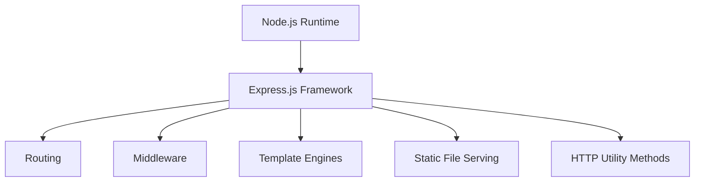
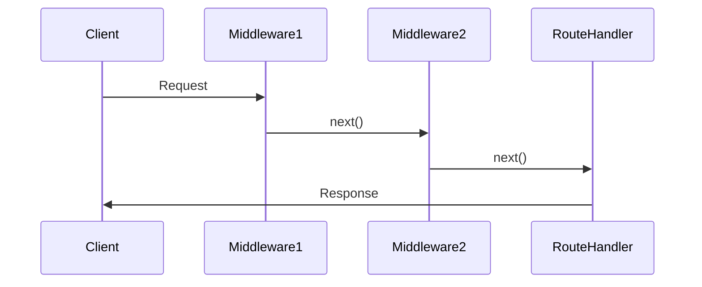
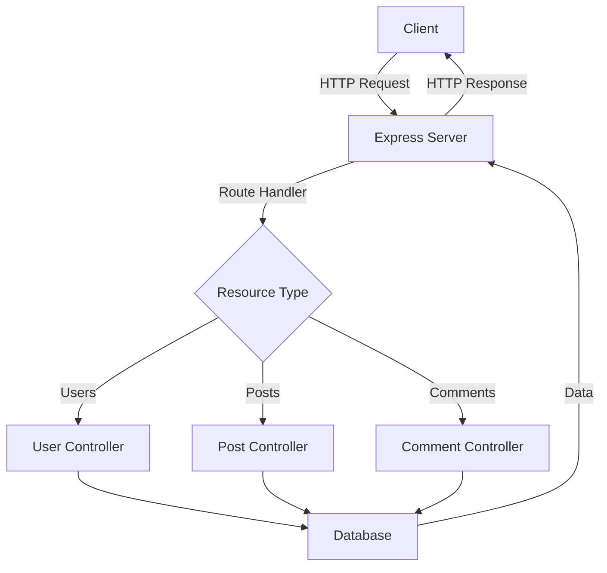
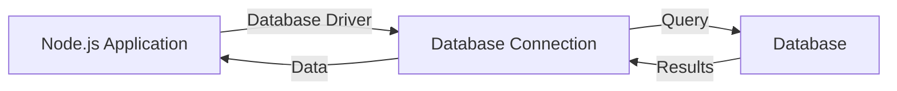
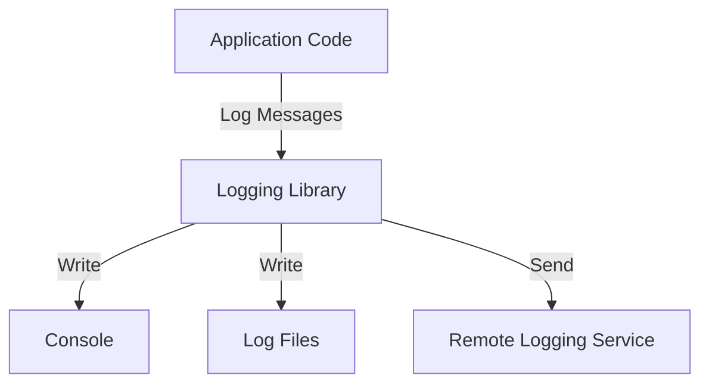

# Node.js Interview Questions and Answers 🚀

## Intermediate Questions

### 1. What is Express.js and how does it relate to Node.js? 🚂

Express.js is a minimal and flexible web application framework for Node.js. It provides a robust set of features for building single-page, multi-page, and hybrid web applications.

#### Key Points:
1. **Middleware**: Express uses middleware to handle requests and responses.
2. **Routing**: It provides a simple way to define routes for your application.
3. **Template Engines**: Express can be integrated with various template engines like EJS, Pug, etc.
4. **Static File Serving**: Easy serving of static files like CSS, images, etc.
5. **HTTP Utility Methods**: Simplifies the process of handling HTTP methods.

#### Relationship with Node.js:
- Express.js is built on top of Node.js.
- It extends Node's features to make web application development easier and faster.
- While Node.js provides the runtime environment, Express provides the framework for building web applications.

#### Example:
```javascript
const express = require('express');
const app = express();
const port = 3000;

app.get('/', (req, res) => {
  res.send('Hello World!');
});

app.listen(port, () => {
  console.log(`Example app listening at http://localhost:${port}`);
});
```

#### Diagram: Express.js in Node.js Ecosystem



#### Novice Explanation:
Imagine Node.js as a powerful but bare-bones car engine 🚗. Express.js is like adding a sleek body, comfortable seats, and a user-friendly dashboard to that engine. It takes the raw power of Node.js and makes it much easier and more convenient to build web applications. With Express, you get pre-built parts (like routing and middleware) that you'd otherwise have to build from scratch with just Node.js. It's like turning your engine into a complete, ready-to-drive car! 🏎️

### 2. How do you handle errors in Node.js? 🚨

Error handling is crucial in Node.js applications to ensure robustness and prevent crashes. There are several ways to handle errors effectively:

1. **Try-Catch Blocks**: For synchronous code.
2. **Error-First Callbacks**: For asynchronous code using callbacks.
3. **Promises**: Using `.catch()` for promise-based asynchronous operations.
4. **Async/Await**: Using try-catch with async functions.
5. **Event Emitters**: For handling errors in event-driven parts of your application.
6. **Global Error Handling**: For uncaught exceptions and unhandled promise rejections.

#### Examples:

1. **Try-Catch:**
   ```javascript
   try {
     const result = riskyOperation();
     console.log(result);
   } catch (error) {
     console.error('An error occurred:', error.message);
   }
   ```

2. **Error-First Callbacks:**
   ```javascript
   fs.readFile('file.txt', (err, data) => {
     if (err) {
       console.error('Error reading file:', err);
       return;
     }
     console.log(data);
   });
   ```

3. **Promises:**
   ```javascript
   fetchData()
     .then(data => console.log(data))
     .catch(error => console.error('Error fetching data:', error));
   ```

4. **Async/Await:**
   ```javascript
   async function fetchData() {
     try {
       const data = await someAsyncOperation();
       console.log(data);
     } catch (error) {
       console.error('Error:', error);
     }
   }
   ```

5. **Event Emitters:**
   ```javascript
   const EventEmitter = require('events');
   class MyEmitter extends EventEmitter {}
   const myEmitter = new MyEmitter();

   myEmitter.on('error', (err) => {
     console.error('An error occurred:', err);
   });

   myEmitter.emit('error', new Error('Something went wrong'));
   ```

6. **Global Error Handling:**
   ```javascript
   process.on('uncaughtException', (error) => {
     console.error('Uncaught Exception:', error);
     // Perform cleanup, log the error, then exit
     process.exit(1);
   });

   process.on('unhandledRejection', (reason, promise) => {
     console.error('Unhandled Rejection at:', promise, 'reason:', reason);
     // Perform cleanup, log the error, then exit
     process.exit(1);
   });
   ```

#### Best Practices:
- Always handle errors in asynchronous code.
- Use specific error types for different scenarios.
- Log errors with sufficient context for debugging.
- In production, avoid sending detailed error messages to clients.

#### Novice Explanation:
Think of error handling like being a safety inspector in a factory 🏭. Your job is to anticipate things that could go wrong and have plans to deal with them. Just like a factory has different safety protocols for different areas (chemical spills, machinery malfunctions, etc.), in Node.js we have different ways to handle errors depending on how our code is structured. The goal is to catch problems early, understand what went wrong, and prevent the whole factory (or in our case, the application) from shutting down because of one small issue. Good error handling makes your application more reliable and easier to maintain, just like good safety practices make a factory safer and more efficient! 🛠️

### 3. What are middleware functions in Express? 🔗

Middleware functions in Express are functions that have access to the request object (req), the response object (res), and the next middleware function in the application's request-response cycle, commonly denoted by a variable named `next`.

#### Key Points:
1. Middleware functions can:
   - Execute any code.
   - Make changes to the request and response objects.
   - End the request-response cycle.
   - Call the next middleware in the stack.

2. Types of Middleware:
   - Application-level middleware
   - Router-level middleware
   - Error-handling middleware
   - Built-in middleware
   - Third-party middleware

#### Example:

```javascript
const express = require('express');
const app = express();

// Application-level middleware
app.use((req, res, next) => {
  console.log('Time:', Date.now());
  next();
});

// Middleware for a specific route
app.use('/user/:id', (req, res, next) => {
  console.log('Request Type:', req.method);
  next();
});

// Route handler
app.get('/user/:id', (req, res) => {
  res.send('User Info');
});

// Error-handling middleware
app.use((err, req, res, next) => {
  console.error(err.stack);
  res.status(500).send('Something broke!');
});

app.listen(3000);
```

#### Diagram: Middleware in Express


#### Novice Explanation:
Imagine you're going through airport security ✈️. Each step (ID check, bag scan, body scan) is like a middleware function. Each "middleware" can do something (check your ID, scan your bag) and then either let you proceed to the next step (like calling `next()`) or stop you if there's a problem (like ending the request-response cycle). Just as airport security makes sure everything is safe and in order before you board the plane, Express middleware processes and checks the request before it reaches its final destination (the route handler). This system allows for a very organized and flexible way to handle web requests! 🛂

### 4. What is the purpose of the `next()` function in Express? ➡️

The `next()` function is a crucial part of Express middleware. It's a function in the Express router which, when invoked, executes the middleware succeeding the current middleware.

#### Key Points:
1. **Passing Control**: `next()` passes control to the next middleware function.
2. **Error Handling**: Calling `next()` with an argument is used to pass errors to Express.
3. **Middleware Chaining**: Allows for the creation of a chain of middleware operations.
4. **Route Skipping**: Can be used to skip the rest of the middleware functions from a router middleware stack.

#### Usage Examples:

1. **Basic Usage:**
   ```javascript
   app.use((req, res, next) => {
     console.log('Time:', Date.now());
     next();
   });
   ```

2. **Error Handling:**
   ```javascript
   app.use((req, res, next) => {
     if (!req.headers.authorization) {
       next(new Error('Unauthorized'));
     } else {
       next();
     }
   });
   ```

3. **Route Skipping:**
   ```javascript
   app.get('/users/:id', (req, res, next) => {
     if (req.params.id === '0') return next('route');
     next();
   }, (req, res, next) => {
     res.send('Regular User');
   });

   app.get('/users/:id', (req, res) => {
     res.send('Special User');
   });
   ```

#### Diagram: `next()` Function Flow



#### Novice Explanation:
Think of `next()` like a relay race baton 🏃‍♂️🏃‍♀️. In a relay race, each runner passes the baton to the next runner to continue the race. In Express, each middleware function is like a runner. When a middleware is done with its job, it passes the baton (calls `next()`) to let the next middleware take over. This way, the request moves through all the necessary steps before the final response is sent back. If a runner (middleware) notices a problem, they can choose not to pass the baton, ending the race early (ending the request-response cycle). It's a simple but powerful way to control the flow of a request through your application! 🏁

### 5. How can you create a RESTful API using Node.js? 🌐

Creating a RESTful API with Node.js typically involves using a framework like Express.js. Here's a step-by-step guide:

1. **Set up your project:**
   - Initialize a new Node.js project
   - Install necessary packages (Express, body-parser, etc.)

2. **Create your Express app:**
   - Set up the basic Express server
   - Configure middleware (like body-parser for JSON)

3. **Define your routes:**
   - Create routes for different HTTP methods (GET, POST, PUT, DELETE)
   - Implement the logic for each route

4. **Handle data:**
   - Connect to a database (e.g., MongoDB with Mongoose)
   - Perform CRUD operations in your route handlers

5. **Implement error handling:**
   - Create middleware for handling errors
   - Use try-catch blocks in async functions

6. **Test your API:**
   - Use tools like Postman or write unit tests

#### Example: Simple RESTful API for a User resource

```javascript
const express = require('express');
const bodyParser = require('body-parser');
const app = express();
const port = 3000;

app.use(bodyParser.json());

let users = [
  { id: 1, name: 'John Doe' },
  { id: 2, name: 'Jane Smith' }
];

// GET all users
app.get('/users', (req, res) => {
  res.json(users);
});

// GET a specific user
app.get('/users/:id', (req, res) => {
  const user = users.find(u => u.id === parseInt(req.params.id));
  if (!user) return res.status(404).send('User not found');
  res.json(user);
});

// POST a new user
app.post('/users', (req, res) => {
  const user = {
    id: users.length + 1,
    name: req.body.name
  };
  users.push(user);
  res.status(201).json(user);
});

// PUT (update) a user
app.put('/users/:id', (req, res) => {
  const user = users.find(u => u.id === parseInt(req.params.id));
  if (!user) return res.status(404).send('User not found');
  
  user.name = req.body.name;
  res.json(user);
});

// DELETE a user
app.delete('/users/:id', (req, res) => {
  const userIndex = users.findIndex(u => u.id === parseInt(req.params.id));
  if (userIndex === -1) return res.status(404).send('User not found');
  
  users.splice(userIndex, 1);
  res.status(204).send();
});

app.listen(port, () => {
  console.log(`API running on port ${port}`);
});
```

#### Diagram: RESTful API Structure



#### Novice Explanation:
Creating a RESTful API is like being a traffic controller for data 🚦. Imagine you're managing a busy intersection (your server) where different types of vehicles (GET, POST, PUT, DELETE requests) want to go to different destinations (routes like /users or /posts). 

Your job is to:
1. Set up the roads (create the Express app and routes)
2. Direct traffic (handle incoming requests)
3. Make sure vehicles reach their destination safely (process data and send responses)
4. Handle any accidents (error handling)

Just like a well-managed intersection makes traffic flow smoothly, a well-designed API makes data flow efficiently between clients and your server. It's all about creating clear rules and paths for data to travel! 🚗💨

### 6. What is the significance of the `key` prop in Node.js applications?

The `key` prop is actually more relevant to React applications than Node.js applications. However, since React is often used with Node.js in full-stack JavaScript development, it's a good concept to understand.

#### Key Points:
1. The `key` prop is used in React when rendering lists of elements.
2. It helps React identify which items have changed, been added, or been removed.
3. Keys should be unique among siblings in a list.
4. They improve performance by allowing React to reuse existing DOM elements.

#### Example:
```jsx
const TodoList = ({ todos }) => (
  <ul>
    {todos.map(todo => (
      <li key={todo.id}>{todo.text}</li>
    ))}
  </ul>
);
```

#### Why it's important:
1. **Efficiency**: Helps React update the DOM more efficiently.
2. **State Preservation**: Ensures component state is maintained correctly across re-renders.
3. **Reconciliation**: Assists in React's reconciliation process for determining what needs to be re-rendered.

#### Novice Explanation:
Think of the `key` prop like name tags at a conference 🏷️. When you have a room full of people (a list of elements), giving each person a unique name tag (key) helps you quickly identify who's who. If someone leaves or a new person joins, you can easily update your list without having to recheck everyone. React uses keys in a similar way to keep track of elements in a list, making updates faster and more efficient. It's like having a smart organizer for your virtual elements! 🧠💻

### 7. How do you connect a Node.js application to a database? 🗄️

Connecting a Node.js application to a database involves several steps and can vary depending on the database you're using. Here's a general overview using MongoDB as an example:

1. **Choose a Database**: Select a database that fits your needs (e.g., MongoDB, MySQL, PostgreSQL).
2. **Install Driver**: Use npm to install the appropriate database driver.
3. **Configure Connection**: Set up the connection details (host, port, credentials).
4. **Establish Connection**: Write code to connect to the database.
5. **Perform Operations**: Use the driver's API to perform CRUD operations.

#### Example: Connecting to MongoDB using Mongoose

1. Install Mongoose:
   ```bash
   npm install mongoose
   ```

2. Connect to MongoDB:
   ```javascript
   const mongoose = require('mongoose');

   mongoose.connect('mongodb://localhost:27017/myapp', {
     useNewUrlParser: true,
     useUnifiedTopology: true
   })
   .then(() => console.log('Connected to MongoDB'))
   .catch(err => console.error('Could not connect to MongoDB', err));
   ```

3. Define a Schema and Model:
   ```javascript
   const userSchema = new mongoose.Schema({
     name: String,
     email: String,
     age: Number
   });

   const User = mongoose.model('User', userSchema);
   ```

4. Perform CRUD Operations:
   ```javascript
   // Create
   const newUser = new User({ name: 'John Doe', email: 'john@example.com', age: 30 });
   await newUser.save();

   // Read
   const users = await User.find();

   // Update
   await User.updateOne({ name: 'John Doe' }, { age: 31 });

   // Delete
   await User.deleteOne({ name: 'John Doe' });
   ```

#### Diagram: Node.js Database Connection



#### Novice Explanation:
Connecting your Node.js app to a database is like setting up a direct phone line ☎️ between your app and a giant filing cabinet 🗄️. First, you need to choose which filing cabinet (database) you want to use. Then, you install a special phone (database driver) that knows how to talk to that specific filing cabinet.

Next, you dial the number (connection string) to establish a connection. Once connected, your app can ask the filing cabinet to find, add, change, or remove files (CRUD operations). The filing cabinet does the work and sends back the results.

Just like how a good phone connection is crucial for clear communication, a properly set up database connection is essential for your app to store and retrieve data reliably! 📞💾

### 8. What is the purpose of the `require()` function? 📦

The `require()` function is a built-in function in Node.js used to include external modules in your application. It's a fundamental part of the CommonJS module system used by Node.js.

#### Key Points:
1. **Module Loading**: Loads modules and returns the exported object.
2. **Caching**: Modules are cached after the first time they are loaded.
3. **Synchronous Operation**: `require()` is synchronous and blocks execution until the module is loaded.
4. **File Resolution**: Follows a specific algorithm to find and load modules.

#### How it works:
1. Resolves the module path
2. Loads the module
3. Wraps the module code
4. Evaluates the code
5. Caches the module
6. Returns the `exports` object

#### Example Usage:

```javascript
// Built-in module
const fs = require('fs');

// Local module
const myModule = require('./myModule');

// npm package
const express = require('express');

// Using a loaded module
fs.readFile('example.txt', 'utf8', (err, data) => {
  if (err) throw err;
  console.log(data);
});
```

#### Module Resolution Algorithm:
1. If the module name starts with '/' or './' or '../', it's treated as a file path.
2. If not, Node looks in the 'node_modules' folder.
3. If not found, it moves up the directory tree, looking in each parent's 'node_modules'.
4. If still not found, it throws an error.

#### Novice Explanation:
Think of `require()` as a magic spell 🧙‍♂️ that lets you summon helpful tools into your code. Imagine you're building a house 🏠. Instead of creating every tool from scratch, you can use `require()` to instantly bring in pre-made tools (modules) to help you.

For example, `require('fs')` is like saying "Bring me my file toolkit!" Now you have all sorts of file-related tools at your fingertips. 

The best part? Once you've summoned a tool, it stays with you (thanks to caching), so you don't need to keep summoning it over and over. It's like having a magical toolbelt that keeps all your summoned tools handy! 🛠️✨

### 9. What is the difference between `module.exports` and `exports`? 🔄

`module.exports` and `exports` are both used in Node.js to export functionality from a module, but they have some key differences:

#### Key Points:
1. `exports` is a reference to `module.exports`.
2. `module.exports` is the actual object that gets returned by `require()`.
3. Reassigning `exports` doesn't change what gets exported.
4. Reassigning `module.exports` changes the entire exported object.

#### Examples:

1. Using `exports`:
   ```javascript
   // myModule.js
   exports.sayHello = function() {
     console.log('Hello');
   };

   exports.sayGoodbye = function() {
     console.log('Goodbye');
   };

   // main.js
   const myModule = require('./myModule');
   myModule.sayHello(); // Outputs: Hello
   ```

2. Using `module.exports`:
   ```javascript
   // myModule.js
   module.exports = {
     sayHello: function() {
       console.log('Hello');
     },
     sayGoodbye: function() {
       console.log('Goodbye');
     }
   };

   // main.js
   const myModule = require('./myModule');
   myModule.sayHello(); // Outputs: Hello
   ```

3. Reassigning `exports` (doesn't work as expected):
   ```javascript
   // myModule.js
   exports = function() {
     console.log('This won't be exported');
   };

   // main.js
   const myModule = require('./myModule');
   console.log(myModule); // Outputs: {}
   ```

4. Reassigning `module.exports` (works as expected):
   ```javascript
   // myModule.js
   module.exports = function() {
     console.log('This will be exported');
   };

   // main.js
   const myModule = require('./myModule');
   myModule(); // Outputs: This will be exported
   ```

#### Diagram: `module.exports` vs `exports`

```mermaid
graph TD
    A[module object] --> B[exports property]
    A --> C[module.exports]
    B -.-> C
    C --> D[Returned by require()]
```

#### Novice Explanation:
Imagine you're packing a suitcase for a trip ✈️🧳. `module.exports` is like the entire suitcase, while `exports` is like a label on the suitcase.

- When you use `exports.something = ...`, it's like adding items to your suitcase through a small opening (the label).
- When you use `module.exports = ...`, it's like replacing the entire suitcase with a new one.

Initially, the label (`exports`) and the suitcase (`module.exports`) are connected. But if you try to replace the entire label (`exports = ...`), it doesn't change what's inside the suitcase. However, if you replace the entire suitcase (`module.exports = ...`), that's what gets sent on the trip (exported).

So, if you want to export multiple things, use `exports.thing = ...`. If you want to export just one thing, especially a function, use `module.exports = ...`. Either way, what's in `module.exports` at the end is what gets packed for the journey! 🧳🚀

### 10. How do you implement logging in a Node.js application? 📝

Logging is crucial for monitoring and debugging Node.js applications. There are several ways to implement logging, from simple `console.log` statements to more advanced logging libraries.

#### Key Logging Libraries:
1. **Winston**: Versatile logging library with multiple transport options.
2. **Bunyan**: JSON-based logging library.
3. **Pino**: High-performance logging with low overhead.
4. **Morgan**: HTTP request logger middleware for Express.

#### Example: Using Winston

1. Install Winston:
   ```bash
   npm install winston
   ```

2. Set up Winston logger:
   ```javascript
   const winston = require('winston');

   const logger = winston.createLogger({
     level: 'info',
     format: winston.format.combine(
       winston.format.timestamp(),
       winston.format.json()
     ),
     transports: [
       new winston.transports.File({ filename: 'error.log', level: 'error' }),
       new winston.transports.File({ filename: 'combined.log' })
     ]
   });

   // If we're not in production, log to the console as well
   if (process.env.NODE_ENV !== 'production') {
     logger.add(new winston.transports.Console({
       format: winston.format.simple()
     }));
   }

   module.exports = logger;
   ```

3. Use the logger in your application:
   ```javascript
   const logger = require('./logger');

   logger.info('Application started');
   logger.error('An error occurred', { error: 'Details here' });
   ```

#### Best Practices:
1. Use log levels appropriately (error, warn, info, debug).
2. Include relevant context in log messages.
3. Use structured logging in production for easier parsing.
4. Implement log rotation to manage log file sizes.
5. Consider using a centralized logging service in distributed systems.

#### Diagram: Logging Flow



#### Novice Explanation:
Imagine you're an explorer 🧭 on a journey through a dense forest 🌳 (your code). Logging is like leaving a trail of breadcrumbs 🍞 as you go. 

- Different types of breadcrumbs represent different log levels (errors are big red crumbs, warnings are yellow, info is green).
- Sometimes you drop breadcrumbs on the ground (console logs), sometimes you put them in your backpack (log files), and sometimes you send a bird 🐦 with a message to base camp (remote logging).

Why do this? If you get lost (encounter a bug), you can follow your trail back. If someone needs to follow your path later, they can use your breadcrumbs. And if you need help, you can tell the rescue team exactly where you've been!

Good logging is like being a responsible explorer - it helps you navigate your code forest safely and helps others understand your journey too! 🗺️🔍