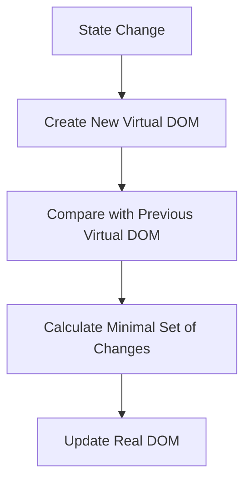
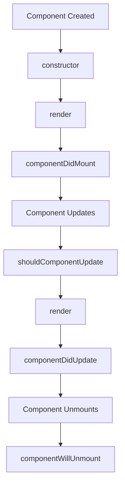

# 🚀 React.js Interview Questions and Answers

## Basic Questions

### 1. What is React.js? 🤔

React.js is a popular JavaScript library for building user interfaces, particularly for single-page applications. It was developed by Facebook and is now maintained by Facebook and a community of individual developers and companies.

**Novice Explanation:** Imagine you're building a house 🏠. React.js is like a set of special building blocks that make it easier to create the rooms and furniture inside. It helps you build the parts of a website that people see and interact with, like buttons, forms, and pictures.

**Expert Explanation:** React.js employs a component-based architecture, allowing developers to create reusable UI elements. It utilizes a virtual DOM for efficient rendering and updates, which significantly improves performance in complex applications. React's declarative nature simplifies the process of creating interactive UIs by describing the desired state, and letting React handle the DOM updates efficiently.

### 2. What are the key features of React? 🔑

1. **Virtual DOM:** Improves performance by minimizing direct manipulation of the actual DOM.
2. **JSX:** Syntax extension that allows mixing HTML with JavaScript.
3. **Component-Based:** Encourages building encapsulated components that manage their own state.
4. **Unidirectional Data Flow:** Data flows in a single direction, making it easier to understand and debug.
5. **React Native:** Allows development of mobile applications using React.
6. **Large Ecosystem:** Vast collection of tools, libraries, and extensions.

**Example:**
```jsx
// A simple React component
function Welcome(props) {
  return <h1>Hello, {props.name}!</h1>;
}

// Using the component
const element = <Welcome name="Alice" />;
```

### 3. What is JSX and why is it used in React? 🖋️

JSX (JavaScript XML) is a syntax extension for JavaScript that looks similar to XML or HTML. It allows you to write HTML structures in the same file as JavaScript code.

**Novice Explanation:** JSX is like a special language that lets you write HTML inside your JavaScript. It's like mixing chocolate 🍫 and peanut butter 🥜 - two great things that work even better together!

**Expert Explanation:** JSX provides a more intuitive and visual way to describe the UI structure directly within JavaScript code. It's transformed into regular JavaScript function calls during the build process, typically using Babel. This approach offers several benefits:

1. Improved readability and maintainability
2. Compile-time error checking
3. Easier integration of dynamic values and expressions within markup

**Example:**
```jsx
const element = (
  <div>
    <h1>Hello, world!</h1>
    <p>This is JSX in action.</p>
  </div>
);
```

### 4. What is the Virtual DOM and how does it work? 🌐

The Virtual DOM (VDOM) is a lightweight copy of the actual DOM kept in memory. React uses it to improve performance by minimizing direct manipulation of the real DOM.

**Novice Explanation:** Imagine you're planning to redecorate your room 🛋️. Instead of moving all the furniture around to try different layouts, you draw a map of your room and move things around on paper first. The Virtual DOM is like that map - it lets React figure out the best way to update the webpage before actually doing it.

**Expert Explanation:** The Virtual DOM works as follows:

1. When state changes occur, React creates a new Virtual DOM tree.
2. It then compares this new tree with the previous one (diffing).
3. React calculates the most efficient way to update the real DOM.
4. Finally, it applies these changes to the actual DOM in a single batch.

This process, known as reconciliation, significantly reduces the performance cost of DOM manipulation.

**Diagram:**



### 5. What are props in React? 🎁

Props (short for properties) are a way of passing data from parent components to child components in React. They are read-only and help make your components more reusable.

**Novice Explanation:** Props are like a gift box 🎁 that a parent component gives to its child. The child can look inside the box and use what's there, but it can't change what's in the box.

**Expert Explanation:** Props serve several important purposes in React:

1. **Data Flow:** They establish a one-way data flow from parent to child components.
2. **Component Communication:** Allow components to communicate and share data.
3. **Reusability:** Enable the creation of more generic, reusable components.
4. **Immutability:** Props are read-only, enforcing the principle of immutable data flow.

**Example:**
```jsx
function Welcome(props) {
  return <h1>Hello, {props.name}!</h1>;
}

function App() {
  return (
    <div>
      <Welcome name="Alice" />
      <Welcome name="Bob" />
    </div>
  );
}
```

### 6. What is state in React? How does it differ from props? 🔄

State is a JavaScript object that represents the internal data of a component. Unlike props, state can be changed over time, typically in response to user actions or network responses.

**Novice Explanation:** If props are like a gift box 🎁, state is like your own toy box 🧸. You can add toys, remove them, or change them around as much as you want.

**Expert Explanation:** Key differences between state and props:

1. **Mutability:** State is mutable and can be updated using `setState()`, while props are read-only.
2. **Ownership:** State is owned and managed by the component itself, props are owned by the parent component.
3. **Updates:** Changing state triggers a re-render, while changing props from the parent also triggers a re-render.
4. **Usage:** State is used for data that changes over time within a component, props are used for passing data between components.

**Example:**
```jsx
class Counter extends React.Component {
  constructor(props) {
    super(props);
    this.state = { count: 0 };
  }

  increment = () => {
    this.setState(prevState => ({ count: prevState.count + 1 }));
  }

  render() {
    return (
      <div>
        <p>Count: {this.state.count}</p>
        <button onClick={this.increment}>Increment</button>
      </div>
    );
  }
}
```

### 7. What are the lifecycle methods of a React component? 🔄

Lifecycle methods are special methods that get called at different stages of a component's life in the DOM.

**Novice Explanation:** Imagine a plant growing 🌱. It starts as a seed, then sprouts, grows leaves, and eventually dies. React components have similar stages in their "life," and lifecycle methods let you do things at each stage.

**Expert Explanation:** The lifecycle methods can be categorized into three phases:

1. **Mounting:** When a component is being added to the DOM.
   - `constructor()`
   - `render()`
   - `componentDidMount()`

2. **Updating:** When a component is re-rendered due to changes in props or state.
   - `shouldComponentUpdate()`
   - `render()`
   - `componentDidUpdate()`

3. **Unmounting:** When a component is being removed from the DOM.
   - `componentWillUnmount()`

**Diagram:**



### 8. What is the purpose of the `render()` method? 🎨

The `render()` method is the only required method in a class component. Its main purpose is to return the JSX that should be displayed by the component.

**Novice Explanation:** The `render()` method is like a painter 🎨. Its job is to describe what the component should look like on the screen.

**Expert Explanation:** Key points about the `render()` method:

1. It should be pure, meaning it doesn't modify component state.
2. It returns a single React element, which can be a representation of a DOM node or another composite component.
3. It can also return `null` or `false` to indicate that nothing should be rendered.
4. It's called every time a component updates.

**Example:**
```jsx
class Welcome extends React.Component {
  render() {
    return <h1>Hello, {this.props.name}!</h1>;
  }
}
```

### 9. What is the difference between class components and functional components? 🏛️

Class components and functional components are two ways of defining components in React, each with its own syntax and capabilities.

**Novice Explanation:** Think of class components as Swiss Army knives 🔪 with lots of tools built-in, while functional components are like simple, lightweight pocket knives. Both can do the job, but one is more complex and powerful, while the other is simpler and easier to use.

**Expert Explanation:**

Class Components:
- Defined using ES6 classes
- Can hold and manage local state
- Have access to lifecycle methods
- Use `this` keyword to access props and state
- Generally used for complex components with many features

Functional Components:
- Defined as JavaScript functions
- Originally stateless, but can now use state with hooks
- Simpler and more concise
- Easier to test and debug
- Preferred in modern React development due to hooks

**Example:**
```jsx
// Class Component
class Welcome extends React.Component {
  render() {
    return <h1>Hello, {this.props.name}!</h1>;
  }
}

// Functional Component
function Welcome(props) {
  return <h1>Hello, {props.name}!</h1>;
}
```

### 10. What are controlled and uncontrolled components? 🎮

Controlled and uncontrolled components refer to how form inputs handle and store their values in React.

**Novice Explanation:** Imagine you're playing with a remote-controlled car 🚗. A controlled component is like driving the car with the remote - you're in charge of every move. An uncontrolled component is like a wind-up toy car - you start it, but then it does its own thing.

**Expert Explanation:**

Controlled Components:
- The component's state handles the form data
- React controls the input's value through props
- Typically use `onChange` event to update state
- More predictable and easier to validate

Uncontrolled Components:
- The DOM handles the form data
- React doesn't control the input's value
- Use `ref` to get the input's value when needed
- Simpler to implement but less predictable

**Example:**
```jsx
// Controlled Component
function ControlledInput() {
  const [value, setValue] = useState('');
  return <input value={value} onChange={e => setValue(e.target.value)} />;
}

// Uncontrolled Component
function UncontrolledInput() {
  const inputRef = useRef(null);
  return <input ref={inputRef} />;
}
```

### 11. What is the significance of keys in lists? 🔑

Keys are special attributes used when rendering lists of elements in React. They help React identify which items have changed, been added, or been removed.

**Novice Explanation:** Imagine you have a row of lockers 🔐. Each locker needs a unique number so you can find your stuff easily. Keys in React are like those locker numbers - they help React keep track of each item in a list.

**Expert Explanation:** Keys serve several important purposes:

1. **Uniqueness:** Each key should be unique among siblings (but not globally).
2. **Stability:** Keys should be stable across re-renders to maintain component state.
3. **Performance:** They help React optimize rendering by identifying changes in lists.
4. **Reconciliation:** Keys aid in the reconciliation process, allowing React to reuse existing DOM elements.

**Example:**
```jsx
function TodoList({ todos }) {
  return (
    <ul>
      {todos.map(todo => (
        <li key={todo.id}>{todo.text}</li>
      ))}
    </ul>
  );
}
```

### 12. What are the differences between functional and class components? 🔄

While we touched on this earlier, let's dive deeper into the differences between functional and class components.

**Novice Explanation:** Think of class components as traditional recipes with lots of steps and ingredients 📖, while functional components are like modern, simplified recipes that still make a great dish 🍽️.

**Expert Explanation:**

1. **Syntax:**
   - Class components use ES6 class syntax
   - Functional components are just JavaScript functions

2. **State Management:**
   - Class components use `this.state` and `this.setState()`
   - Functional components use the `useState` hook

3. **Lifecycle Methods:**
   - Class components have access to all lifecycle methods
   - Functional components use the `useEffect` hook to handle side effects

4. **`this` Keyword:**
   - Class components require `this` to access props, state, and methods
   - Functional components don't use `this`

5. **Performance:**
   - Functional components can have slightly better performance and smaller bundle size

6. **Reusability:**
   - Functional components are easier to reuse and test due to their simplicity

**Example:**
```jsx
// Class Component
class Counter extends React.Component {
  constructor(props) {
    super(props);
    this.state = { count: 0 };
  }

  increment = () => {
    this.setState(prevState => ({ count: prevState.count + 1 }));
  }

  render() {
    return (
      <div>
        <p>Count: {this.state.count}</p>
        <button onClick={this.increment}>Increment</button>
      </div>
    );
  }
}

// Functional Component
function Counter() {
  const [count, setCount] = useState(0);

  const increment = () => {
    setCount(prevCount => prevCount + 1);
  }

  return (
    <div>
      <p>Count: {count}</p>
      <button onClick={increment}>Increment</button>
    </div>
  );
}
```

